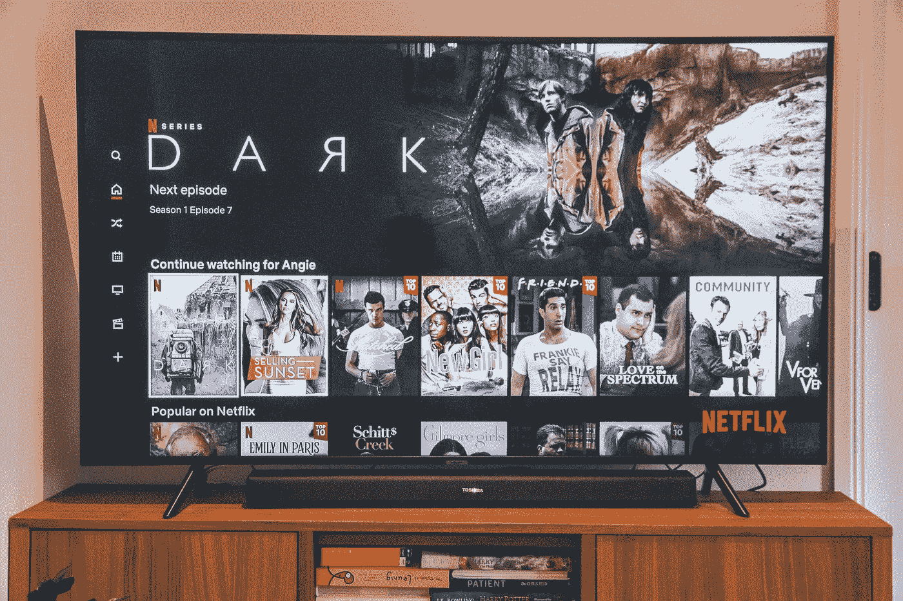

# 为什么我最终抛弃了网飞

> 原文：<https://medium.com/geekculture/why-i-finally-ditched-netflix-ec62d616fd7e?source=collection_archive---------17----------------------->

一个关于青年、中年和不可避免的衰老的故事。不是我的，是他们的。

Photo by [Marques Kaspbrak](https://unsplash.com/@popcornmatch?utm_source=unsplash&utm_medium=referral&utm_content=creditCopyText) on [Unsplash](https://unsplash.com/s/photos/netflix?utm_source=unsplash&utm_medium=referral&utm_content=creditCopyText)

当我看到我的用户设置屏幕时，我惊讶地注意到，当我最终决定在本周关闭这项服务时，我已经成为网飞的用户整整 10 年了。

过去，能够在舒适的环境中观看相当近期的电影和电视剧是非常令人兴奋的