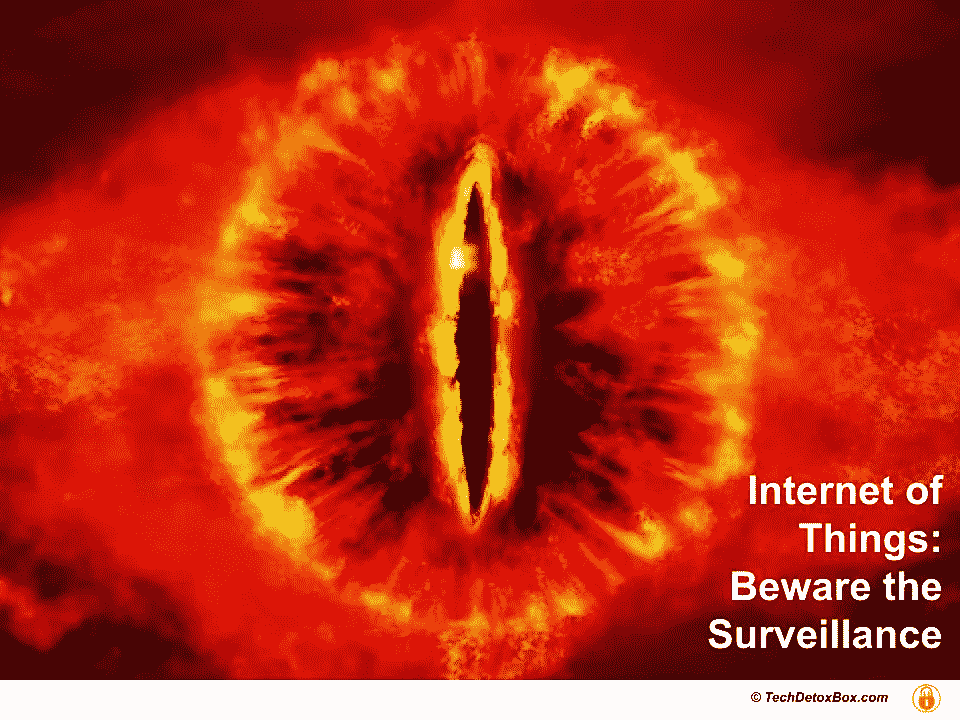
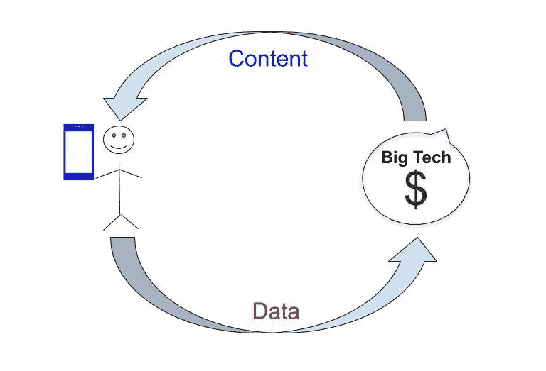
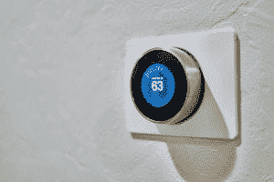
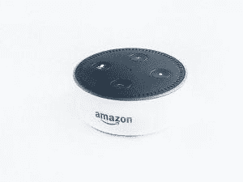
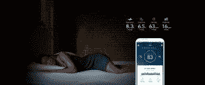

# 为什么我让我的家保持沉默:监视的特洛伊木马

> 原文：<https://medium.com/geekculture/why-i-keep-my-home-dumb-the-trojan-horse-of-surveillance-645fa6a54a6b?source=collection_archive---------33----------------------->

# 监控的特洛伊木马

如果你重视你的自由，考虑让你的家保持“沉默”。 智能设备风靡一时，但物联网(IoT)的隐私政策揭示了它们的真实面目——监控的特洛伊木马。

> 旨在摧毁我们的家园和身体的避难所。

小玩意很有趣，很神奇，它们节省时间和金钱，它们让我们看起来很酷，它们甚至有助于养成好习惯！不喜欢什么？

关于特洛伊战争的古希腊神话是一个警示故事。在这个故事中，围攻独立城市特洛伊的希腊人设计了一个巧妙的计划来突破它的防线。他们做了一匹巨大的木马，作为礼物送给了这座城市。一旦特洛伊木马在城墙内，士兵从里面出现并打开城门。特洛伊被摧毁了。

从那时起，[“特洛伊木马”](https://en.wikipedia.org/wiki/Trojan_Horse)就意味着**任何使目标主动邀请敌人进入受保护地方的阴谋。**

特洛伊木马是一个“免费”的礼物，但代价高昂。今天，我们花高价购买“智能”设备，并邀请监控特洛伊木马进入我们家的避难所。一旦它们进入我们的生活，我们需要准备好迎接隐藏在其中的算法精神控制军队的攻击。

> 隐私政策实际上是监视政策。

他们的战斗口号"*我们致力于保护您的隐私！*”是一个谎言:作为一家企业，他们**致力于监控利润，只有在没有隐私的情况下才有可能。**

社会困境纪录片[中的《监控资本主义时代》的作者 Shoshana Zuboff 将物联网称为监控资本主义的供应路线，其目标是将人类经验转化为预测和操纵人类行为的产品。这些预测产品然后被出售给真正的客户——广告商或任何试图控制我们思想的人。](https://www.humanetech.com/the-social-dilemma)

**智能家居物品是实现这一目标的完美双向工具:**

> *拉:*他们向科技公司提供行为数据。
> *推:*他们充当行为修正的代理人。

Image from [TechDetoxBox.com](http://www.techdetoxbox.com)

## **行为数据有两种用途:**

1.  ***再投资于用户体验*** 以改进产品。我们买的时候就是这么假设的。
2.  ***喂给机器智能*** 来制造用户行为预测出售。 ***我们没有报名参加这个。***

技术大师们向我们承诺，未来互联网将消失在背景中，成为日常生活中不可或缺的一部分。每样东西都会被连接起来:我们的家具，我们的衣服，我们的食物，我们的身体。

> 我们使用的一切都将监视我们——并在我们意识之外操纵我们的行为。

为了隐藏联网设备的真正目的，我们的注意力被转移到了它们的好处上，而我们隐私的巨大成本则隐藏在没人阅读的隐私政策的小字中。

即使我们真的读了，也没什么区别。**没有“拒绝”按钮。**如果您不接受监控，产品根本无法工作:基本功能受制于监控收入。

毫无疑问，智能设备提供了很多价值。不幸的是，他们的效用是魔鬼的交易。

> 你必须用你的灵魂来支付，这将被挖掘到你生命的最深处。

便利和隐私之间的权衡是真实的。我们有用的小工具收集的数据到底发生了什么？

## 我通读了几条“隐私”政策。这是我的发现。

# Fitbit

Image by shane on unsplash

在自愿将这些跟踪设备绑在自己身上后，人类不再是自由活动的动物。从那一刻起，我们的行为，动作，呼吸，心率，睡眠，甚至月经周期都属于大他者。

2019 年，Fitbit 被谷歌收购。《监督资本主义》的作者警告我们，这种收购背后的原因是为行为数据建立新的供应渠道——健康数据是最有价值的一种。结合谷歌已经知道的一切，健康数据的商业使用是不可避免的——除非它被定为非法。

## **他们知道什么？**

*   您的姓名、电子邮件、密码、出生日期、性别、身高、体重、电话号码、个人资料照片、个人简介、国家、用户名、您的食物、睡眠、饮水和女性健康日志；您在 Fitbit 网络中的信息内容、您与教练一起记录的计划、目标和行动、您的日历事件、您的步数、您的跑步距离、消耗的卡路里、心率、睡眠阶段、活动分钟数、精确的地理位置数据、您的网络活动以及您用来访问 Fitbit 的所有设备。
*   还有:“如果你连接到脸书或谷歌，我们可能会收到你的名字，个人资料图片，年龄范围，语言，电子邮件地址和朋友名单等信息。”
*   雇主和保险公司也与 Fitbit 共享您的数据，以“确定您是否有资格享受折扣”。

## 不包括隐私

*   有很多人见证了你的锻炼制度:Fitbit 邀请他们“推广我们认为你会感兴趣的新功能或产品”，并将“信息传递给我们的企业附属机构、服务提供商和其他合作伙伴”。
*   Fitbit 通过你所有设备上的定向广告找到你:它与“为我们提供分析和广告服务的合作伙伴”合作，提供“互联网上的广告”。
*   当您参加挑战或雇主健康计划时，您的数据将公开，任何人都可以看到。
*   如果你计划犯罪，确保你和你的受害者都没有佩戴 Fitbit:该公司可能“为了遵守法律而披露你的信息”。Fitbit 数据已经导致谋杀定罪。

事实上，在佩戴 Fitbit 的同时，更安全的做法是不考虑任何不当行为。假设你的 Fitbit 记录的一切都可能会被用来对付你。即使个人身份信息不应该落入第三方之手，通过适当的法律压力或分析工具，它也可以追溯到个人用户——你和我。[将活动数据用于伤害或残疾法律案件的潜力](https://theconversation.com/how-your-fitbit-data-can-and-will-be-used-against-you-in-a-court-of-law-34580)是无限的。

来自 Fitbit、Apple Watch 等可穿戴设备的生活方式信息受到保险公司的热切追捧，以获得“更准确的承保和新的定价模式”。

> *如果我每天去跑步，我的医疗保险会打折。如果你的 Fitbit 位置显示你午餐时间在麦当劳，你的保费就会提高。*

这就是事情的发展方向。谷歌会决定。

[阅读 Fitbit“隐私”政策](https://www.fitbit.com/global/us/legal/privacy-policy)

# 嵌套学习恒温器

Image by dan lefebvre on unsplash

Nest 属于谷歌，如果你用谷歌账户使用其产品，适用的不仅仅是 Nest，还有谷歌隐私政策。这是一个雾和镜子的迷宫。"通过使用 Nest 产品，您同意允许我们收集和处理信息."不，我们没有。我们购买产品是为了使用它，而不是被它使用——但谷歌声明不同。

## 他们知道什么？

*   谷歌从你的谷歌账户中已经知道的关于你的一切:你是谁，你住在哪里，你的实时活动，你的兴趣，你的电子邮件内容，你的通讯录，你的整个搜索历史，等等。
*   Nest 收集的数据:您的 WiFi 密码、地址或邮政编码、电子邮件、来自传感器的环境数据(温度、湿度、光线)、加热和冷却使用情况、您的 HVAC 系统功能、您下载应用程序后的电话信息、您的位置、您使用任何 Nest 服务时的互联网活动。
*   来自 Google 的数据+来自 Nest 的数据=你的详细资料。

## 不包括隐私

*   当你在家调节温度时，Nest 会感应到:这意味着谷歌知道你的日程安排，可以对你的下一步行动做出假设。
*   Nest 应用程序可以监控你的手机位置，即使你远离恒温器也能了解你的习惯:该功能被称为 Home/Away Assist。
*   家庭成员可以拥有管理 Nest 的个人账户，这意味着他们所有的手机都可以被实时跟踪。
*   Nest 数据以定向广告的形式返回给你:“为了我们和第三方的合法利益”，“帮助我们做出销售、营销和商业决策。”
*   Nest 与“有兴趣提供需求响应服务或其他激励计划的合作伙伴”共享信息。你的能源使用数据被卖给你的公用事业公司，也卖给他们的竞争对手。
*   Nest 向用户保证，他们“会采取措施防止非个人信息与你相关联”，但如果算法工具正确，匿名数据可能会被追踪到真实的个人和地址。
*   Nest 数据[可与执法部门](https://www.forbes.com/sites/thomasbrewster/2018/10/13/smart-home-surveillance-governments-tell-googles-nest-to-hand-over-data-300-times/)共享:公司不能合法拒绝，你对此没有发言权。你信任政府吗？
*   保险公司一直渴望得到 Nest 的数据，他们也得到了。 [Nest 正与家庭保险公司](https://www.digitalinsuranceagenda.com/9/nest-labs-creating-a-home-thats-better-than-smart/)合作，“帮助人们在省钱的同时保持安全”。Nest 产品所有者可以享受房屋保险折扣——这很好。

> 你能想象一个场景，当你的保险公司拒绝支付基于 Nest 传感器读数的索赔，而不是基于你说的话？

*   如果你买了一个带摄像头的 Nest 产品，那就更令人毛骨悚然了——这些产品收集音频、视频，并将面部识别技术应用于拜访你家的人。甚至谷歌高管也承认，你应该警告你的客人他们正在被录像。隐私政策警告说，有些人可能会生气，你可能需要从那些访问你家的人那里收集法律同意书。这在现实中应该是什么样子，谷歌没有澄清——猜猜谁会出现在你家门口，并提前给他们送去文件？
*   如果你有多个嵌套产品相互连接，它们之间共享信息——以及与任何可以访问系统的人共享信息。
*   这种访问是出售的:Works with Nest program 向第三方开发者提供 Nest 设备的访问权限，包括敏感信息，如您的住宅何时被设置为“离开”，或摄像机镜头。你不认识的人知道你不在家。

> 你不认识的人可以通过你的安全摄像头看到你的孩子。

*   当您的信息与这些第三方共享时，Google 会指示您阅读他们的隐私政策，以了解他们的监视做法。伦敦大学的法律学者总结道[购买一个 Nest 产品会让用户签订近千个这样的“合同”](https://papers.ssrn.com/sol3/papers.cfm?abstract_id=2725913)。

选择不进行监控会损害 Nest 产品的功能。后果可能是可怕的:冰冻的管道、失灵的一氧化碳和火灾报警器、被黑的安全系统。这家公用事业公司受到了监视。

Nest 木马家族正在迅速壮大:它与 Google Home 的一切都融为一体，包括视频门铃、报警系统、锁、室内摄像头、音频助手、流式显示屏、灯、烟雾探测器、WiFi 等。有一个完整的智能家居产品生态系统与 Nest 集成。

> 如果你没注意到的话，谷歌搬来和你一起住了。

[阅巢“隐私”声明](https://nest.com/legal/privacy-statement-for-nest-products-and-services/)
[阅谷歌(31 页)“隐私”政策](https://www.gstatic.com/policies/privacy/pdf/20210204/3jla0xz1/google_privacy_policy_en_us.pdf)

# 亚马逊的 Alexa 语音助手

Image by rahul chakraborty on unsplash

你应该让 Alexa 进入你的家吗？在目睹我们的孩子在 Alexa 的帮助下在他们的堂兄弟家做数学作业后，我们决定不做。

## 他们知道什么？

*   亚马逊的 Echo 可以捕捉到房间里的每一个声音。它总是在倾听。
*   它知道你的名字、地址、电子邮件、昵称、电话号码、你的工作、信用卡信息、你的家庭成员和你的地址簿。
*   它会跟踪你的 IP 地址，你访问的每个网页，你使用 Alexa 服务的设备，以及你来自第三方的互联网数据，包括你的社交媒体活动。
*   Alexa 知道你在搜索什么，听什么，或者发送什么。从你的活动中，你的行为和个性的详细轮廓浮现出来。
*   为了追踪你，Alexa 会“目前使用谷歌的第三方像素和 cookies。请直接联系谷歌了解更多关于其隐私做法的信息”(记住，那是另外 31 页)。
*   有一种猜测认为，亚马逊可以开始跟踪我们通过 Alexa 要求的健康信息，有效地建立用户病史的档案。

## 不包括隐私

*   **监视是默认选项。**亚马逊自动存储 Echo 的所有录音，除非你选择退出或删除它们。
*   Alexa 将你交给广告商:它与“广告合作伙伴合作，向你展示基于兴趣的广告”，基于“你的互动”。通过 Echo 和你使用的任何其他设备。如果您点击，客户信息将与该“合作伙伴”共享。
*   他们为向你出售的特权付费:Alexa 可以让“第三方提供的服务、产品或应用程序可供你使用”。
*   它了解你的朋友和家人，并有可能影响你的整个社交网络。共享您的联系人允许 Alexa 使用您的语音命令发送信息和电子邮件。
*   亚马逊不仅听你的，它还能看到你:后来的 Echo 型号带有摄像头。[自然语言处理](https://en.wikipedia.org/wiki/Natural_language_processing)已经让它洞察你内心深处的感受和不安全感。考虑到[面部识别技术](https://en.wikipedia.org/wiki/Facial_recognition_system)，它现在可以看着家里的每一个人，知道他们在做什么、感觉和计划。嘿，这可能是一个特点:永远知道你的妻子在想什么，只是不要告诉她怎么想的！
*   像 Nest 设备一样，亚马逊的 Alexa 与许多第三方开发商合作，这些开发商可以访问你的数据，并让他们的智能家居产品显示一个自豪的标签“与 Alexa 配合使用”。Alexa 技术已经与数千个物联网对象集成在一起。
*   你在家里当着 Alexa 的面说的任何话都将成为呈堂证供。在某些情况下， [Alexa 的录音已经移交给当局](https://www.wired.com/2017/02/murder-case-tests-alexas-devotion-privacy/)。
*   Alexa 存储的大量人类经验是大企业、大政府或黑客攫取的诱人财富。
*   通过 Alexa 进行大规模监控对于对付任何形式的政治反对派都非常有用。
*   根据任何隐私政策，没有绝对安全的数据。[数据安全漏洞导致个人信息暴露](https://www.theguardian.com/technology/2019/oct/09/alexa-are-you-invading-my-privacy-the-dark-side-of-our-voice-assistants)亚马逊道歉。

Alexa 只是最知名的语音助手——还有谷歌、苹果的 Siri、微软的 Cortana、三星的 bix by——都在追逐同一个奖项:人类体验。

> 目标是无处不在的人工智能声音，命令你的整个生活。

它更清楚你应该买什么，做什么，你应该如何投票，你应该去哪里度假，你应该想什么，感觉什么。它与“值得信赖的合作伙伴”合作，用他们的广告费来支持它的推荐。从你手中拿走所有的决定权。

[阅读亚马逊的“隐私”声明](https://www.amazon.com/gp/help/customer/display.html?nodeId=GX7NJQ4ZB8MHFRNJ)

# Roomba iRobot 真空吸尘器

谷歌用谷歌地图和谷歌地球绘制了整个外部世界，**你的客厅就是下一个。**谷歌长期以来的梦想是绘制每个家庭的内部地图——这样就没有躲避无所不知的眼睛的避难所。Roomba vacuum 非常适合这样的任务。

该公司的首席执行官无意中透露，Roomba vacuum 收集的私人住宅平面图可以出售给第三方，这引起了轰动。在强烈反对后，声明被修改为他们只打算“在客户同意的情况下免费共享它们”。

可能性是诱人的。广告商可能会建议在吸尘器探测到的空白处放一张咖啡桌。机器人知道谁住在家里，家庭有多富裕，每个人的习惯和日常生活是什么。它知道你在哪里工作，你的孩子在哪里睡觉。私人生活方式信息的商业用途是一座金矿。

他们需要做的只是让你点击“我同意”隐私政策，以获得所谓的“知情同意”。

## 他们知道什么？

*   您的姓名、电子邮件地址、用户名和密码、地址、账单信息、电话号码以及您拥有的机器人。
*   您的社交网络个人资料信息和互动，如“喜欢”或“关注”这些数据“取决于你在社交网络上的隐私设置”。翻译:脸书知道你的一切，你的吸尘器也知道。
*   关于机器人部署环境的信息:你家的地图、平面图、物体的存在和类型(使用摄像机检测)——椅子、桌子、冰箱等。、“房间名称”和“区域名称”、连接到本地网络的 Wi-Fi 设备的位置以及 Wi-Fi 热点图。
*   生活方式信息，如您的休闲和其他兴趣、子女数量和宠物数量、家庭环境信息以及您的收入。
*   手机上智能家居应用的名称和应用 id。
*   您在网站或应用程序上执行的每个操作，以及您访问它的位置。
*   您手机上的 iRobot 应用程序会收集设备数据、IP 地址、设备类型、设备名称、标识符、序列号、产品代码、网络带宽使用情况以及设备在家中或附近的位置。没错——**你的吸尘器随时知道你在地球上的位置**。
*   **来自你家内部的图像和视频:**“我们会在你的机器人上收集图像。我们可能会将视频流式传输到您通过设备选择的合作伙伴应用程序”。别担心，他们说你家里所有东西的照片和视频都不会被保存。我们必须相信他们。以及其他合作伙伴的应用程序。

## 不包括隐私

*   交叉销售:因为“我们的合法利益”而获取您的数据。其中包括“为我们的直接营销提供信息”，以及开发“您可能感兴趣的产品和服务”。
*   你的 vacuum 可能还没有向你播放广告，但它会通过你的脸书订阅源播放广告:“我们允许第三方在线广告网络、社交媒体公司和其他第三方服务收集你使用我们网站和应用程序的信息，以便他们可以在我们的网站、其他网站、你可能使用的应用程序或服务以及你可能使用的其他设备上播放或显示广告。”
*   你的吸尘器需要同伴的监视设备。iRobot 应用程序将您的帐户与“智能家居合作伙伴”连接，以“扫描您的设备上的智能家居应用程序，以便建议智能家居连接并优先考虑未来的智能家居自动化合作伙伴。”越多越好
*   通过 iRobot Beta 计划，未来由伪装成真空的机器人进行监视的机会是可行的，“实现额外的实验机器人和/或应用程序功能”。
*   追踪你的手机位置可以让 iRobot 的监控基础设施为你提供“个性化服务”,无论你在哪里。他们“收集您用于连接我们服务的电脑、平板电脑、智能手机或其他电子设备的信息。”我的笔记本电脑和吸尘器有什么关系？！“合法利益”又来了:“即告知我们的直销”。
*   像往常一样，“我们保留修改本隐私政策的权利”，以单方面实施未来的监控。
*   该机器人可以与谷歌家居集成，让谷歌和其他 ***可以直接看到你的客厅和你家的确切平面图。***

真空吸尘器在没有监控的情况下能工作吗？是的，但是他们没有使它变得明显。隐私政策的深层内容是这样的:“我们可以在没有 Wi-Fi 或蓝牙数据传输的情况下使用我们的智能技术机器人，只需将你的 Wi-Fi 或蓝牙与机器人断开连接，或者根本不连接。您也可以通过应用程序中的设置选择不将地图数据传输给我们”。

[阅读 iRobot“隐私”政策](https://www.irobot.com/legal/privacy-policy)

# 睡眠号床

Sleep Number bed 在 2018 年成为可耻的头条新闻，当时一些用户根据其隐私政策认为[床会记录你卧室的每一个声音](https://gizmodo.com/sleep-number-denies-recording-users-in-their-beds-call-1830775153)。
Sleep Number 急忙澄清，只有一款已经停售的手机有语音指令功能。不管有没有麦克风，这张床都有强大的生物传感器，可以让**一些不知名的人收听你的睡眠和性生活。**

> 下一个合乎逻辑的步骤是提供“相关”广告来改善它。

## 他们知道什么？

*   个人信息:姓名、地址、电子邮件、IP 地址、互联网活动、时区、您手机的地理位置、WiFi 访问以及从第三方获得的数据，“如公共或政府数据库、社交媒体平台和联合营销合作伙伴”。
*   生活方式信息:每日咖啡因摄入量、饮食、锻炼、看电视、媒体使用和药物。
*   床和它的 app 收集的 SleepIQ 生物特征数据:睡眠模式、心率、呼吸频率、在床上的时间和运动。
*   人口统计数据:年龄、性别、健康状况、活动细节、日常活动和偏好。
*   个人数据+生物特征数据+人口统计数据=详细个人资料。

## 不包括隐私

*   **你的卧室习惯与一长串“合作伙伴”分享**，包括那些“帮助我们为你提供量身定制的广告内容”的人。
*   如果你不想被跟踪呢？“因为目前还没有识别或遵守 DNT(请勿追踪)信号的行业标准，所以我们暂时不做回应。”
*   这种床在欧洲没有销售，因为欧洲的数据隐私法对于一种如此具有侵犯性的产品来说过于严格。
*   你可以选择打开隐私模式，将数据保存在本地设备上，但“某些功能，如获取 SleepIQ 分数，将无法使用”。
*   个人信息可以与当局共享，或者在合并或收购的情况下转移。
*   如果您停用帐户，睡眠号码将继续使用您的个人数据。目前，只有加州居民有权要求删除数据。
*   你的信息的安全性是“认真对待的”，但是…“没有一个数据传输或存储系统能保证 100%安全”。
*   如果你为你的孩子创建一个档案呢？Sleep Number 采取“合理措施，仅向有能力维护其机密性和安全性的各方发布此类信息”。不管那是什么意思。
*   为了确保将来可以添加新的监控功能，“我们保留随时更改本隐私政策条款的权利”。

即使在顾客吓坏后，床上没有隐藏的麦克风，同样的顾客[在晚上把他们的手机放在他们的床边](https://www.techdetoxbox.com/screen-time-problems/screen-time-and-childrens-sleep/)——麦克风可以被访问或黑客攻击……只是一个想法。

[阅读(16 页)SleepNumber 床的“隐私”政策](https://www.sleepnumber.com/pdfs/Privacy_Policy_Print_Version.pdf)

# 我们的手机

当然，你的智能手机是终极的“互联网产品”。它知道你的一切，它和你一起去任何地方。你在上面安装的每个应用程序都有可能访问高度私人的信息，获取你的位置、联系人、麦克风和摄像头。有了这些知识，手机会带着[潜意识行为广告](https://www.techdetoxbox.com/weapons-of-digital-manipulation/algorithm-of-you-how-ai-programs-human-behavior/)——带着来自苹果和谷歌的全部祝福，回到你身边。

有关您的信息在整个监控领域共享，目的是为了获取利润，正如我们所见，当局可能会利用这些信息来对付您。苹果公司的政策规定:“如果我们认为出于国家安全、执法或其他公共重要问题的目的，披露您的信息是必要或适当的，我们可以披露您的信息。”

# 有地方躲吗？

看完监控政策后，我决定让我们的家保持沉默。我们调节我们自己的温度，用吸尘器打扫我们自己的地板，用钥匙打开我们的锁，并且只与实际的人类交谈——而不是与 Alexa、谷歌、Cortana 和 Siri 交谈。我们没有“智能家居”设备，只有最基本的电脑和手机。在这些网站上，我会确保进入隐私设置，关闭我能找到的所有追踪功能。

> 默认的隐私设置从来不会对我们有利。

他们很可能会收集我的数据，嘲笑我的天真，但至少我行使了我的自由意志说不。

这些“隐私”政策只是冰山一角。随着时间的推移，监视将变得更加普遍。将会有更多的“东西”注视着我们，被公司和政府作为默认选项强加给我们。我们对监控技术唯一拥有的权力就是不使用它。

## 我选择做一个自由放养的人类。

[TechDetox 妈妈](https://www.techdetoxbox.com/mission-screentime-children-wellbeing/)发现自己的孩子在[接受令人上瘾的技术](https://www.techdetoxbox.com/screen-time-problems/)并决定反击。

她对技术和心理之间的[关系的研究](https://www.techdetoxbox.com/weapons-of-digital-manipulation/)试图揭示数字行为操纵如何影响人类福祉。

她在她的博客[TechDetoxBox.com](https://www.techdetoxbox.com/)上写道，要找到[解决方案](https://www.techdetoxbox.com/digital-wellbeing/)来保护我们的家庭，恢复我们的人性。