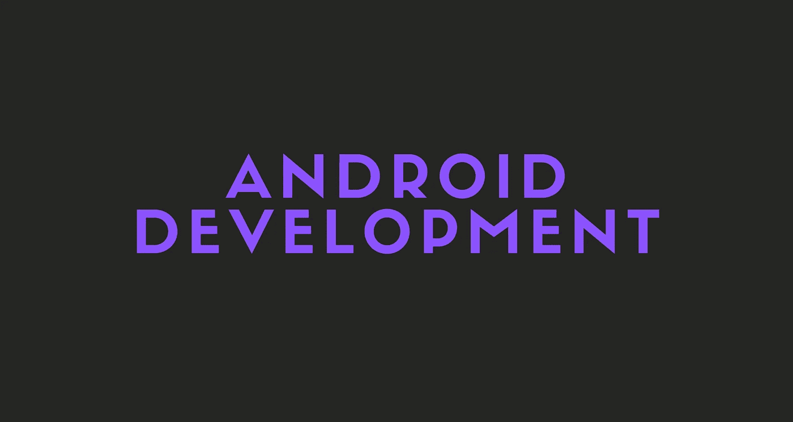

# 为什么我离开 Android 开发，为什么我现在又回来了

> 原文：<https://medium.com/geekculture/why-i-left-android-development-and-why-im-returning-back-now-e4d9d688bb33?source=collection_archive---------5----------------------->

Android 以前很无聊，很复杂。嗯，不再是了。

在这个故事中，我将谈论为什么我一年前离开了 Android 开发，为什么我现在又回来了。我还会谈到你是否应该作为一名网络开发人员去尝试一下。

## 注意

回国不代表我不会再做网页开发了。我也会做 Android 开发。

开始吧！

# 我为什么离开

看，那时 Android 开发并不那么有趣。我是说，当然，还不算太糟，但也不算太好。

我厌倦了一遍又一遍地重复同样的事情，花更多的时间在 native 上，而我可以在更短的时间内在 Flutter 或 React Native 上为 Android 和 iOS 构建相同的应用程序。

所以我决定离开。我开始学习网页开发，真的很有趣。通过学习 JavaScript，我还可以使用 React Native 并构建移动应用程序。

# 为什么我现在回来了

尽管我真的很喜欢 web 开发，但在内心深处，我仍然热爱 Android 开发。

我等了将近一年，观察谷歌添加到 Android 框架中的所有东西。与此同时，JetBrains 还为 Kotlin 添加了许多新东西。他们发布了类似 Ktor 的东西，我们可以用它来制作网络服务器。

所有这些更新都很酷也很有趣，是的，但是仍然缺少一点。构建原生 Android 应用程序的更好、更有趣的方式。

你猜怎么着，谷歌做到了。

他们发布了 Jetpack Compose 并改进了现有的 Jetpack 库，还更新了 API，使它们变得更加容易和有趣。

现在，随着 Android 11 和 Android 12 的发布，Android API 中增加了更多的功能，使平台更加有趣。

他们还更新了他们的网站，使它们看起来更好，并有许多新功能，使阅读文档更容易。

哦，顺便说一下，Kotlin 也获得了多平台支持。您现在几乎不需要额外的代码就可以构建原生的 Android 和 iOS 应用程序！

# 新功能

我不会在这里谈论所有新增的功能。不过，我可以给你举一两个例子。

对我来说，最重要的功能是 Jetpack Compose。简直太棒了。想象一下使用 Kotlin 构建原生 Android 应用程序，但语法类似于 Flutter。是的，这就是 Jetpack Compose。

它基本上让你仍然使用相同的 Android 框架和相同的背景，但是你现在可以使用 Kotlin 直接在视图中编写 UI，而不是创建几十个 XML 视图。

来自 Google 的 Android Compose 教程的示例代码片段。

很酷不是吗？

基本上，您可以创建可组合的函数，并在任何需要的地方使用它们。

您甚至可以在代码编辑器中预览它。

我是说，这多棒啊！

# 你应该尝试 Android 开发吗？

是的。只要确保只遵循更新和新的在线文档和教程。

我是说，你没什么可失去的。即使你决定它不适合你，你至少会知道并有一点点 Android 开发的经验。

我会说这是值得的。

# 最后的想法

我只是喜欢新的 Android 功能，我想继续做 Android 开发。我绝对推荐尝试一下。

希望这个故事对你有帮助。我很想知道你是否已经决定尝试 Android 开发！

# 仅此而已。感谢您阅读这个故事！

如果你喜欢这个故事，一定要为它鼓掌！你想问我什么都可以。

在 Twitter 上关注我:

 [## re _ ally 边缘

twitter.com](https://twitter.com/Re_allyedge) 

在 Patreon 上支持我:

 [## 阿里木阿尔斯兰卡亚是创造编程故事和教程。帕特里翁

### 今天就成为阿里木阿尔斯兰卡亚的赞助人:在世界上最大的…

www.patreon.com](https://www.patreon.com/allyedge)