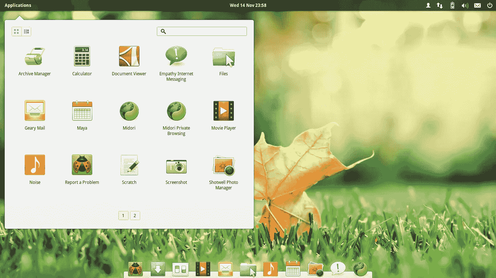

# 为什么我在 4 年后放弃了 Linux

> 原文：<https://medium.com/geekculture/why-i-quit-linux-as-a-creative-after-4-years-965944ffb68f?source=collection_archive---------6----------------------->

## 它打击了我的生产力，阻碍了我的梦想

Image by [Ajubola Okubanjo](https://www.flickr.com/photos/okubax/8186005379/in/photolist-dtnqcM-iEQgnE-XoSpz3-eJNJS8-bjH5A6-ep4Mev-dWMy77-5RSALp-n86cJM-6fF9C-5oEGSU-82g78W-9conTV-4L2V1X-8m6yua-7bwTL-aXvmHF-cXM51N-iNMUVR-fACQTb-fAoyq8-sp8LaZ-fAoyrr-fACQS9-4pEtp8-fACQSs-fAoyr4-fACQSW-7iTWNw-q2C7TJ-qYLCep-oZaKMR-dRqcAk-fsKsuu-e5D3Jv-5WGxVX-en9Nbx-oiGYFL-5NGTu4-5NGTRK-bqrX5U-sp8L8p-myZRVj-soYbmw-NNL4Ke-f7ZtRv-s7FbLX-soYbk9-smQEZ5-oHHaMB) on Flickr / CC-2.0

我作为一名 Linux 用户开始了我的写作生涯。我最持久的生产力技巧是在 Linux 中打造的，十多年后我仍在使用。

多亏了 Linux，我免费试用了许多类型的写作软件。这最终让我找到了一个适合我的系统。