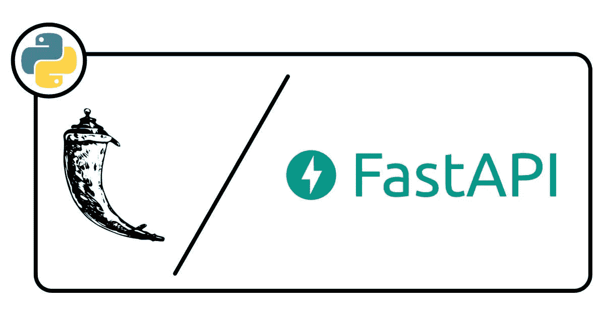

# 为什么我(有时)从 Flask 切换到 FastAPI

> 原文：<https://medium.com/geekculture/why-i-sometimes-switch-from-flask-to-fastapi-2c08c4138c9a?source=collection_archive---------3----------------------->

## 能否获得快速、安全、易读的 Python REST APIs？是的，但不是用烧瓶！

在现代 web 开发中，我们充斥着如此多的前端和后端工具，以至于在开始一个新项目时很难选择一个。当前端框架之战每天都在激烈进行时，另一场战斗正在…