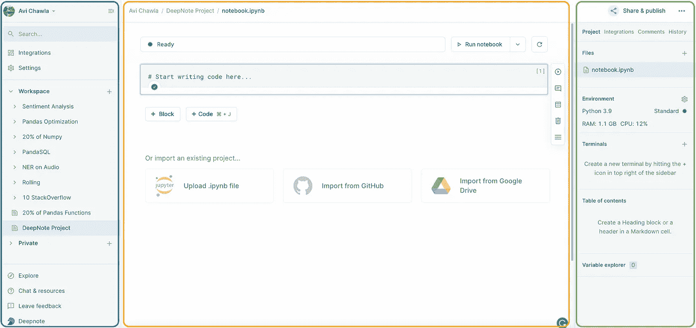
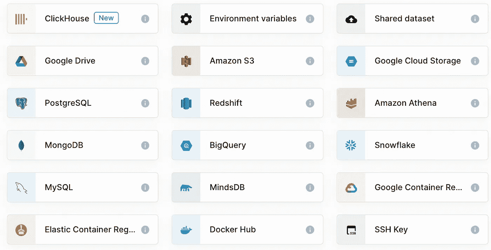
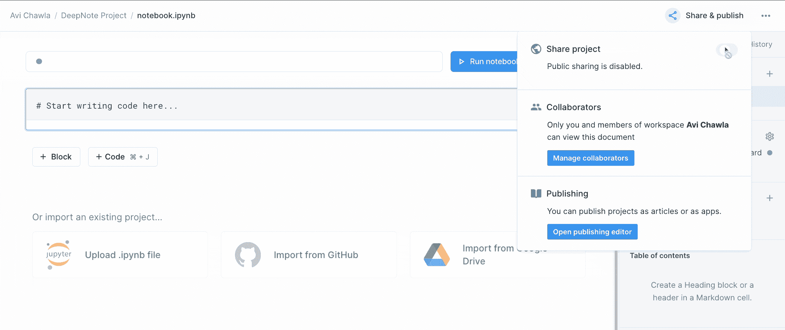
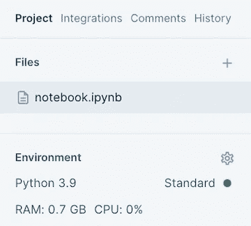
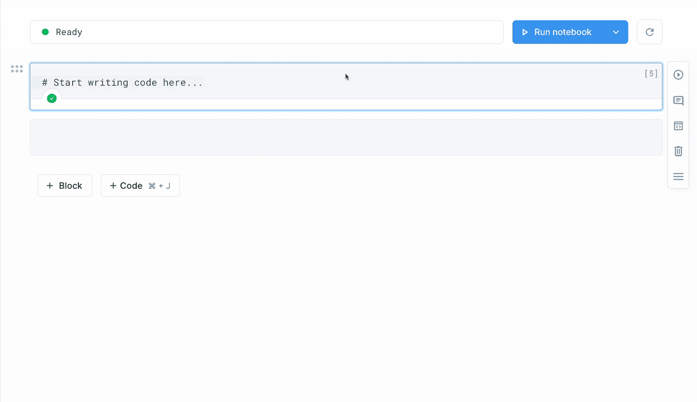
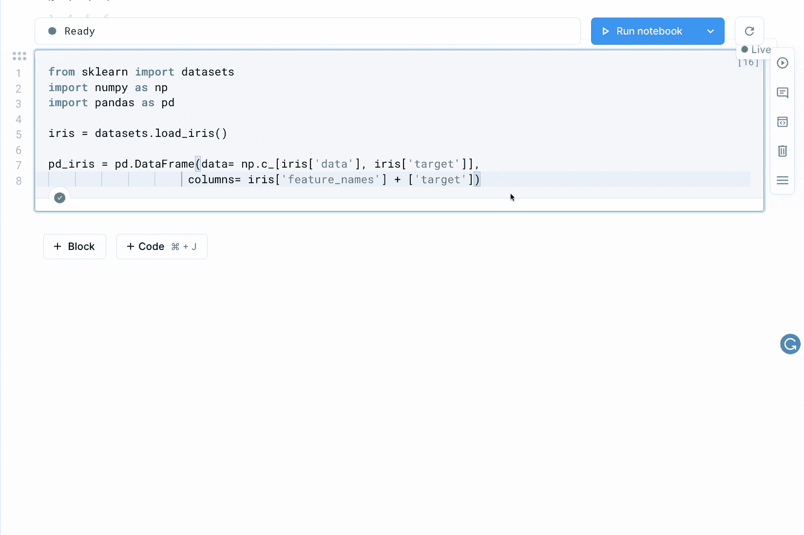
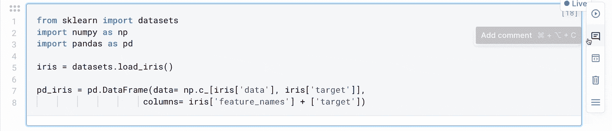
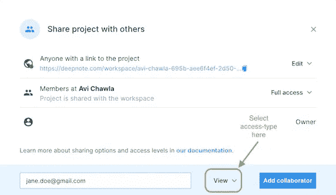
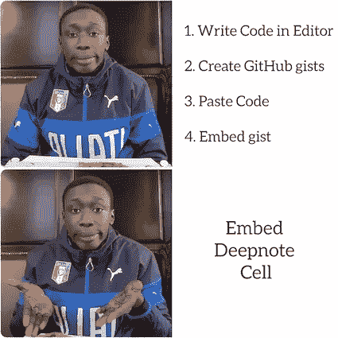

# 为什么我停止使用 Jupyter 笔记本，为什么你也应该停止使用

> 原文：<https://medium.com/geekculture/why-i-stopped-using-jupyter-notebook-and-why-you-should-too-f5a3b00e90a6?source=collection_archive---------0----------------------->

## 探究 Jupyter 笔记本的缺点及其替代方案


Photo by [Jim Wilson](https://unsplash.com/@wilsonjim?utm_source=medium&utm_medium=referral) on [Unsplash](https://unsplash.com?utm_source=medium&utm_medium=referral)

多年来，Jupyter 笔记本一直是众多数据科学工作流不可或缺的工具。这些包括执行数据挖掘、分析、处理、建模，以及在每个数据科学项目的生命周期中执行的日常实验任务。


Jupyter (Image by Author)

尽管它很受欢迎，但许多数据科学家也指出了它的众多缺点，例如这里的和这里的。

像 Jupyter 一样，Deepnote 也是一个数据科学笔记本，旨在高效地为个人和团队提供所有数据科学任务，同时解决 Jupyter 的深刻警告。

如果你最近一直关注我的博客，你应该已经注意到我在所有项目中都使用 Deepnote，它为我简化了整个数据生态系统。

因此，这篇文章是对 Deepnote 的介绍，以及在我看来是什么让它成为革命性的数据科学笔记本。文章的亮点提到如下:

[**入门**](#fffb)[**先看看笔记本**](#8a3f)[**Jupyter vs Deepnote**](#a2f5)[**最终想法**](#2ec3)

我们开始吧🚀！

# 入门指南

要使用 Deepnote，你应该创建一个[账户](https://deepnote.com/sign-up)(这是免费的)。登录后，通过`Create new → New project`创建一个笔记本，这将打开一个笔记本，如下图所示:



The Deepnote Notebook (Image by author)

# 第一眼看笔记本

为了方便起见，我将笔记本分为三个区域——分别用蓝色、橙色和绿色的方框包围。

*   您将在左侧的**工作区**部分看到您已有的项目(蓝色区域)。最近，我一直在 Deepnote 上尝试我所有的中型博客，该部分列出了我创建的所有笔记本。
*   数据是每个数据科学项目最突出的需求。左侧的**集成**允许您连接到各种数据源，并在您的管道中利用它们。目前支持的集成有:



The Deepnote integrations (Image by author).

您最有可能使用的一些集成包括:

```
**Shared Dataset:** This allows you to upload a dataset manually to their servers.**Google Drive:** Mount google drive to the notebook and use it seamlessly as you do with Google Colab.**Amazon S3:** Here, you can mount an Amazon S3 bucket and use it for I/O operations in the notebook.
```

*   橙色区域提供了编写代码和实验的空间。可以选择从三个来源上传现有代码，即`Jupyter Notebook`、`GitHub`和`Google Drive`。我将在这个博客的下一部分回到它的更多特性。
*   在顶部的绿色框中，有一个通过 URL 共享笔记本的选项— **消除了通过电子邮件、GitHub** 等共享代码的需要。下面，您可以看到 python 环境、内存利用率、终端和内容列表。这个笔记本运行的 Python 版本是`3.9`。

# Jupyter vs Deepnote

在讨论了笔记本界面的概述之后，让我们在各种参数上比较一下 Jupyter note 和 Deepnote。

我将在下面讨论的参数与个人和数据科学团队使用笔记本电脑的一些最常见的情况有关。这些是:

[](#9834)**[**【2】托管环境**](#aa6c)[**【3】代码嵌入**](#a17d)[**【4】数据可视化**](#31a6)
[](#bbb0)**

****下面我们就来一一讨论一下。****

## ****头号实时协作****

****你有多少次在电话中与同事共享屏幕来查找代码中的错误(或者不仅仅是错误，还解决了一般的问题)？我去过那里很多次，我相信你也去过。****

****Jupyter 笔记本虽然是数据科学家独自工作的优秀工具，但并不是团队协作的最佳选择，因为它们通常位于个人桌面上。****

****另一方面，Deepnote 允许你在同一个笔记本内进行协作。这个过程就像与您的团队成员共享链接一样简单，如下所示:****

********

****Steps to share a Deepnote Notebook (Gif by author).****

****步骤如下:`Share & Publish` → `Enable Sharing` → `Select Permission` → `Copy Link` → `Share`。搞定了。****

****与 Google Docs 类似，作为工作区所有者，您可以为每个潜在的协作者指定各种权限级别。这包括`view`、`execute`、`comment`、`edit`、`full access`。****

## ****排名第二的托管环境****

****在本地计算机上设置 conda 环境有时本身就是一个挑战。这变得令人不知所措，尤其是当您切换系统并且不得不重复这个过程时，引入了不必要的冗余。****

********

****The python environment running in Deepnote (Image by author)****

****Deepnote 负责安装模块和设置运行 python 的环境。因此，数据科学家可以利用其完全托管和托管的解决方案，而不必担心管理不同版本的 python。****

****除了 Python 之外，执行 SQL 查询也是 Deepnote 笔记本固有的支持。****

## ****#3 代码嵌入****

****我最喜欢的 Deepnote 特性之一是能够在我的博客中嵌入代码块。****

****代码块是编写一个高质量的博客来阐述编程概念不可或缺的一部分。由于 Jupyter 笔记本在本地运行，除了首先将代码复制到 GitHub 以创建 GitHub gists 并将其嵌入到博客中之外，基本上没有其他方法。****

********

****Steps to embed a Deepnote cell to a Blog (Gif by author).****

****Deepnote 允许你在一个地方试验和创建代码嵌入，消除了专门为此目的创建 GitHub gists 的需要。****

****此外，使用 GitHub gists，除了在 gist 本身中注释输出之外，您没有其他方法来显示代码的输出。而 Deepnote 单元格则允许你将三个选项，即嵌入`only code`、嵌入`only output`和嵌入`both code and output`。****

****从 Deepnote 创建的代码嵌入如下所示:****

## ****#4 数据可视化****

****探索性数据分析(EDA)是构建数据科学应用程序的重要一步，因为它们允许您从给定的数据中生成见解，这反过来有助于建立机器学习模型。****

****虽然 python 库像 Matplotlib，Seaborn，Plotly 等。，在这方面是很好的工具，他们的无代码替代方案在数据科学家中越来越受欢迎(阅读我下面的博客了解更多)。****

****[](https://blog.devgenius.io/goodbye-matplotlib-these-no-code-visualization-tools-are-your-new-friend-e16c1cbe56e2) [## 再见 Matplotlib！无代码可视化工具是你的新朋友

### 是时候消除代码了

blog.devgenius.io](https://blog.devgenius.io/goodbye-matplotlib-these-no-code-visualization-tools-are-your-new-friend-e16c1cbe56e2) 

Jupyter 笔记本本身不提供任何对给定数据执行 EDA 的方法，除非通过显式编写代码。虽然像 [Lux](https://pypi.org/project/lux-api/) 这样的开源库已经在这个方向上迈出了一步，为给定的数据自动生成可视化，但许多人(包括我)个人发现它生成的图没有任何用处，或者与手头的任务无关。

Deepnote 理解数据科学家的无代码偏好，并在笔记本本身中提供了一个可视化工具。为了理解这一点，我提供了 iris 数据集的可视化演示:



Steps to visualize the dataset (Gif by author)

如上所述，visualization 块允许您以与 python 库相同的方式生成洞察力，但是更有效，并且不需要任何代码。

## 团队的第五大工具

到目前为止，我在 Deepnote 上完成的所有项目都是单独进行的。然而，根据我的理解和经验，Deepnote 对于一群人或一组数据科学家一起工作有着巨大的效用，例如:

*   **通过评论反馈:**deep note 中的每个单元格都允许合作者留下评论，无需在消息应用和代码之间来回切换来提供反馈。



Commenting on a cell (Gif by author)

*   **代码开发跟踪:**通过访问开发人员的代码，经理和其他团队成员可以轻松地监控代码进度和开发生命周期。
*   **不需要代码托管服务:**由于 Deepnote 负责管理和处理你的代码，团队不需要将他们的编码管道推送到 GitHub、BitBucket 等工具上。—从而降低运营成本。
*   **Python 环境管理:**被管理和托管的一个额外好处是，组织不需要担心版本管理和系统更新。
*   **访问管理:**通常，在团队中工作时，不同的人根据他们的角色可能被授予不同的访问权限。Deepnote 使工作区所有者只需点击一个按钮，就可以更容易地在其团队成员中分配所有权或限制访问。头转向`Share & Publish` → `Collaborators` → `Manage Collaborators` → `Enter email and Select Access-type` → `Add Collaborator`。搞定了。



Access sharing panel (Image by author)**** 

# ****最后的想法****

****多年来，Jupyter 笔记本无疑一直是众多数据科学工作流的首选工具。****

****然而，随着我们开始利用高效系统进行团队协作，Jupyter 笔记本在大规模数据科学项目领域开始变得无能和过时。****

****这导致组织转向实用的解决方案，其中，由于上面讨论的几点，Deepnote 无疑是交易的破坏者。****

****虽然像 Google Colab 这样的替代品可能有用，但我个人不喜欢使用它，因为有限的使用限制和隐私问题。这主要是开发面向私有用户的应用程序的团队所关心的问题，这使得 Deepnote 成为一个值得探索的好选择。****

******感谢阅读！******

****[🧑‍💻**成为数据科学专业人士！获取包含 450 多个熊猫、NumPy 和 SQL 问题的免费数据科学掌握工具包。**](https://subscribepage.io/450q)****

****✉️ [**注册我的电子邮件列表**](/subscribe/@avi_chawla) 不要错过另一篇关于数据科学指南、技巧和提示、机器学习、SQL、Python 等的文章。Medium 会将我的下一篇文章直接发送到你的收件箱。****

********

****Khaby meme (Image by author)****