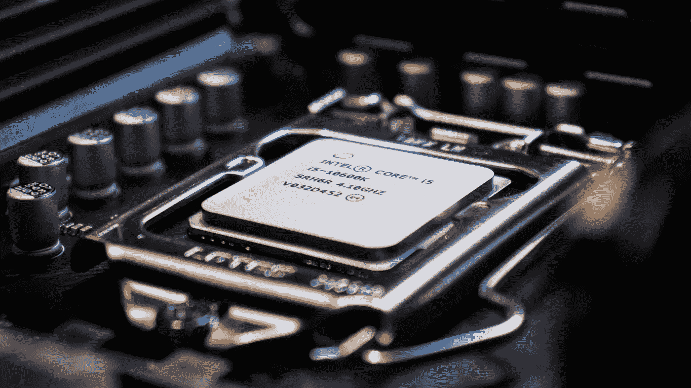
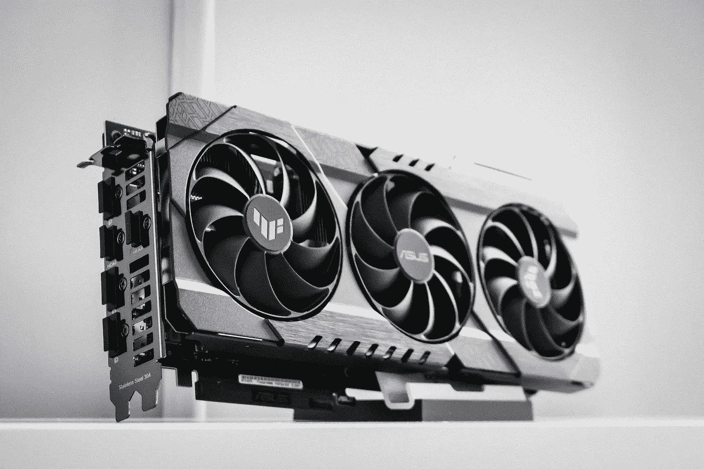
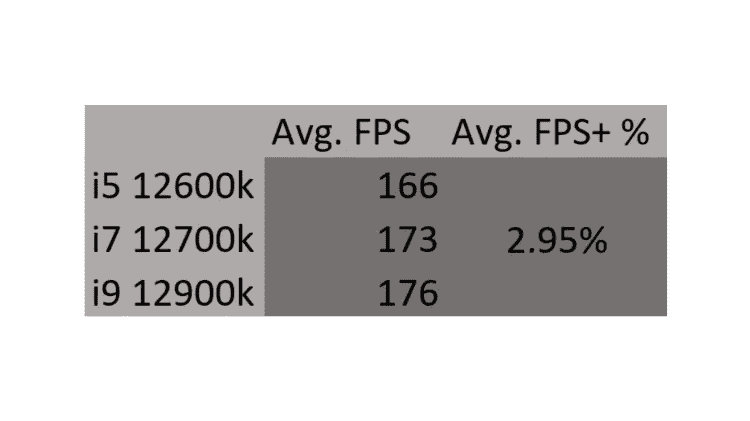
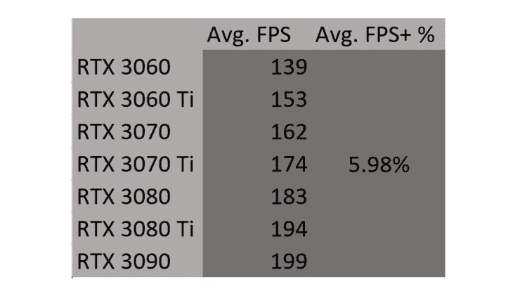

# 为什么我是一个白痴(为什么 GPU 是每个 PC 构建的焦点)

> 原文：<https://medium.com/geekculture/why-im-an-idiot-and-why-gpus-are-the-focus-of-every-pc-build-407baac4b0a?source=collection_archive---------16----------------------->

我开始写本周的博客文章，目的是证明*CPU 应该是你 PC 构建的重点，而不是 GPU*。通常，PC 制造商会为更好的 GPU 而不是更好的 CPU 支付额外的费用。我自作聪明地认为，与其额外花钱买一个更好的 GPU，不如额外花钱买 CPU。哦，天啊。我大错特错了。

但是尽管我的推理有误，我还是决定继续下去。我把我的帖子命名为“CPU 应该是你的 PC 构建的焦点，而不是 GPU”。我写了一篇介绍，并**对 CPU 和 GPU 上令人困惑的规范意味着什么做了大量的研究。写下相关信息后，我开始寻找 2 个 youtube 视频，这些视频用我想要比较的 CPU 和 GPU 跟踪了不同游戏的 FPS(i5 12600k，i7 12700k，i9 12900k，3060，3060 Ti，3070，3070 Ti，3080，3080 Ti，3090)。我从 CPU 类和 GPU 类(i3 12100，i9 12900KS，3050，3090 Ti)省略了最便宜和最贵的部分。我这样做是因为大多数电脑制造商不会选择最便宜或最贵的产品。**

现在你可能会奇怪我为什么选择英特尔和英伟达。目前，它们提供了最好的性价比，这就是我选择它们的原因。回到我彻底垮台的故事。

找到 youtube 视频后，我记下了所有的数据，**相信这些数据会支持我的假设**。在取每个 CPU 和 GPU 的平均 FPS 后，我发现从一个 GPU/CPU 到它的更高端兄弟的百分比增加。例如，我发现从 i5 到 i7 的 FPS 百分比增加，或者从 3060 Ti 到 3070 的 FPS 百分比增加。做完这些后，我取了所有百分比的平均值。而令我大为吃惊的是， ***我错了*** 。我投入了这么多时间和精力，却发现自己错了。我不知道该怎么办。我花了这么多时间来写这篇博文，结果却是 ***全错了。想了一会儿，我觉得我至少应该写点什么。所以我来了。写作。但是后来我有了一个好主意。如果我只是使用我刚刚收集的所有信息，而不是用它来支持 CPU，而是让它支持 GPU，会怎么样？所以我就这么做了。***

下面你会发现我的研究结果，下面你会发现当人们谈论 CPU 和 GPU 时那些奇怪的规范意味着什么。祝阅读愉快！:)

## 什么是 CPU？

CPU 或中央处理器接收输入数据，对其进行处理，并输出结果。换句话说，它是计算机的大脑。

CPU 负责在你的计算机上运行程序。如果没有 CPU，你将无法运行 windows、打开浏览器或观看你最喜欢的 Youtube 视频。

CPU 有核心。这些内核是 CPU 中进行计算/处理的部分。一个核心相当于一次做一个任务。因此，如果您有一个 8 核 CPU，该 CPU 可以同时执行多达 8 项任务。

CPU 也有线程。同步多线程或超线程会占用一个 CPU，并将其分成两个虚拟内核。这允许两个不同的信息流流入一个内核，使得处理时间比没有线程处理时快得多。

一些应用和程序充分利用线程，而其他应用和程序(通常是旧的应用或程序)更喜欢使用少量的内核。

GHz 最简单的定义是衡量 CPU 的速度。时钟速度越快(以 GHz 为单位)，CPU 就越快。存在基础时钟速度和提升时钟速度。基本时钟速度是 CPU 正常运行的速度。提升时钟速度是指 CPU 在繁重的工作负载下提高速度。

关于 CPU 是什么和它做什么有更多的信息，但是这些信息要么是不相关的，要么是不重要的。

因此，希望读完这篇文章后，你现在明白我说的锐龙 7 5800x 是一个 8 核 16 线程 CPU，基本时钟速度为 3.6 GHz，提升时钟速度为 4.7 GHz。

## 什么是 GPU？

GPU 或图形处理单元只是渲染图像、视频以及 2d 和 3d 动画。这释放了 CPU 去做其他事情。

有两种类型的 GPU:集成和离散。集成 GPU 位于您的 CPU 中，并使用 PC 的 RAM。独立的 GPU 有自己的卡，并使用自己的内存(称为 VRAM)。

分立式将提供更好的性能，而集成式更便宜。

游戏运行时，VRAM 或视频内存会临时存储纹理文件和其他资源。VRAM 越快，你的游戏加载速度也越快。

有内存时钟速度和内核时钟速度。内存时钟速度会提高 VRAM 的速度，尽管这不会影响 FPS。核心时钟速度提高了 GPU 中核心的速度，从而提高了 FPS。

提升时钟速度指的是当 GPU 处于重负载下时，将自身提升 100–200 MHz，以在负载下提供额外的性能。如果你决定不超频，这一点很重要，因为提升时钟速度是你的卡能达到的最快速度。这意味着提升时钟速度越高，您的卡在不超频的情况下可以提供的 FPS 就越高。如果你打算超频，那么忽略提升时钟速度，因为超频时你会超过这个速度。

# 结果呢

The CPUs were tested with an RTX 3090 and the GPUs with an i9 12900k.

如您所见，每个 CPU 的平均 FPS 增加平均为 **2.95%** 。对于 GPU，这个数字是 **5.98%** ，与我之前的假设相矛盾。我认为 CPU 的平均 FPS 增加会比 GPU 更大。如果它更大，那么获得比 GPU 更高端的 CPU 是有意义的。但是唉，我错了。

## 结论

尽管我在写这篇文章时经历了磨难，但我(我指的是我们)发现了一些有价值的人生经验。

1.  我们有时会犯错。
2.  不要指望 CPU 比 GPU 做得更好。

## 即将发布的帖子

在接下来的几周里，我会出去旅行几次，所以每周的文章要么会比平时晚些发表，要么会在我回来后发表。

我希望你喜欢这篇文章。如果你拍我一下让我知道。如果你没有在评论里让我知道。:)

如果你有一个特定的话题想让我探讨，请在评论中告诉我。

签名，你愚蠢的电脑怪胎，

萨姆·米申

我使用的资源链接:

*   [https://www . khanacademy . org/computing/computers-and-internet/xcae 6 f 4 a 7 ff 015 e 7d:computers/xcae 6 f 4 a 7 ff 015 e 7d:computer-components/a/central-processing-unit-CPU](https://www.khanacademy.org/computing/computers-and-internet/xcae6f4a7ff015e7d:computers/xcae6f4a7ff015e7d:computer-components/a/central-processing-unit-cpu)
*   [https://www . toms hardware . com/news/CPU-core-definition，37658.html](https://www.tomshardware.com/news/cpu-core-definition,37658.html)
*   [https://www . toms hardware . com/reviews/GPU-graphics-card-definition，5742.html](https://www.tomshardware.com/reviews/gpu-graphics-card-definition,5742.html)
*   [https://www.easypc.io/gpu-memory-clock-speed/](https://www.easypc.io/gpu-memory-clock-speed/)
*   [https://www.youtube.com/watch?v=GxwK4FdVBHg](https://www.youtube.com/watch?v=GxwK4FdVBHg)
*   [https://www.youtube.com/watch?v=DSMO0KXUfik&t = 8s](https://www.youtube.com/watch?v=DSMO0KXUfik&t=8s)