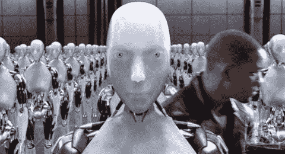

# 为什么我不担心机器人的情况

> 原文：<https://medium.com/geekculture/why-im-not-worried-about-an-i-robot-scenario-41e6e8633662?source=collection_archive---------48----------------------->

还有比这更合理的人工智能危言耸听！

Image from http://grouchoreviews.com/reviews/1991

每当人们开始思考与人工智能扩散相关的后果时，他们通常会想到机器人场景。近年来，人工智能的危言耸听吸引了越来越多的关注。在我看来，许多人都是从*的机器人场景中得出他们的结论，*将它广泛应用于所有的人工智能…