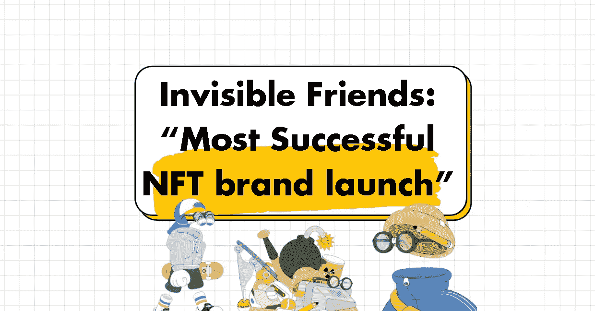
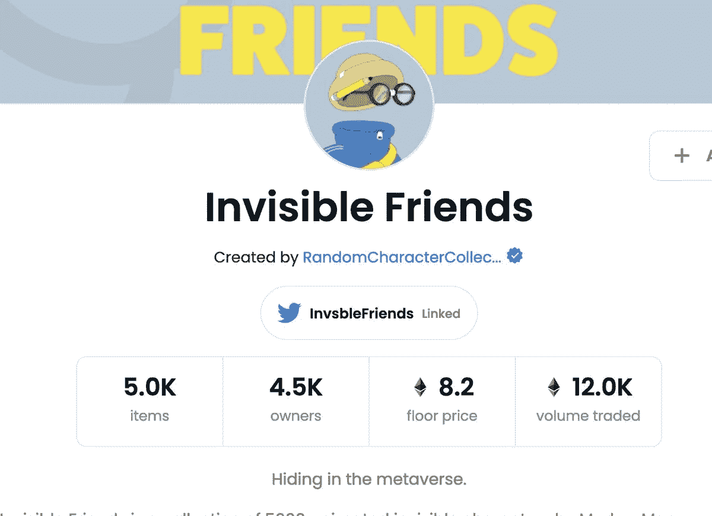
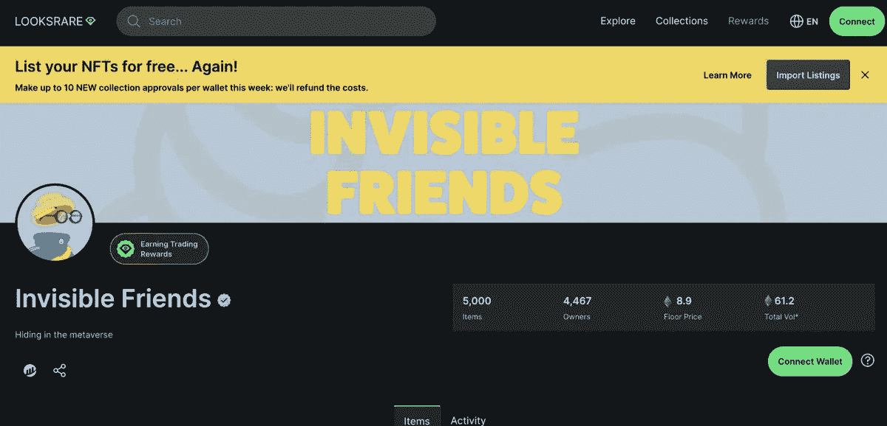
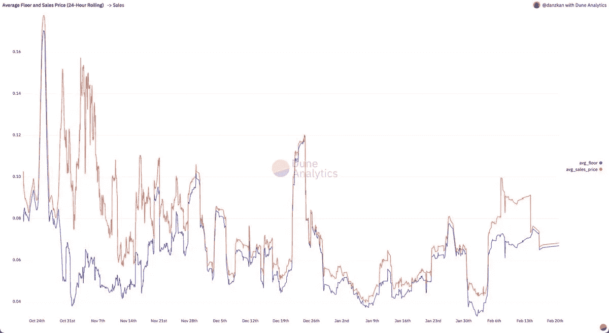
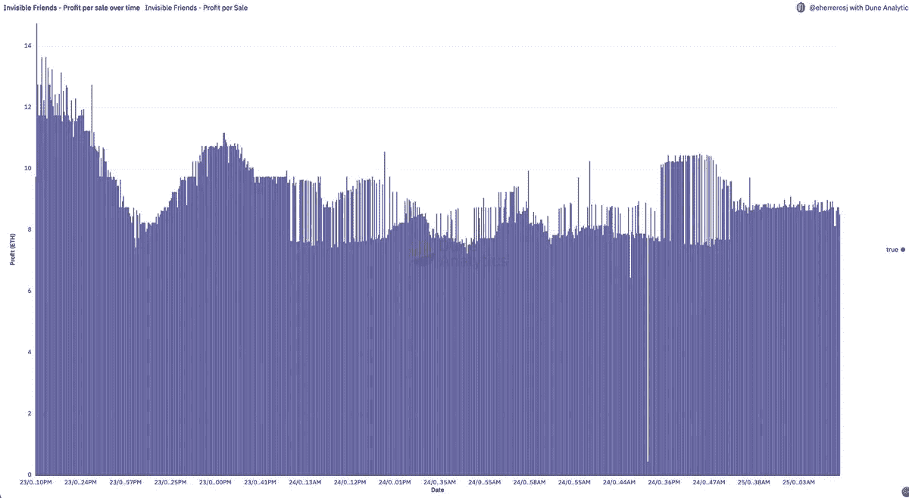
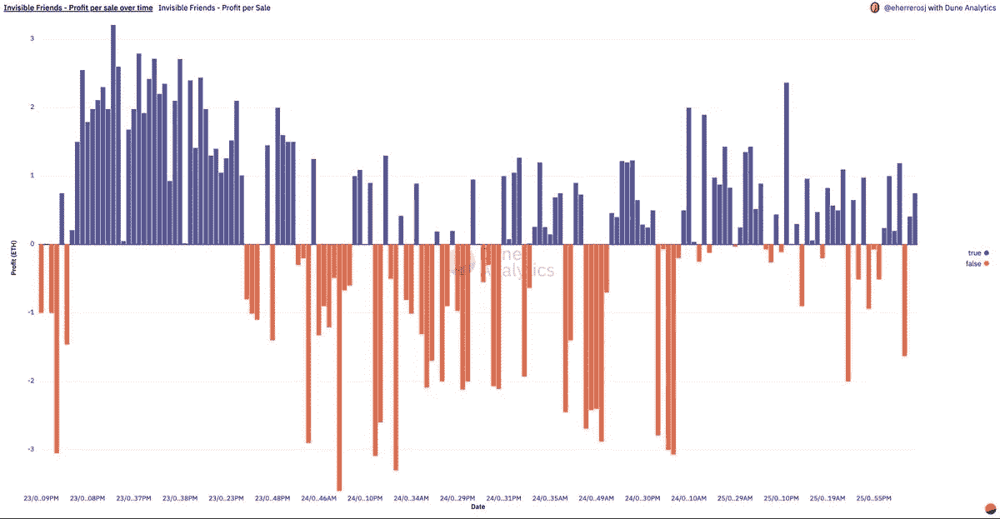
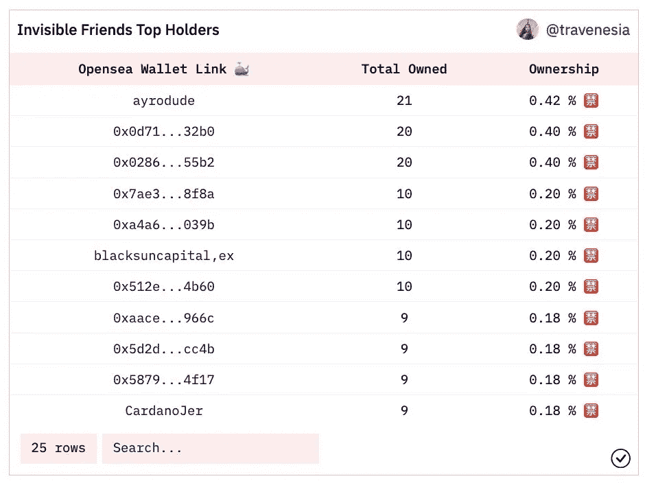
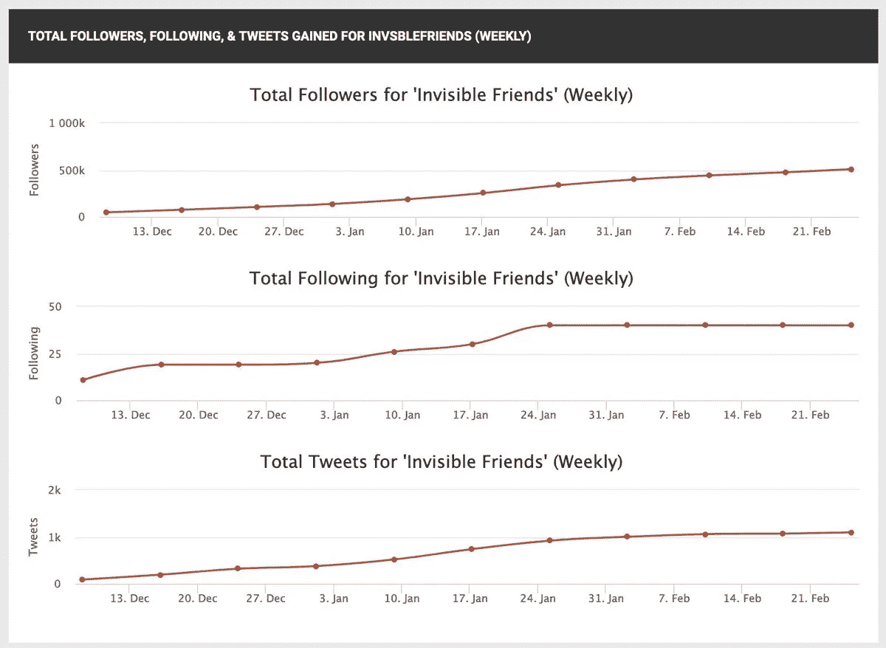

# 为什么《看不见的朋友》是“最成功的 NFT 品牌发布会”

> 原文：<https://medium.com/geekculture/why-invisible-friends-is-the-most-successful-nft-brand-launch-d51286e9343b?source=collection_archive---------6----------------------->

两天前，Motion Markus 推出了“看不见的朋友”NFT 系列，定价 0.25 欧元(630 美元)，白名单受限。虽然动画角色还没有公布，但该项目已经获得了 650 万美元。

没错，650 万美元用于 NFT 发射。

让我们来分析一下销售背后的数字。

# 黄金朋友慈善发布会

他们开始了他们的 1/1 黄金朋友系列，售价为 130 万美元。这些 100%都捐给了慈善机构。

# 发布后销售

在另外 520 万美元中:350 万美元来自铸币厂，另外 170 万美元来自二级市场——open sea(99.4%)、LooksRare (0.6%)

# 二级市场销售

让我们来谈谈二级市场(OS)，IF 在那里获得 5%的永久版税。平均每 4 分钟就有一个 IF 卖出，均价 9.5ξ，中位数 9.1ξ。

在二级市场的销售已经超过 1300 次，总计 12350ξ

## 早期造币者对非造币者

再深究一下，1300 台操作系统的销售额中有 85%来自 minters，他们的平均利润为 9.3ξ，中位数为 8.85ξ🚀。继续，现在最有趣的部分来了:
*支付市场价格的非 minter 所有者的 15%转售会发生什么？*

到目前为止，已经有 220 次“非 minter”二级销售，产生了 2060ξ的总交易量。只有超过一半的人(59%)能够实现收益(平均 1ξ)。7%的销售盈亏平衡(如果考虑汽油费，则为亏损)和 24%的已实现亏损(平均 1.4ξ)🙀

> 考虑到还不罕见，二次销售的差异相当大。

在操作系统中出售的最便宜的物品定价为 0.7ξ，而最贵的物品以 18.88ξ的价格卖给了拥有 5 件物品的钱包(平均支付价格为 14.44ξ，+50%下限)

Hodling-wise，9%的商品目前都在 OS 中列出，这与其他顶级 NFT 系列没有太大区别:

*   [@AzukiZen](https://twitter.com/AzukiZen) (10%)，
*   [@mfersbot](https://twitter.com/mfersbot) (10%)，
*   [@worldofwomennft](https://twitter.com/worldofwomennft) (5%)，
*   [@BoredApeYC](https://twitter.com/BoredApeYC) (5%)或者 MAYC (5%)

# 有多分散？

在收藏分散化方面，有 7 个钱包保存了收藏中的 10 件或更多物品。如果他们愿意，他们可以用 25 万美元清算他们的 IF。

# 大量的追随者

所有这些数字从一开始就令人印象深刻。账户创建后，他们在 twitter 上有 20 万粉丝。他们现在有 50 多万。他们的 discord 拥有近 27.6 万名成员(截至 2021 年 2 月)。

# 结论

-拥有良好业绩记录的非匿名动作艺术家
-0.25ξ造币价格，预披露前两天利润超过 500 万美元
-尚未制定路线图
- < 2%的用户加入白名单
-白名单用户平均收入 25000 美元
-非白名单用户平均收入 500 美元
-从一开始就是一个大社区

> 👋**在[媒体](/@pooriaarab)—[LinkedIn](https://www.instagram.com/pooria.arab/)—[Twitter](https://twitter.com/pooria_arab)—[insta gram](https://www.instagram.com/pooria.arab/)—[抖音](https://www.tiktok.com/@pooria.arab)**
> 
> 更多关于 Web3，Crypto，NFTs，DeFi 等的好东西…
> 
> 点击获取 NFT 发布战略

# 参考

*   [https://dune.xyz/travenesia/InvisibleFriends](https://dune.xyz/travenesia/InvisibleFriends)
*   [https://twitter.com/InvsbleFriends](https://twitter.com/InvsbleFriends)