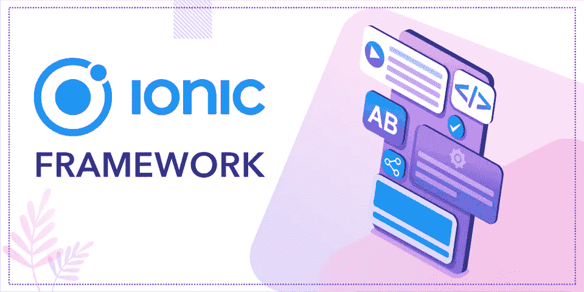

# 为什么 Ionic Framework 最适合构建混合移动应用？

> 原文：<https://medium.com/geekculture/why-ionic-framework-is-the-best-for-building-hybrid-mobile-apps-24e59507a86b?source=collection_archive---------12----------------------->

可供选择的有很多，各有利弊；然而，在这篇文章中，我们将讨论使用**离子框架的一些好处。**

****

**CSS、HTML5 和 JavaScript 只是可以在这样的系统中一起使用的一些语言。这三种强大的语言将帮助你为你的目标人群创造最佳的用户体验。如果你的项目非常注重美学，那么 **Ionic framework** 就是你要走的路。**

**序言已经说得够多了；以下是为什么您应该使用 Ionic Framework 来构建您的应用程序的许多原因:**

# ****为什么选择 Ionic 框架？****

****混合应用开发**提供了许多好处，包括减少开发时间和成本。你可以从同一个代码库中获得几个平台的应用程序。Ionic 是一个跨多个平台的移动应用框架。使用 Ionic，您可以制作具有相同功能和数据的原生 Android 和 iOS 应用捆绑包。**

## ****1。使用流行技术构建****

**由于 Ionic 是一个用几种不同技术(HTML、CSS、JavaScript、AngularJS 等)构建的直观框架，制作的应用程序运行更加流畅。).对应用如何跨平台工作有一个基本的了解是使用 Ionic 框架从头开始创建一个应用所需要的全部。结果是不同经验水平的开发者可以创建高质量的应用程序。**

## ****2。高级生态系统****

**Ionic 框架使得在应用中包含第三方服务、UI(用户界面)元素库和本地存储变得简单。与此同时，Angular 的插件库拥有超过 2000 个模块，使应用程序开发更容易，并使 web 特定技术的集成成为可能，Ionic 自带插件、模块、AngularJS 插件和 Cordova 插件库。类似地，Cordova 的知识库提供了丰富的模块来帮助创建创新的移动软件。**

## ****3。创建具有卓越性能的应用****

**Ionic 的成功可以归功于框架对速度和效率的重视。该框架也是为了最大限度地提高应用程序的效率而创建的。因此，无论使用何种设备，软件都可以高效运行。**

## ****4。从离子的角度结合本地反馈****

**有了 Ionic View，你可以在服务器上托管应用，而无需在移动操作系统上发布。因此，潜在的失误不太可能发生。如果应用程序停止工作，你仍然可以利用 Ionic View 访问它并进行任何调整。**

## ****5。吸引人的用户体验****

****ionic 移动应用框架**提供了各种技术，可以结合起来创建具有广泛功能的应用。Ionic 丰富的 UI 组件、主题、插件、交互元素和字体保证了有吸引力的直观用户体验，提高了应用的性能和留住用户的能力。**

**既然你知道为什么 Ionic 框架是创建混合应用程序的最佳选择，你就可以做出明智的选择了。备选 [**混合 app 开发**](https://jumpgrowth.com/hybrid-app-development/) 框架可供评估。**

## ****6。系统之间的切换更简单****

**在你的软件首次在一个平台上发布后，无论是 Android、iOS、Windows Phone 还是其他平台，都有理由希望它被广泛采用。Ionic 框架通过提供一种语言来促进程序在平台间的可移植性，从而促进了这种可能性。选择本地语言而不是混合语言需要花费额外的时间和金钱来学习每种编程语言的特定于平台的语法。**

## ****7。这是免费的****

**这一定是 Ionic 移动应用程序框架的最大优势。创建一个应用程序可能会花费很多，包括所有的前期工作和最终的市场推广。由于大多数框架的使用成本高达 1000 美元，Ionic 免费的事实将有助于缓解部分财务压力。即使你在读完这篇文章后仍然对使用它犹豫不决，在做出另一个选择之前尝试一下也不会有什么损失。**

****

**From Pexels**

## ****8。爱奥尼亚**中使用了科尔多瓦插件**

**对于那些不熟悉这个词的人来说，插件是添加到你的应用程序中用 JavaScript 编写的一段代码。它给你很大的灵活性，因为它就像平台的原始语言。具体来说，Cordova 插件允许您访问设备的地理位置、摄像头、电池和其他硬件资源。你至少需要其中一个来拥有一个全功能的应用程序，你选择哪一个取决于你的应用程序的功能性质。**

## ****9。这么大的受众群，可以轻松表达****

**伙计们，编码可不容易。综上所述，如果你刚刚开始使用 Angular 和 Ionic，当出现问题时，你需要一个支持系统来帮助你。使用 Ionic 框架的最大好处是它周围有一个大而有用的社区。你甚至可以在社交媒体上找到**Ionic 移动应用框架**的创建者，因为他们致力于帮助他们的用户制作最好的应用。**

## ****10。开发者友好型****

**由于 Ionic 框架对开发人员友好，所以强烈推荐使用它来创建混合应用程序。它运行在一个通用的代码库上，因此程序员在为不同平台制作应用程序时不再需要重复劳动。这也减少了**创建一个应用**所需的时间和金钱。另一个方面是，Ionic 框架提供了一个直观的 UI，并要求开发者在混合应用开发方面表现出色。web 应用程序的开发人员也可以从这个平台中获益匪浅。**

## ****结论****

**事实上，这个框架是免费的，这只是众多支持它的令人信服的理由之一。继续前进，在你的训练中测试这三种强大语言的组合。**

**贵公司需要专业的 Ionic app 开发吗？一些外包组织以拥有熟练的 ionic 应用程序开发人员团队而自豪，他们已经用完美的移动应用程序处理了世界各地的客户。您可以立即联系**[**最佳 Ionic app 开发**](https://jumpgrowth.com/ionic-app-development/) 机构之一。****