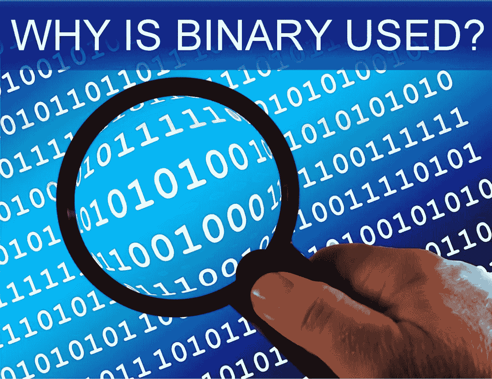

# 为什么电子和计算机要用二进制？

> 原文：<https://medium.com/geekculture/why-is-binary-used-in-electronics-and-computers-2c439354ee3a?source=collection_archive---------29----------------------->

Public domain image courtesy courtesy [Geralt, via Pixabay.com](https://pixabay.com/illustrations/binary-magnifying-glass-hand-http-1607161/)

二进制编码系统是计算机系统和数字电子设备中存储、传输和处理数据的基础。这个系统使用的基数是 2，而不是我们日常生活中熟悉的用于计数的基数 10。在这篇浅显易懂的文章结束时，你会明白为什么二进制被用于计算机和电子设备中。