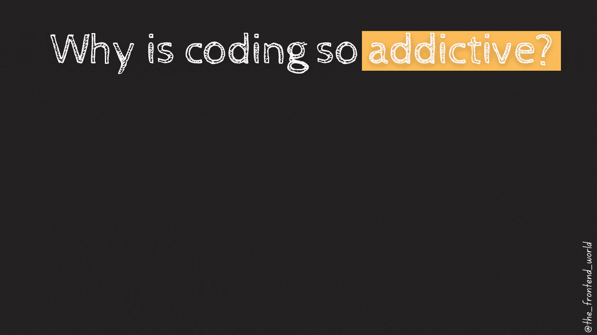

# 为什么编码这么容易上瘾？

> 原文：<https://medium.com/geekculture/why-is-coding-so-addictive-6ee4b63d55f4?source=collection_archive---------7----------------------->

## 每个人都会对某样东西上瘾。对我来说，就是编码，吃饭，写作！

每个开发人员都有选择编码的理由。开发人员经常沉迷于编码。这篇文章收集了几乎所有开发人员对编码上瘾的原因。这个列表是我自己的原因启发出来的，如果你有其他原因，请分享给我们。我会…