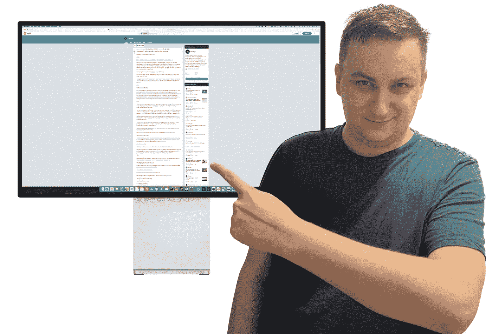

# 为什么现在每个人都对三星的隐私政策感到恐惧

> 原文：<https://medium.com/geekculture/why-is-everyone-terrified-of-samsungs-privacy-policy-right-now-4f58494508fb?source=collection_archive---------3----------------------->

## 我们应该害怕吗？

Image courtesy of the author

公众总是倾向于不信任大型企业集团。毕竟，这些组织的宗旨都是让股东的回报最大化。人们通常有这样一种印象，他们会不择手段地去实现这个目标，不管他们的行为会对环境产生什么影响