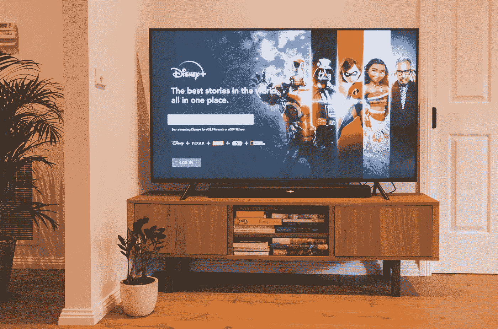
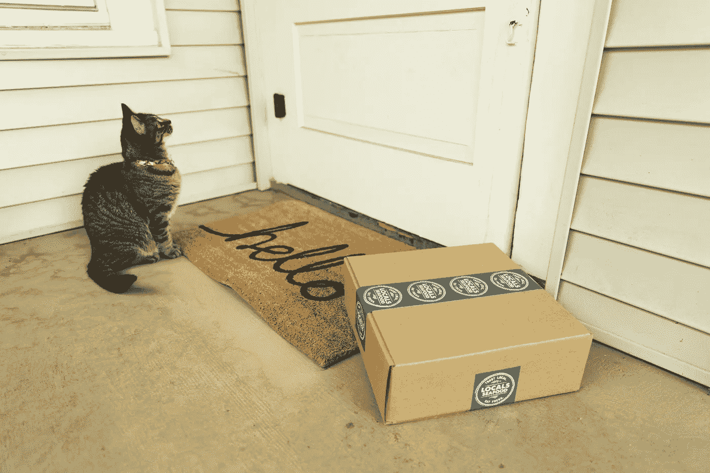

# 为什么现在一切都是基于订阅的？

> 原文：<https://medium.com/geekculture/why-is-everything-subscription-based-now-490ed66304fd?source=collection_archive---------2----------------------->

你肯定已经注意到这个趋势了。越来越多的东西，我们过去只是简单地付费，然后按照我们认为合适的方式使用，现在正在转变为订阅系统。“软件即服务”这个词已经变得平淡无奇，内容创作者都依赖于 Patreon 订阅，GamePass 是一个东西，现在有消息传出，苹果也想将 iPhones 转变为订阅模式。虽然有些东西在每月支付系统中是有意义的，但其他一些东西似乎被延伸并塑造成这种新的“所有权”模型。那么，为什么有这么多公司进行这种转变，而且这种转变会持续下去吗？

# 钱，亲爱的孩子

Austin Distel

“为什么”的答案就像科技一样，是钱。多年来，无论如何，有两种核心收入模式可以持续带来资金:直接广告和订阅。有线电视频道、流媒体服务和定期交付已经发展成为一个通用的系统，原因很简单——它能有效地产生资金。

订阅模式轻松征服市场，多达 78%的美国家庭[报告](https://nationalinterest.org/blog/techland/majority-us-households-have-least-two-streaming-services-169095)在 2020 年至少订阅一个流媒体服务，55%的家庭至少订阅两个。几乎可以肯定的是，这些数字被正在进行的 COVID 疫情夸大了一点，这迫使人们多年呆在家里，这意味着在沙发上看电影的价值上升了不少。不过，很有可能流媒体已经在人们的生活中根深蒂固，现在不能离开。层出不穷的内容涌现出来，随着游戏即服务和游戏发行订阅成为一种趋势，许多家庭很可能会选择简单的娱乐解决方案。毕竟，订阅有一个非常诱人的提议:只需支付一次费用，你就可以随时获得内容流。与其在发布日花 60 美元买一个游戏，为什么不在 8 个月内花 12 美元买很多其他游戏，最终得到你想要的游戏呢？如果你皱着眉头说“但是那最终会花费更多”，你是对的，但是，记住，订阅并不仅仅是以你想要的价格卖给你你想要的东西。这种模式依赖于小额支付，通过额外的额外支出来减轻成本的打击，让价格的任何上涨看起来都是无关紧要的，因为你得到了更多的东西。它会是你想要的东西还是你真正喜欢的东西？没人知道，但你已经为此付费了，让这些内容源源不断地出现是如此方便。公司了解人类心理，所以不要因为享受 GamePass 或网飞订阅而责怪自己。它们是定制的赚钱机制，简单而巧妙。

虽然许多人认为这个系统只被贪婪的大公司采用，但这并不完全正确。2020 年，独立音乐的音乐市场 Bandcamp(最近[被 Epic 收购了](https://www.theguardian.com/music/2022/mar/07/bandcamp-sells-to-epic-can-a-video-game-company-save-independent-music))让音乐人可以选择[向他们的粉丝提供订阅](https://www.altpress.com/news/bandcamp-launches-subscription-service/)。这是一个非常干净的模式——每月支付固定费用，作为回报，可以独家或提前获得新音乐，以及获得你最喜欢的艺术家的后备目录。因此，即使是较小的艺术家也意识到，这个系统在其基本形式上是可行的。毕竟，这是 Patreon 的基础，可以说是正确使用订阅模式的最成功的例子之一。创作者通过小规模的专门粉丝群每月赚取数千美元，而不是依赖 YouTube 变幻无常的货币化系统或加入可能干扰他们风格或信息的公司。但是对于每一个 Patreon 的成功故事，都有一个令人困惑的服务将订阅用于不必要的东西。这里，例如，[的一篇文章列出了](https://cluboenologique.com/story/best-wine-subscription-services-uk/)的八个(！)英国最佳葡萄酒订阅服务。即使只有一项这样的服务，其必要性也是有争议的，但事实上，有足够多的服务可以让一份榜单排名前八，这充分说明了订阅模式已经根深蒂固。

# 不想要但又必须接受的事物

Marques Kaspbrak

读完所有这些，你可能会想订阅是不是天生就不好，但事实并非如此。就像我提到的，有一些非常好和公平的订阅模式的例子，有利于得到钱的人和得到内容的人，带来了同等的回报。

只有当订阅模式是出于从客户身上榨取最后一分钱的愿望而应用于某些事情时，而不是当它有意义时，问题才会出现。想一想，为什么 Adobe 需要你每月付费来使用一个软件，而不是你支付一个固定的价格来实际拥有它？实际上，除了 Adobe 知道他们的产品已经成为设计者、编辑和更多人事实上的行业标准，这意味着他们可以稍微贪婪一点而不受惩罚之外，没有任何逻辑原因。这种订阅没有真正的额外服务，只有一方面的好处——这是一个如何*而不是*做到这一点的完美例子。

相反，像蓝色围裙甚至亚马逊快递这样的东西可能不是每个人都喜欢的，但它们至少在基本层面上是有意义的——如果你知道你不想费心购买食品杂货和准备饭菜，你就可以得到膳食工具包。如果你知道，出于某种原因，你每个月 25 号需要 10 块海绵，那就去订阅吧。你批量购买，节省时间，所有的好东西。与此同时，这些公司获得了有保证的月收入和忠实的客户。这个计划可能不是最完美的例子，但它确实有意义。对于普通人来说，即使是葡萄酒订阅这种东西可能也很奇怪，但它肯定有一个利基市场。

# 长期坚持下去吗？

这里有趣的问题是，从长远来看，这种模式是否可持续。当然，它现在正在赚钱，但是 5 年或 10 年后呢？人们还会愿意每月为基本的东西付费吗，比如软件或硬件的使用？这些因素因服务类型而异，但在当今不断变化的世界中，我倾向于说答案是否定的。即使是优秀的旧广告也改变了形式和方式，这一直是最有利可图和最容易产生收入的方式之一。保持不变，依靠当前流行的技巧并不能保证长寿。

另外，你可能已经注意到我一直在说收入而不是利润。原因很简单——这些公司中有许多通过订阅模式销售产品赚了很多钱，但赚钱并不是目的。然后，你必须计算你的支出，看看你的投资者是否满意，检查当你开始计算利润时，那一大笔钱是否会缩水。许多公司没有获得如此可观的利润，而那些获得利润的公司往往是以牺牲有意义的增长为代价的:看看网飞不断增长的利润和他们设定的未能实现的用户目标就知道了。通过试图每年最大化收益，这些公司正在耗尽他们自己的市场，限制他们未来成功的机会。

订阅模式，在它的基础层面上，不会消亡，因为它对于某些用例来说是最好的。但我 100%预计，当利润不再打破记录，用户转向更好的服务时，一些当前的巨头要么放弃它，要么倒下。这座纸牌屋的可持续性充其量也值得怀疑。但是接下来的几年，不要担心，享受你的网飞吧。