# 为什么 Flutter 很快？—第 3 部分:渲染管道

> 原文：<https://medium.com/geekculture/why-is-flutter-fast-part-3-rendering-pipeline-3a31056355e5?source=collection_archive---------0----------------------->

在许多情况下，使用 Flutter SDK 中包含的一组小部件就足以为最终用户提供良好的用户体验。然而，现代应用程序的发展趋势是，设计者和用户需要更富动感、高度可定制的 UI 组件。由于*像素驱动的架构*，而不是依赖于平台中可用的小部件，Flutter 的目标是在同一级别的所有平台上实现高 UI 可定制性和一致性[ [1](https://docs.flutter.dev/resources/faq#does-flutter-use-my-operating-systems-built-in-platform-widgets) ]。

我相信高效地实现丰富和高质量的 UI 组件需要很好地理解 Flutter 框架是如何工作的。这就是为什么[我在](https://www.youtube.com/watch?v=Y9Az2p06yTs) [Flutter Vikings 会议](https://fluttervikings.com/) *上的演讲“从运动设计规范到 Flutter 代码*”从解释 Flutter 的渲染管道开始。

渲染管道不是一个特定于 Flutter 的术语。在计算机图形学中，它用于定义一个模型，该模型由渲染对象以产生一帧的连续步骤组成。渲染管道的最终结果是我们在窗口中看到的像素。

由于渲染管道是一个非常详细的主题，我们将在本文中只提到一部分。要了解更多详细信息，我建议阅读来自[阿里巴巴 Clouder](https://community.alibabacloud.com/users/5040995529404844?spm=a2c65.11461447.0.0.160b6fb8EnLzbf) 的[这篇综合博客文章](https://www.alibabacloud.com/blog/exploration-of-the-flutter-rendering-mechanism-from-architecture-to-source-code_597285)，并观看来自 Adam Barth 的著名[演讲](https://youtu.be/UUfXWzp0-DU)、 *Flutter 的渲染管道*。

*   [第 1 部分:次线性建筑](https://ulusoyca.medium.com/why-is-flutter-fast-part-1-sublinear-building-317572cd6b47)
*   第二部分:分层架构
*   **第三部分:渲染管道**

作为 Flutter 应用程序开发人员，我们在渲染管道中的角色很少:

1.  构建一个部件树，并在构建阶段将其提供给框架。
2.  当我们想要更新 UI 时，让框架知道哪些小部件需要被标记为*“需要构建”*。例如，通过用手势事件调用`[StatefulWidget](https://api.flutter.dev/flutter/widgets/StatefulWidget-class.html)`的`[State](https://api.flutter.dev/flutter/widgets/State-class.html)`对象上的`[setState](https://api.flutter.dev/flutter/widgets/State/setState.html)`方法，我们隐式地将小部件标记为需要构建，并将其对应的元素标记为下一帧的脏元素。

# UI 工具包的性能

在移动应用开发的早期，为用户准备一个足够快的 UI 是主要考虑的事情。随着设备获得更多的计算能力，性能目标转移到不同的领域，例如:

*   有效地使用设备资源，使得设备在 UI 线程中呈现期间有足够的资源来执行后台任务
*   每秒绘制 60 或 120 帧的流畅动画性能，绘制一帧需要 16 或 8 毫秒。
*   优化设备中处理器的使用，从而降低绘制帧所消耗的能量，并因此节省电池。

> “几十年来，脏区管理一直是 UI 框架的主要内容，但从早期在主频为 MHz 的芯片上进行 CPU 渲染到现代在几乎任何设备上进行 GHz GPU 渲染，技术水平已经发生了很大变化。[【7](https://docs.google.com/document/d/19WDvGJql1bmnECTdEzJFeH9Ixw4AP2R7JlgujBSbDbk/edit#)]

实现这些目标需要高效的 UI 渲染算法和良好的脏区管理。Flutter framework 已经有很好的解决方案来防止渲染管道不同阶段不必要的计算，我们将在本文中提到。然而，小组意识到仍有改进的余地。例如，在本文档的[中，你可以读到关于最小化每帧重画区域的讨论。](https://docs.google.com/document/d/19WDvGJql1bmnECTdEzJFeH9Ixw4AP2R7JlgujBSbDbk/edit#)

# runApp

当我在撰写这一系列文章时，我注意到了来自 Flutter 团队的 Andrew Fitz Gibbon 的[这个很棒的视频](https://youtu.be/e5RhcvWqJAo) *“了解 runApp 函数】*。当我试图弄清楚这个框架是如何工作的时候，看到他像我一样探索源代码真是太棒了。

Flutter 应用程序开发人员通过调用`[runApp](https://api.flutter.dev/flutter/widgets/runApp.html)`方法开始使用 widgets 层。这是启动 Flutter 应用程序的方法。这种方法完成了两件重要的事情:

1.  作为参数提供给`[runApp](https://api.flutter.dev/flutter/widgets/runApp.html)`方法的根小部件被附加到小部件树的**顶部**。对于初始构建，它是一个线性的**自顶向下的**过程，在 [*第一篇*](https://ulusoyca.medium.com/why-is-flutter-fast-part-1-sublinear-building-317572cd6b47) 中作为**案例 5** 提到了所有的`[updateChild](https://medium.com/r?url=https%3A%2F%2Fapi.flutter.dev%2Fflutter%2Fwidgets%2FElement%2FupdateChild.html)`方法调用。在这种情况下，当所有的小部件在小部件树中展开时，它们相应的元素和渲染对象被创建。
2.  颤振框架层和引擎层借助`[WidgetsFlutterBinding](https://api.flutter.dev/flutter/widgets/WidgetsFlutterBinding-class.html)`类绑定。这个单例类在`[runApp](https://api.flutter.dev/flutter/widgets/runApp.html)`方法中初始化。它包含渲染管道的两个重要的管理器类:`[BuildOwner](https://kikt.gitee.io/flutter-doc/widgets/BuildOwner-class.html)`和`[PipelineOwner](https://api.flutter.dev/flutter/rendering/PipelineOwner-class.html)`。

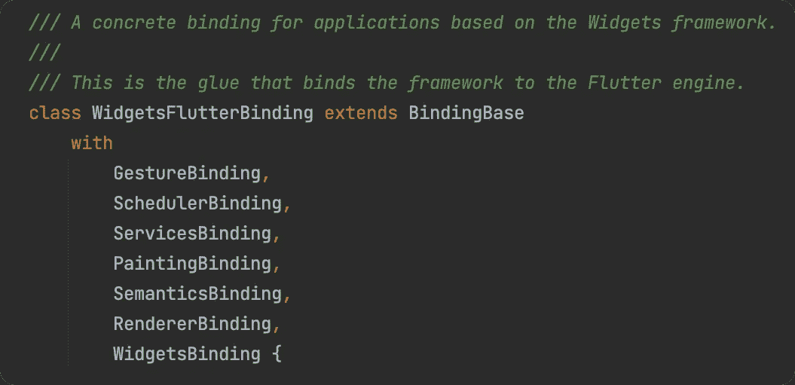

尽管`[WidgetsFlutterBinding](https://api.flutter.dev/flutter/widgets/WidgetsFlutterBinding-class.html)`类看起来像框架中的 God 对象，但它实现了许多单例混合来分离实现中的关注点。每个 mixin 都是引擎和框架之间的粘合剂，具有特定的职责。

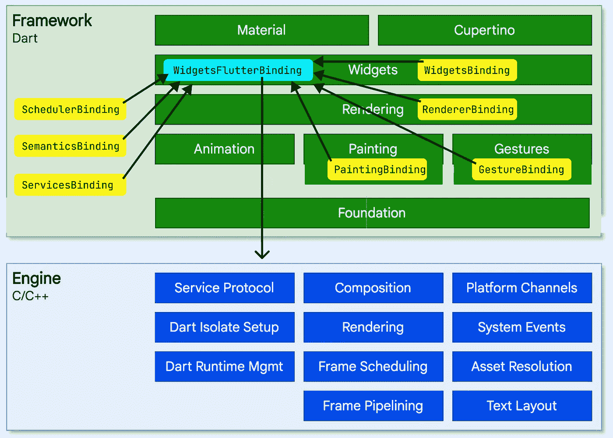

*   `[GestureBinding](https://api.flutter.dev/flutter/gestures/GestureBinding-mixin.html)`是手势识别器的绑定。
*   `[SchedulerBinding](https://api.flutter.dev/flutter/scheduler/SchedulerBinding-mixin.html)`是调度器帧回调的绑定，比如瞬态回调、持久回调、帧后回调和帧间非渲染任务。它确保任务仅在适当的时候运行。
*   `[ServicesBinding](https://api.flutter.dev/flutter/services/ServicesBinding-mixin.html)`是针对[平台特定服务](https://api.flutter.dev/flutter/services/services-library.html)的绑定，暴露于框架层。
*   `[PaintingBinding](https://api.flutter.dev/flutter/painting/PaintingBinding-mixin.html)`是为 Flutter [画库](https://api.flutter.dev/flutter/painting/painting-library.html)绑定的，该画库封装了引擎的绘画 API。
*   `[SemanticsBinding](https://api.flutter.dev/flutter/semantics/SemanticsBinding-mixin.html)`是[语义层](https://api.flutter.dev/flutter/semantics/semantics-library.html)和引擎的绑定。
*   `[WidgetsBinding](https://api.flutter.dev/flutter/widgets/WidgetsBinding-mixin.html)`是 widget 树和引擎之间的绑定。这是`[BuildOwner](https://kikt.gitee.io/flutter-doc/widgets/BuildOwner-class.html)`开始和结束构建阶段的 mixin。
*   `[RendererBinding](https://api.flutter.dev/flutter/rendering/RendererBinding-mixin.html)`是渲染树和引擎之间的绑定。这就是 mixin，`[PipelineOwner](https://api.flutter.dev/flutter/rendering/PipelineOwner-class.html)`在构建阶段的开始和结束之间执行渲染管道阶段。

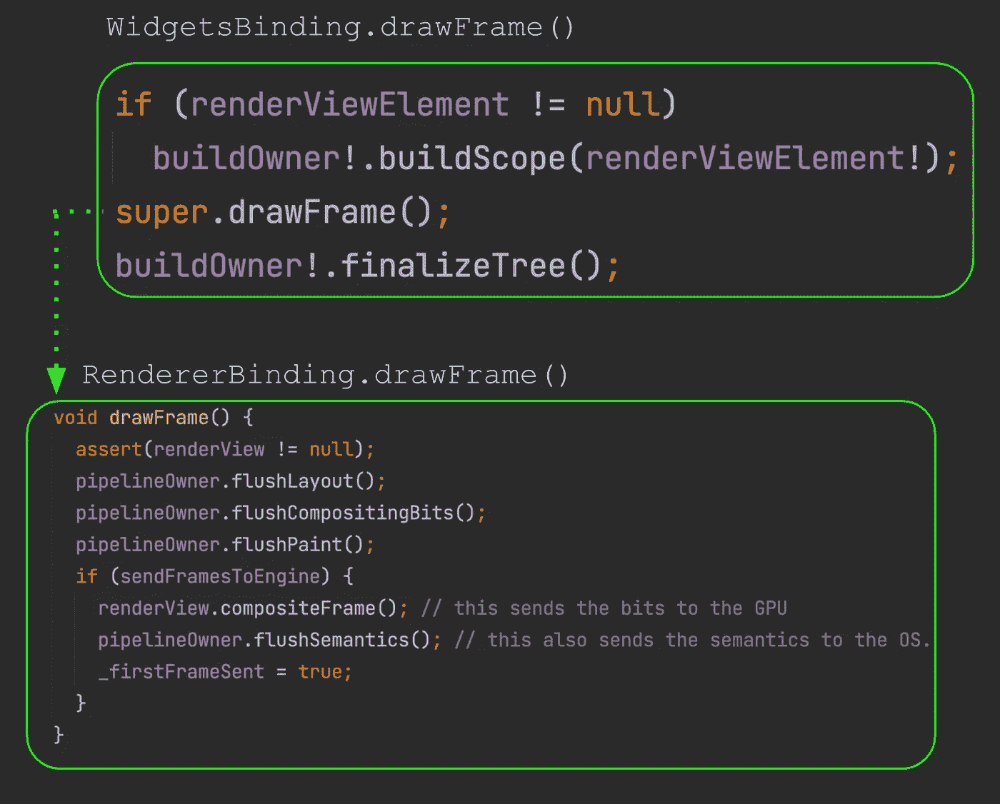

# 拉伸机

当需要制作和布局一个帧时，引擎调用`[WidgetsFlutterBinding](https://api.flutter.dev/flutter/widgets/WidgetsFlutterBinding-class.html)`类上的`[drawFrame](https://api.flutter.dev/flutter/widgets/WidgetsBinding/drawFrame.html)`方法，这将启动构建阶段的渲染管道。

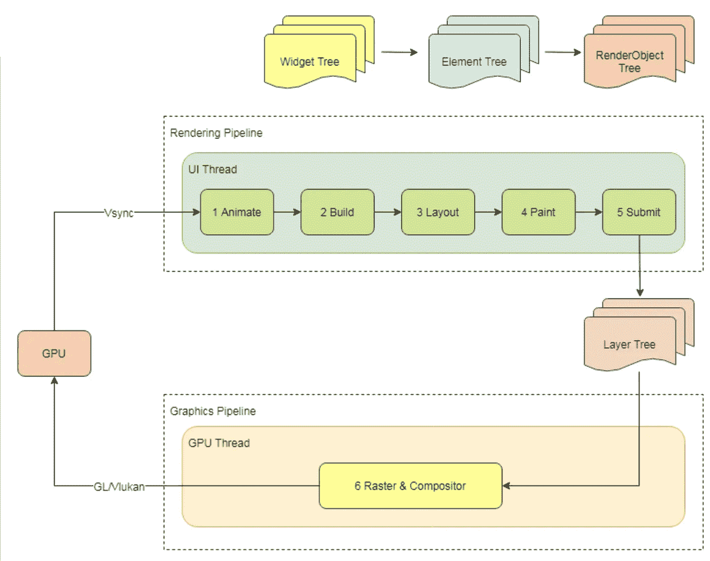

Image taken from [alibabacloud blog](https://www.alibabacloud.com/blog/exploration-of-the-flutter-rendering-mechanism-from-architecture-to-source-code_597285)

渲染管道的输出是层树，该层树在 CPU 中运行的光栅线程中消耗，用于光栅化和合成。这个线程之前被 Flutter 团队命名为 GPU 线程，但后来被重命名为 raster thread，因为它会产生误导，给人一种它是在 GPU 中运行的印象。Skia 在光栅线程上运行，最终输出被翻译成 GPU 渲染指令，以在屏幕上绘制像素。

`[BuildOwner](https://kikt.gitee.io/flutter-doc/widgets/BuildOwner-class.html)`是*小部件树*的管理器类。通过调用`[BuildOwner](https://kikt.gitee.io/flutter-doc/widgets/BuildOwner-class.html)`上的`[scheduleBuildFor](https://api.flutter.dev/flutter/widgets/BuildOwner/scheduleBuildFor.html)`方法，需要构建的元素被添加到**脏元素**列表中。

`[PipelineOwner](https://api.flutter.dev/flutter/rendering/PipelineOwner-class.html)`是*渲染树*的管理器类。在构建阶段之后，它存储布局、合成位、绘制和渲染管道的语义阶段的脏状态。例如，如果一个`[RenderObject](https://api.flutter.dev/flutter/rendering/RenderObject-class.html)`在布局阶段被标记为脏的，那么在渲染帧的过程中为那个`[RenderObject](https://api.flutter.dev/flutter/rendering/RenderObject-class.html)`计算布局。

> “任何时候渲染对象上的任何变化都会影响该对象的布局，它应该调用 [markNeedsLayout](https://api.flutter.dev/flutter/rendering/RenderObject/markNeedsLayout.html) 。”[ [6](https://docs.flutter.dev/resources/inside-flutter)

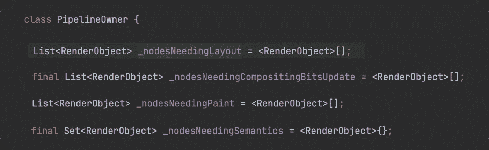

list of dirty render objects in PipelineOwner

# 单程布局

在颤振中，布局阶段是单向的: ***自上而下******一遍*** 。父级`[RenderObject](https://api.flutter.dev/flutter/rendering/RenderObject-class.html)`调用子级渲染对象的`[layout](https://api.flutter.dev/flutter/rendering/RenderObject/layout.html)`方法，为它们提供约束:*最大宽度*、*最小宽度*、*最大高度、*和*最小高度*值。

> "颤振每帧执行一个布局."[ [6](https://docs.flutter.dev/resources/inside-flutter)

与构建阶段一样，布局阶段最初也具有线性性能，随后具有次线性性能。每个子节点`[RenderObject](https://api.flutter.dev/flutter/rendering/RenderObject-class.html)`被访问，并且在布局过程中仅返回其尺寸**一次**，直到下一帧。儿童无权超越规定的限制来调整自己的大小。

> “约束下去。尺寸会变大。父设置位置。[ [2](/flutter-community/flutter-the-advanced-layout-rule-even-beginners-must-know-edc9516d1a2) ]

父`[RenderObject](https://api.flutter.dev/flutter/rendering/RenderObject-class.html)`访问并且**将渲染树**中的 **约束** **向下逐个传递给其子**。例如，让我们考虑一个有两个子节点的`[Flex](https://api.flutter.dev/flutter/widgets/Flex-class.html)`布局的父节点:一个灵活的子节点和一个不灵活的子节点。在这种情况下，父母首先布局不灵活的孩子。布局的子节点**将其在渲染树**中的大小传递给父节点`[RenderObject](https://api.flutter.dev/flutter/rendering/RenderObject-class.html)`。之后，家长为灵活的孩子计算自由空间。最后，灵活的子对象将根据剩余空间接收其约束，并将其在渲染树中的大小返回给父对象`[RenderObject](https://api.flutter.dev/flutter/rendering/RenderObject-class.html)`。****

**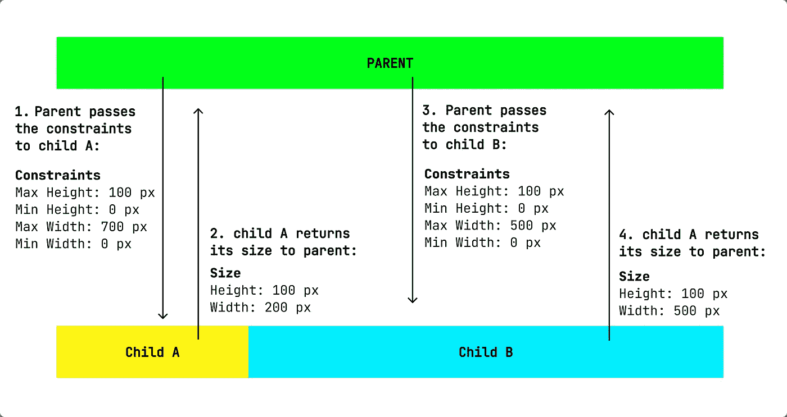**

**Constraints & Size direction in Flutter**

> **在布局过程中，从父对象流向子对象的唯一信息是约束，从子对象流向父对象的唯一信息是几何图形[ [6](https://docs.flutter.dev/resources/inside-flutter)**

**在 Flutter 中，子对象的定位由父对象独立于布局过程进行控制，并且不能在布局所有子对象之前完成。一些渲染对象尽可能晚地进行定位。甚至在某些情况下，定位是在*喷漆阶段*完成的。**

**考虑到在不同平台上如何实现，在构建和布局阶段使用单遍算法的次线性性能是一个重要的优化。例如，绘制布局对于原生 Android 应用程序来说是两遍过程: [*测量*](https://developer.android.com/reference/android/view/View#measure(int,%20int)) 遍和 [*布局*](https://developer.android.com/reference/android/view/View#layout(int,%20int,%20int,%20int)) 遍。在*度量*过程中，父视图调用子视图上的`[measure](https://developer.android.com/reference/android/view/View#measure(int,%20int))`方法，以找出子视图在给定约束内应该有多大。当此方法从子视图返回时，子视图及其所有子视图将测量自身。根据不同的情况，父类可能不止一次调用子类的`[measure](https://developer.android.com/reference/android/view/View#measure(int,%20int))`方法。例如，在第一次呼叫中，父母知道如果没有约束，孩子们想要变得多大或多小。然后，在第二次调用中，父节点提供实际的约束。当 [*测量*](https://developer.android.com/reference/android/view/View#measure(int,%20int)) 走刀完成时*布局走刀*开始。在这个过程中，父母根据他们想要的尺寸给他们的孩子定位。**

# **用例子总结**

**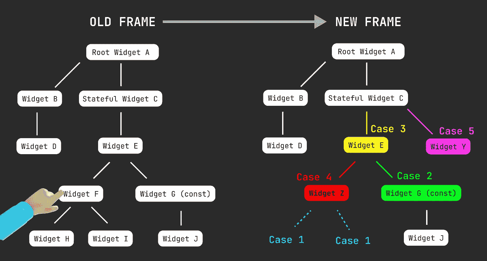**

**让我们用一个例子来总结我们在这一系列文章中学到的东西。在上面的小部件树中，我们有根小部件`A`，它有两个子部件:小部件`B`和有状态小部件`C`。在小部件`C`的`State`对象中，我们通过在顶部提供一个子小部件`E`来声明一个小部件子树。**

## **污染树木**

**假设小部件`E`的子小部件`F`是一个`[GestureDetector](https://api.flutter.dev/flutter/widgets/GestureDetector-class.html)`小部件，我们在它的`[onTap](https://api.flutter.dev/flutter/widgets/GestureDetector/onTap.html)`回调方法上调用`[setState](https://api.flutter.dev/flutter/widgets/State/setState.html)`方法。在这种情况下，元素`C`将被标记为需要构建，因为在它的`[State](https://api.flutter.dev/flutter/widgets/State-class.html)`对象内部调用了`[setState](https://api.flutter.dev/flutter/widgets/State/setState.html)`方法。因此，在新帧开始之前，元素`C`将被添加到脏元素列表中。**

**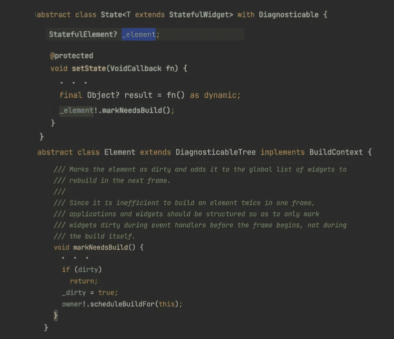**

**现在，让我们更深入地了解一下“泥土”的含义。小部件`C`的`[State](https://api.flutter.dev/flutter/widgets/State-class.html)`对象可以访问其永久关联的元素`C`。当在这个状态对象上调用`[setState](https://api.flutter.dev/flutter/widgets/State/setState.html)`方法时，它将调用元素`C`的`[markNeedsBuild](https://api.flutter.dev/flutter/widgets/Element/markNeedsBuild.html)`方法。在这个方法中，`[BuildOwner](https://kikt.gitee.io/flutter-doc/widgets/BuildOwner-class.html)`类将为元素`C`安排一个构建。**

**通过调用元素`C`的`[scheduleBuildFor](https://api.flutter.dev/flutter/widgets/BuildOwner/scheduleBuildFor.html)`方法，该元素将被添加到`[BuildOwner](https://kikt.gitee.io/flutter-doc/widgets/BuildOwner-class.html)`类跟踪的脏元素列表中。这些脏元素将在下一帧中被清除。**

**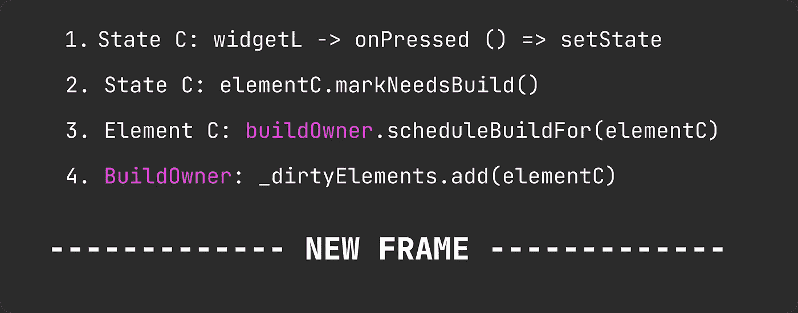**

## **绘制新框架**

**当在`[WidgetsFlutterBinding](https://api.flutter.dev/flutter/widgets/WidgetsFlutterBinding-class.html)`上调用`[drawFrame](https://api.flutter.dev/flutter/widgets/WidgetsBinding/drawFrame.html)`方法时，下一帧的渲染管道开始。**

**通过调用`[BuildOwner](https://kikt.gitee.io/flutter-doc/widgets/BuildOwner-class.html)`上的`[buildScope](https://api.flutter.dev/flutter/widgets/BuildOwner/buildScope.html)`方法，在`[WidgetsFlutterBinding](https://api.flutter.dev/flutter/widgets/WidgetsFlutterBinding-class.html)`实例的`[WidgetsBinding](https://api.flutter.dev/flutter/widgets/WidgetsBinding-mixin.html)` mixin 中触发构建阶段。在这个方法中，所有脏元素都是一个接一个地重新构建的。**

## **更新子元素**

**现在是时候让元素`C`通过调用它们的`[updateChild](https://medium.com/r?url=https%3A%2F%2Fapi.flutter.dev%2Fflutter%2Fwidgets%2FElement%2FupdateChild.html)`方法来检查它的子元素了。**

**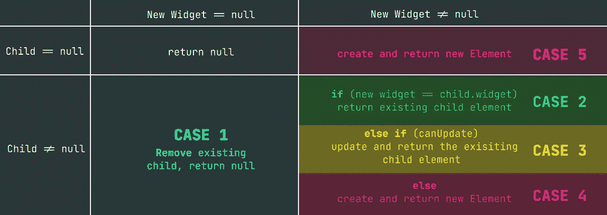**

## **案例 3 — canUpdate 返回 true**

**在第一个槽中，检查元素`E`。看起来那个槽的新窗口小部件的运行时类型又是`E`，让我们假设新旧窗口小部件`E`有相同的键。因此，`[canUpdate](https://api.flutter.dev/flutter/widgets/Widget/canUpdate.html)`方法将返回`true`，元素`E`和渲染对象`E`将使用新小部件`E`描述的新配置进行更新。**

*   **假设在这个版本中，小部件`E`的宽度或高度是不同的。然后，渲染节点`E`将通过调用其`[markNeedsLayout](https://api.flutter.dev/flutter/rendering/RenderObject/markNeedsLayout.html)`方法将其自身标记为需要布局。在布局阶段将为当前帧安排视觉更新。**
*   **让我们假设小部件`E`的不透明度在这个版本中是不同的。然后，渲染节点`E`将通过调用其`[markNeedsPaint](https://api.flutter.dev/flutter/rendering/RenderObject/markNeedsPaint.html)`方法将其自身标记为需要绘制。在绘制阶段，将为当前帧安排视觉更新。**
*   **让我们假设为了可访问性的目的，小部件`E`的语义配置在这个版本中是不同的。然后，渲染节点`E`将通过调用其`[markNeedsSemanticUpdate](https://api.flutter.dev/flutter/rendering/RenderObject/markNeedsSemanticsUpdate.html)`方法将其自身标记为需要语义更新。因此，将在语义阶段为当前帧安排语义更新。**

**注意，当 RenderObject 被更新时，对它调用这些`needs`方法是可选的。**

**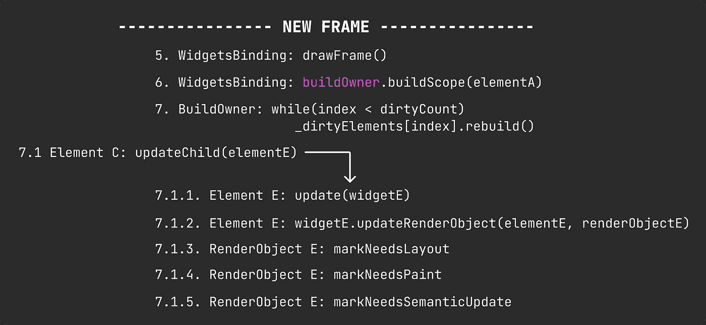**

## **案例 5 —膨胀部件**

**与之前的构建阶段不同，元素`C`的下一个槽不再是空的。有一个新的小部件(`Y`)作为元素`C`的直接子元素。在这种情况下，父元素`C`将膨胀小部件`Y`，并为新创建的元素`Y`分配一个新的槽。还将实例化新的呈现对象 Y。**

## **案例 4 — canUpdate 返回 false**

**现在是元素`E`访问其子元素的时候了。在最后的构建阶段，元素`E`的第一个插槽中有元素`F`。在当前的构建阶段，它有一个新的小部件，该小部件有一个不同的运行时类型(`Z`)。因此，`[canUpdate](https://api.flutter.dev/flutter/widgets/Widget/canUpdate.html)`方法将返回`false`，元素`F`将被设置为不活动，小部件`Z`将被膨胀，元素`Z`和渲染对象`Z`将被实例化。**

## **案例 2——建筑走道的切割**

**在元素`E`的下一个槽中，我们有一个带有`const`构造函数的小部件 G。我们假设它的构造函数参数也是`const`变量。然后小部件 G 子树的构建遍历将停止，因为小部件 G 是一个`const`小部件，元素 G 将被重用而无需更新。**

## **案例 1 —停用未使用的**

**元件`Z`的构建走查继续进行。它将检查旧的子元素的槽。与先前的构建不同，在当前的构建中没有这些插槽的子部件。因此，这将是**情况 1** ，其中元素`H`和元素`I`将被设置为非活动的，并且它们相应的元素和渲染节点将从树中移除。**

## **该冲水了**

**现在构建阶段已经在`[WidgetsBinding](https://api.flutter.dev/flutter/widgets/WidgetsBinding-mixin.html)`中完成，我们已经访问了脏部件的所有子树。是时候刷新`[RendererBinding](https://api.flutter.dev/flutter/rendering/RendererBinding-mixin.html)`中的布局、合成位、绘画和语义了！**

******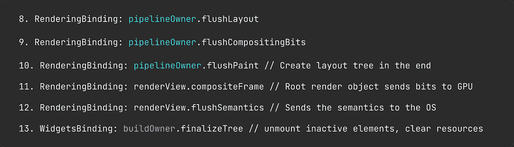**

**在构建阶段之后，渲染管道继续进行*布局* *阶段*。这个阶段从调用`[WidgetsFlutterBinding](https://api.flutter.dev/flutter/widgets/WidgetsFlutterBinding-class.html)`实例的`[RendererBinding](https://api.flutter.dev/flutter/rendering/RendererBinding-mixin.html)` mixin 中的`[PipelineOwner](https://api.flutter.dev/flutter/rendering/PipelineOwner-class.html)`的`[flushLayout](https://api.flutter.dev/flutter/rendering/PipelineOwner/flushLayout.html)`方法开始。在此阶段，渲染树中的所有脏渲染对象将为自己计算几何体，以便它们的计算大小在下一阶段保持最新。**

***合成位阶段*跟随布局阶段，从调用`[PipelineOwner](https://api.flutter.dev/flutter/rendering/PipelineOwner-class.html)`的`[flushCompositingBits](https://api.flutter.dev/flutter/rendering/PipelineOwner/flushCompositingBits.html)`方法开始。这个阶段是关于渲染对象中的图层管理。我建议深入研究这篇关于在 Flutter 中合成比特的惊人文章。**

> **在框架的上下文中，合成通常是指将渲染对象分配给与绘画相关的层[4]**

**通过调用`[PipelineOwner](https://api.flutter.dev/flutter/rendering/PipelineOwner-class.html)`的`[flushPaint](https://api.flutter.dev/flutter/rendering/PipelineOwner/flushPaint.html)`方法，在*合成位阶段*之后开始*绘制* *阶段*。在这个阶段，所有脏的渲染对象都用`[drawLine](https://api.flutter.dev/flutter/dart-ui/Canvas/drawLine.html)`、`[clipRect](https://api.flutter.dev/flutter/dart-ui/Canvas/clipRect.html)`、`[rotate](https://api.flutter.dev/flutter/dart-ui/Canvas/rotate.html)`、`[transform](https://api.flutter.dev/flutter/dart-ui/Canvas/transform.html)`等方法绘制到一个`[Canvas](https://api.flutter.dev/flutter/dart-ui/Canvas-class.html)`上。此阶段执行的绘图将在层树的节点中合成。**

> **"`Canvas`表示支持许多绘图操作的图形上下文."[5]**

**在绘制阶段结束时，所有的绘制指令都存储在层树中。然后，是时候调用根对象上的`[compositeFrame](https://api.flutter.dev/flutter/rendering/RenderView/compositeFrame.html)`了，它也被称为`[renderView](https://api.flutter.dev/flutter/rendering/RenderView-class.html)`。在光栅线程中提交图层树之后，具有脏语义的渲染对象将被更新。语义事件侦听器(如操作系统的可访问性系统)将被告知 UI 更改。**

## **最终确定版本**

**在第一篇文章中，我们提到了作为**案例 1** 和**案例 4** 中`[updateChild](https://medium.com/r?url=https%3A%2F%2Fapi.flutter.dev%2Fflutter%2Fwidgets%2FElement%2FupdateChild.html)`方法调用的结果的非活动子元素。当前帧的渲染管道以调用`[BuildOwner](https://kikt.gitee.io/flutter-doc/widgets/BuildOwner-class.html)`类上的`[finalizeTree](https://api.flutter.dev/flutter/widgets/BuildOwner/finalizeTree.html)`结束。在该方法中，在绘制同一帧的过程中，树中未被重用的非活动子元素被移除，并且它们的资源被清除。在我们的例子中，我们在构建阶段没有做任何 [*树操作*](https://docs.flutter.dev/resources/inside-flutter#tree-surgery) 。因此，元素`F`、`H`和`I`将被卸载。**

# **结论**

**在这一部分，我们解释了 Flutter 的渲染管道，并介绍了在窗口上绘制框架的步骤。这听起来可能是一个复杂的话题，但我相信渲染管道中最重要的学习阶段是构建、布局和绘制。理解这些步骤将有助于我们充分利用小部件库。例如，我们可以利用`[CustomSingleChildLayout](https://api.flutter.dev/flutter/widgets/CustomSingleChildLayout-class.html)`和`[CustomMultiChildLayout](https://api.flutter.dev/flutter/widgets/CustomMultiChildLayout-class.html)`来定制布局逻辑，同时留在小部件层。另一个例子是`[Flow](https://api.flutter.dev/flutter/widgets/Flow-class.html)`小部件，它使我们能够添加在绘制阶段执行的逻辑。**

**这是本系列的最后一篇文章。我希望这有助于理解框架的内部。让我们再次感谢这项技术背后的杰出工程师。特别感谢[亚当·巴斯](https://twitter.com/adambarth)、[埃里克·塞德尔](https://twitter.com/_eseidel)、[伊恩·希克森·希谢](https://github.com/Hixie)，以及整个 Flutter 团队为大家提供了非常棒的文档和培训材料。**

**把话传出去，和 Flutter 待在一起！**

# **参考**

1.  **FAQ， [docs.flutter.dev](https://docs.flutter.dev/resources/faq#does-flutter-use-my-operating-systems-built-in-platform-widgets)**
2.  **[扑动:即使是初学者也必须知道的高级布局法则](/flutter-community/flutter-the-advanced-layout-rule-even-beginners-must-know-edc9516d1a2)、[马塞洛·格莱斯伯格](https://medium.com/u/c2db527bc802?source=post_page-----3a31056355e5--------------------------------)。**
3.  **[Android 如何绘制视图](https://developer.android.com/guide/topics/ui/how-android-draws)**
4.  **合成，[flutter.megathink.com](https://flutter.megathink.com/rendering/compositing)**
5.  **画，[flutter.megathink.com](https://flutter.megathink.com/rendering/painting)**
6.  **[内部颤动](https://docs.flutter.dev/resources/inside-flutter)**
7.  **[肮脏区域管理](https://docs.google.com/document/d/19WDvGJql1bmnECTdEzJFeH9Ixw4AP2R7JlgujBSbDbk/edit#)**