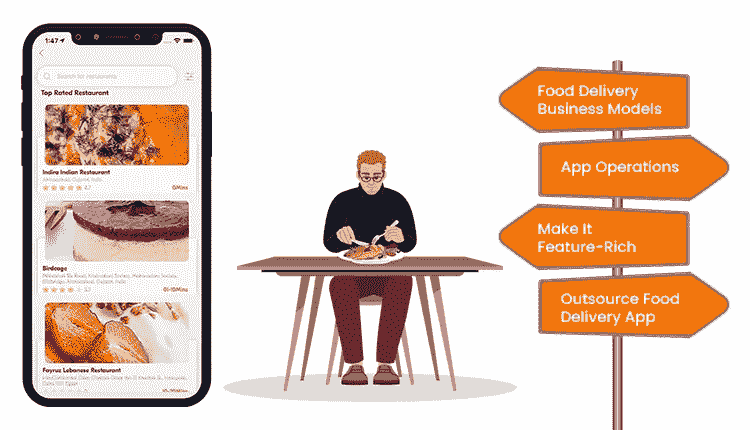

# 为什么送餐克隆 App 开发非常适合餐厅？

> 原文：<https://medium.com/geekculture/why-is-food-delivery-clone-app-development-ideal-for-restaurants-39dcb91727ab?source=collection_archive---------18----------------------->

食品配送克隆应用程序

当你是一个崭露头角的餐馆时，利用成功；战略制定是至关重要的一步。这意味着对当前的流行趋势进行大量的研究。

如果我们从当前的用户行为来看，在线食品交付应用及其使用是一种趋势。这是食品配送行业赢得了利润丰厚的声誉，并拥有异常丰厚的未来的主要原因。

然而，当涉及到开发这些解决方案时，创业机构通常对从头开始构建它们保持警惕。这就是为什么大多数人都支持现成的、贴有白色标签的、随时可以推出的食品配送克隆，以便在短时间内获得可扩展性和增长，同时也获得很大比例的客户。

阅读这篇文章，你将了解这个解决方案，了解它的有益方面，并理解为什么它是食品配送初创公司的福音。

## 在线食品交付应用受欢迎程度的市场统计

在线食品交付应用程序允许餐馆以简化的方式执行他们的操作。它还支持客户进入附近的餐馆，点餐，填饱肚子。这是该解决方案如此受欢迎的主要原因。

这里有一些数字来说明这个方面。

> *1。到 2029 年* ，在线食品交付应用行业的市场规模将达到[*【3200 亿美元】*](https://www.businessofapps.com/data/food-delivery-app-market/)
> 
> *2。在线食品交付业务的当前收入为*[*【2022 年 3233.0 亿美元*](https://www.statista.com/outlook/dmo/eservices/online-food-delivery/worldwide)
> 
> *3。食品配送市场将在* [*增长，2022 年至 2027 年*](https://www.statista.com/outlook/dmo/eservices/online-food-delivery/worldwide)CAGR 为 7.60%
> 
> *4。* [*用户数量到 2027 年将达到 26.132 亿*](https://www.statista.com/outlook/dmo/eservices/online-food-delivery/worldwide)
> 
> *5。2022 年* 当前用户渗透率为 [*23.7%*](https://www.statista.com/outlook/dmo/eservices/online-food-delivery/worldwide)

这些数字表明，接受按需订餐应用程序开发服务是企业设置的正确方法，特别是通过现成的食品交付应用程序克隆。

## 关于食品交付应用程序克隆

食品交付应用克隆是一个白色标签的易于修改，随时推出的解决方案，具有易于定制的功能。这使得传统餐厅可以根据未来的业务需求和客户需求对解决方案进行修改，从而实现可扩展性和增长。

## 餐饮配送应用克隆对餐厅设置的好处

从头开始构建应用程序既费时又费钱。这是餐馆设置执行食物克隆应用程序开发的主要原因。

> ***承诺即时业务推出***

由于[食品配送克隆应用](https://www.fooddeliveryclone.com/blog/top-10-food-delivery-apps-in-uk/)是 100%白色标签，餐厅设置获得支持，以立即启动他们的业务。

这是因为它拥有一些最好的元素，如可定制、可修改等。，不一而足。

> ***多平台兼容性***

兼容不同平台，iOS，Android 等。该解决方案与内核兼容且适应性强。

因此，该解决方案可以在这些平台上无缝运行，没有任何形式的差异或挑战。

> ***是易于定制的***

食品交付克隆应用程序解决方案易于定制和并行扩展。因此，在其中进行修改是一个方便的过程。

因此，在餐馆希望根据未来的业务和客户需求增加一些新功能的情况下，这对他们来说就变得简单了。

> ***承诺全球快速投放***

有了这个解决方案，美食餐厅和餐馆也能以简化的方式在全球范围内开展业务。

这是因为它拥有第三方服务集成以及实时全球功能，包括多语言和多币种的灵活性。

现在，让我们了解一些在克隆应用开发过程中简化流程的技巧。

## 食品克隆应用开发过程中需要记住的提示

你开发的在线送餐应用程序的目标是提高你的利润，并在顾客中创造一种便利感，确保他们随时都能收到他们想要的食物。因此，按需订购食品的应用程序开发服务是一个时代的呼唤。它们将允许可伸缩性和增长完美地发生。然而，由于从头开始开发应用程序耗费时间和资金，克隆应用程序解决方案值得采用。它将承诺一个快速的业务启动。

然而，在使用它们之前，请记住一些要点。这将有助于您成功接触顾客，并使送餐服务更加便捷。

> ***提示 1:了解送餐业务模式***

在按需点餐应用程序开发服务期间，重点收集商业模式的知识。

这里有两个大多数食品配送公司使用的模型-

1.**聚合器模式**多个餐厅可以注册并开始向顾客提供送餐服务。

2.**库存模型**在线食品交付业务执行应用程序启动、膳食准备等。和交付。

> ***技巧二:知道 App 操作***

你需要考虑的第二个技巧是了解 app 运营。这将使您对包含哪些功能会增加价值有所了解。

顾客进入应用程序，添加位置信息，获得附近餐馆的列表。

他们选择符合味蕾的餐厅，选择他们想要的食物。

下订单，订单请求会被发送到餐厅。

餐厅接受订单，并向司机分配提货请求。

司机到达餐厅，拿起订单，顾客得到通知。

客户和司机可以相互跟踪，直到后者到达并交付货物。

> ***技巧三:让它功能丰富***

在食物克隆应用程序开发期间，努力使解决方案功能尽可能丰富。

这里有一些你可以加入的元素-

**= >为客户**

高级搜索过滤器

多个支付网关

实时订单跟踪

定制菜单

寻找附近的餐馆

**= >为餐厅**

订单管理

收入管理

菜单管理

客户/交付驱动因素管理

报告和分析

**= >对于送货司机**

更新交付状态

接受/拒绝交货请求

应用内聊天/通话

收入历史

发票生成

> ***提示 4:外包送餐 App 开发***

创建盈利的食品配送业务的下一个重要步骤是外包食品订购应用程序开发服务。联系海外某按需送餐 app 开发公司。检查企业在克隆应用程序开发方面的专业知识，当你觉得他们符合你的要求时，就去和他们合作。

你如何着手此事？

检查投资组合

评估公司过去的工作

检查客户评论

分析食品交付克隆应用程序开发的经验

一旦你发现按需送餐应用程序开发公司具备适合你的所有先决条件，就和他们联系。分享你的需求，并理解他们的理解。此后，继续前进，并看到你的梦想，一个有利可图的食品配送业务获得短期内的成果。

## 包扎

到 2029 年，送餐业务将赚取 3200 亿美元的利润，到 2027 年，用户数量将达到[26.132 亿。如果你是一家刚刚起步的餐厅，这是你在不降低成本的情况下获得在线食品配送应用的主要原因。联系一家按需送餐 app 开发公司，讨论你的必需品。](https://www.statista.com/outlook/dmo/eservices/online-food-delivery/worldwide)

检查他们在食品克隆应用程序开发方面的专业知识，并让食品交付克隆应用程序在短时间内实现可扩展性和增长。机不可失，时不再来！投入到利用该解决方案建立的创收食品配送中，开始获得前所未有的回报。