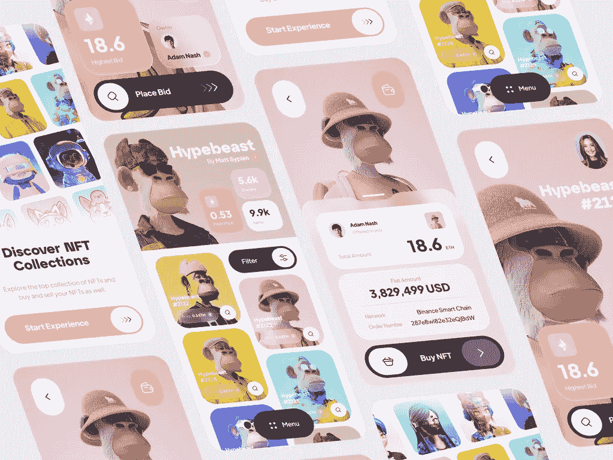

# 为什么 NFT 营销受到各种规模企业的重视？

> 原文：<https://medium.com/geekculture/why-is-nft-marketing-valued-by-businesses-of-all-scales-b8c6e61ca594?source=collection_archive---------24----------------------->

## 随着许多令人兴奋的项目和应用的出现，NFT 空间可能会在 2023 年复兴。

根据全球金融巨头德勤一份名为*[***使用 NFTs 的企业***](https://www.google.com/url?q=https://www2.deloitte.com/content/dam/Deloitte/us/Documents/audit/us-corporates-using-nfts-how-nfts-might-fit-your-business-pov.pdf&sa=D&source=docs&ust=1670421463483049&usg=AOvVaw1jBYLI4YdDzRSuZP96USH5)*的文件显示，**

> **NFT 可以被描述为一个包含创作者生成的内容的胶囊。它在区块链上被锁定，无法复制；只有持有人才能授权转让。”**

**虽然这个定义听起来很酷，但你是否想过为什么这些代币会获得今天的地位？如果是这样，这个博客是给你的；是的，NFT 营销已经并将继续在提升企业走向新一代网络方面发挥重要作用。我们有什么储备？阅读以启发你对 NFT 促销的看法！**

# **非功能性测试的现状**

> **如果考虑 NonFungible.com 著名的 NFT 统计提供商****2022 年第三季度的季度报告，NFT 本季度的销售额约为 17 亿美元。******
> 
> ******尽管考虑到 2021 年第三季度非功能性测试的情况，这可能并不令人鼓舞，但该报告也揭示了 NFT 市场正在为另一场专注于可操作用例的繁荣做准备。******
> 
> ******根据上述陈述和围绕 NFTs 的普遍情绪，我们可以自信地说，NFT 的采用将在 2022 年增加(几个市场已经记录了数百万将钱包与该平台关联的独立用户)。******
> 
> ******随着许多令人兴奋的项目和应用的出现，NFT 空间可能会在 2023 年复兴。******

# ******NFT 营销站在哪里？******

************

******在用数字和预测高度评价 NFT 空间的同时，你可能会怀疑 [**NFT 营销**](https://bit.ly/3CrKyVL) 与所有这些有什么关系。当然，从几年前第一批 NFT 项目涌现的那一天起，它在策划此类抢劫中就有很大发言权。******

******人们可以理解独家促销对 NFT 项目的重要性，因为这些活动是与项目的开发同时进行的。通常，他们会透露项目的元素来吸引观众，建立一个稳定的社区，并增加社交活动。******

> ******“市场营销的工作永远不会结束。是关于永动机的。我们必须每天不断创新。” —贝丝·康斯托克，前 CMO &副总裁，通用电气。******

# ******我们如何着手推广非功能性测试？******

******无论你是在为一个图片收藏、市场、游戏或收藏品项目进行 NFT 营销活动，所使用的基本策略都是相同的，只需稍加改变和定制就能触及目标受众。在宣传 NFT 项目时，风险投资者应该考虑几个目标，让事情变得顺利和无缝:******

*   *******提高品牌知名度和增长*******
*   *******为更高的投资回报率创造空间*******
*   *******在项目门户上生成更多的业务交易*******
*   *******为平台用户创造新奇体验*******

******牢记这些要点可以帮助 NFT 项目的发起人理解企业的使命，并使用成熟的策略向目标受众传播这些使命。******

# ******“久经考验的”NFT 营销策略******

************

*   ******[**社群营销**](https://bit.ly/3BceeWP) *通过 Discord、Telegram 这样的平台，可以成为一个项目社群的基础。一个 NFT 项目可以通过引人入胜的内容形式和竞赛来很好地利用这些平台。*******
*   ******Twitter、脸书、LinkedIn 和 Reddit 上的社交媒体营销有利于风险企业展示其业务，并通过挖掘当前趋势和有洞察力的模因建立在线业务。******
*   ******[**影响者营销**](https://bit.ly/3iI9jH4) *可以被 NFT 商家用来开发新的目标市场，增加他们的官方账号和网站的有机流量。*******
*   ******任何 NFT 企业都应该利用公共关系让公众知道它的名字。有效创建的新闻稿和媒体报道有助于增加业务宣传。******
*   ********内容营销，** *借助以 SEO 友好格式创建的各种内容形式，同时保持与读者的个人联系，可以帮助 NFT 项目获得高度信任、可信度和网络流量。*******
*   ******YouTube 和抖音等平台上的视频营销可以被 NFT 营销团队有效地用来向精通技术的千禧一代和 Z 世代的观众推广项目。******

> *******“内容建立关系。关系建立在信任的基础上。信任推动收入。”* —安德鲁·戴维斯，作者&主题演讲人，重大转变。******

# ******任何 NFT 营销活动产生的费用******

******任何 NFT 营销活动要取得成功，都必须有单独的预算分配，以避免最后一刻的争斗。虽然我们建议与专业的 NFT 广告公司合作，但我们无法给出具体的广告费用。不管 NFT 公司专注于哪个领域，可以说项目的规模可以决定活动的持续时间。同时，目标受众可以支配所花的钱。******

******人们还必须注意到，每一个策略都是有代价的，价格只会随着促销活动的进行而增加。首先，拥有大量追随者的有影响力的人将比那些追随者数量较少的人征收更多的费用，而拥有巨大影响力的媒体机构也将更加昂贵。******

# ******包装想法******

******因此，我们可以说，NFT 营销对于任何企业在 Web3 领域取得成功都是至关重要的，不管它是初创企业还是全球巨头。为了达到最大限度，我们建议制定一个有几个备用方案的计划，以防出现任何反弹。如果你计划在 NFT 地区开展业务，并希望受到整个社区的关注，那么与经验丰富的 [**NFT 营销机构**](https://bit.ly/3CrKyVL) 合作将是理想的选择。这样的公司可以帮助你设计一个基于测试过的策略的活动，为你的新 NFT 业务产生牵引力，而没有麻烦。******