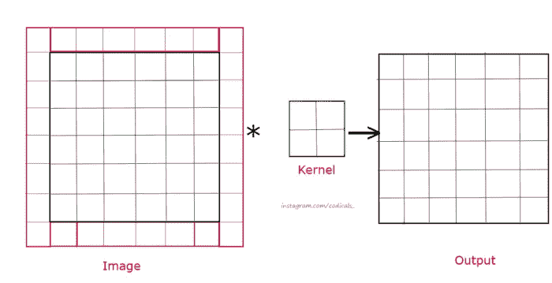
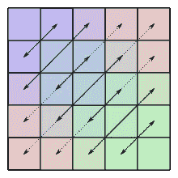
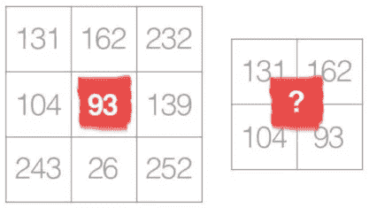

# 为什么奇数内核比偶数内核更受欢迎？

> 原文：<https://medium.com/geekculture/why-is-odd-sized-kernel-preferred-over-even-sized-kernel-a767e47b1d77?source=collection_archive---------8----------------------->

希望大家都意识到内核在计算机视觉中的作用。您一定注意到我们通常使用奇数大小的内核(1x1、3x3、5、5、7x7 以及同一系列中的许多其他内核)。但是为什么只有奇怪的形状呢？这背后的原因是什么，我在这里解释一下。

Convolution using 3x3 kernel with no Padding (Credits: [Codicals](https://www.instagram.com/codicals_/))

我们总是将填充应用到我们的图像中，以进行更多的卷积并获得最好的特征，这就是为什么在卷积之前添加填充变得很重要。填充后的输出要素地图大小可通过以下公式计算:

> **o/p _ size = img _ size-kernel _ size+1+(2 * padding _ size)**

使用填充，我们希望我们的特征映射的 o/p_size 与 img_size 相同，这将帮助我们在 kernel_size 的帮助下找到填充大小。参见从上面导出的公式。

> **padding _ size =(kernel _ size-1)/2**

Constant Padding (fill all the red pixels in the image with 0) Credits: [Codicals](https://www.instagram.com/codicals_/)

你一定在想，为什么我要从奇核的问题中转移出填充。*我包括的所有上述观点都是为了证明为什么我们更喜欢使用奇数核而不是偶数核。*

如果我们把 ***的任何 kernel_size 设为偶数，那么 padding_size 将是一个十进制数，我们将如何对初始图像应用十进制填充是不可能做到的*** 。如果我们使用奇数大小的任何内核大小，那么填充大小将是任何整数，可以应用该值的填充。这就是为什么我们使用奇数内核大小。

除此之外，甚至大小的内核*也可以使用，但是那些图像不能被填充意味着没有填充(有效填充)是必要的。*

使用奇数大小内核的另一个原因是，所有先前层的像素将围绕输出像素对称。 ***如果没有这种对称性，我们将考虑当我们使用均匀大小的内核*** *时发生的所有层的失真。因此，为了简化实现，我们跳过偶数大小的内核。*

Symmetric Output(Credits: [Wikipedia](https://www.google.com/url?sa=i&url=https%3A%2F%2Fen.wikipedia.org%2Fwiki%2FSymmetric_matrix&psig=AOvVaw200gVljt4eZGGlcbcPVQqh&ust=1630150540165000&source=images&cd=vfe&ved=0CAwQjhxqFwoTCOC49rOO0fICFQAAAAAdAAAAABAX))

不使用均匀大小的内核的另一个原因是，如果我们认为卷积是从给定像素到中心像素的*插值(将一个值用于估计其他值)*，**，*我们不能使用均匀大小的内核*** *插值到中心像素。*

Interpolation of pixels to Center pixel (Credits: [SabyaSachi Sahoo](/@ssahoo.ai))

我希望这三个理由足以让我们理解奇数大小的内核比偶数大小的内核更有用。

谢谢你阅读它。

敬请关注。不断学习