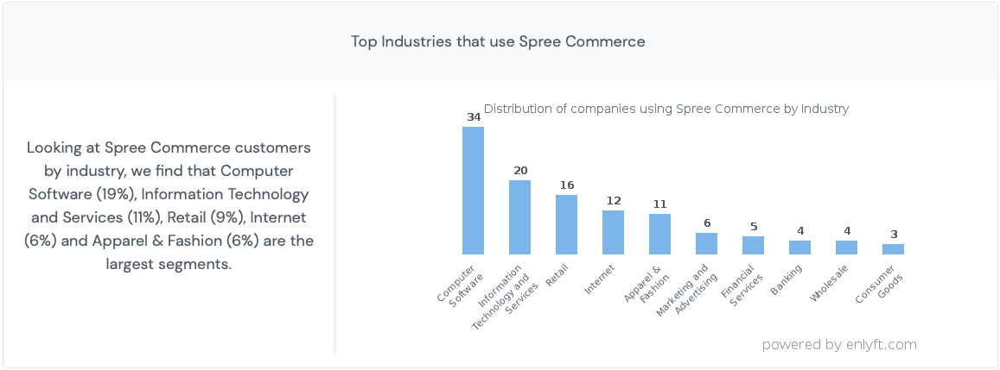

# 为什么 SpreeCommerce 是最好的电子商务平台之一？

> 原文：<https://medium.com/geekculture/why-is-spreecommerce-among-the-best-ecommerce-platforms-4634ec1fe445?source=collection_archive---------24----------------------->

全球有超过 34 亿电子商务用户。越来越多的人要求公司创建电子商务网站，让用户可以方便地购买产品。因此，非常需要能够帮助公司利用技术建立高度直观和用户友好的[电子商务商店](https://www.botreetechnologies.com/case-studies/ecommerce-marketplace)的电子商务平台。

由于电子商务行业发展如此迅速，有几个平台承诺高质量的电子商务解决方案。随着疫情的出现，便利和安全成为优先考虑的问题，这导致电子商务市场在 2020 年超过 10 万亿美元。帮助建立此类网站的平台蓬勃发展，有两个原因。

# **什么是最好的电子商务平台，为什么？**

如今，小型企业、零售商和大型企业都有电子商务平台。所有这些服务于相同的目的，但提供不同的发展方式。一些最大的电子商务平台是:-

*   Magento
*   购物化
*   网络商务
*   方形空间
*   狂欢商务
*   预车间
*   大商业

除此之外，还有多种电子商务平台，如 OpenCar、SAP Commerce Cloud 等，这些平台并未得到广泛应用，但仍能在构建电子商务解决方案方面提供高效的结果。

Shopify 是建立电子商务网站最简单的方法之一，因为它有拖放式界面。一家电子商务网站开发公司可以在几周内创建一个 Shopify 商店的原型。

> **结账对比:** [**狂欢商务 Vs Shopify**](https://www.business2community.com/ecommerce/spree-commerce-vs-shopify-pros-and-cons-comparison-02380909)

在 [BoTree Technologies](https://www.botreetechnologies.com/) ，我们也使用 SpreeCommerce，我们发现它是仅次于它的最简单也是最强大的小型企业和企业电子商务平台之一。本文将讨论什么是 Spree，为什么公司应该雇佣 Spree 商务开发团队，以及他们如何从这个平台开始创建他们的在线商店。

资料来源:W3techs.com

# **网店选择大礼包商务的 7 个理由**

Spree Commerce 是领先的开源电子商务平台之一，用于构建高度互动的电子商务网站。它的免费代码库允许开发者创建动态在线商店，以提供最佳的购物体验。

在电子商务平台比较中，Spree 是 50 大开源项目之一(有 300 万个)。有超过 20，000 家令人惊叹的大礼包商业商店，而且这个数字还在不断增加。使用 Spree 的一些领先公司包括 Paneco、Urban Ladder、Garmentory、Everlane、Huckberry 等。

那么，为什么这些公司的网上商店都是用 Spree 建立的呢？以下是选择 Spree Commerce 建立互动电子商务商店的 7 个理由-

1.  **基于 Ruby on Rails** Spree Commerce 的主要优势在于它基于 Ruby on Rails。这意味着快速的应用程序开发、直观性和动态性是创建电子商务商店时狂欢的一部分。Spree 可以同时处理数百个请求，使网站能够处理繁重的流量，同时为数百名客户提供服务。
2.  **定制能力** Spree Commerce 是[最好的 b2b 电子商务平台](https://www.botreetechnologies.com/case-studies/online-marketplace-for-industrial-gases)之一，本质上是模块化的。它提供大量定制功能，使企业能够构建个性化的电子商务应用。与众不同的功能允许修改现有的在线购物网站或向新商店添加各种功能——这一切都归功于大量的集成，这将我们带到了下一点。
3.  **广泛的集成** 任何与 Spree 合作的电子商务网站开发公司都知道它在集成方面的力量。从支付网关到跟踪网站活动，Spree Commerce 提供了强大的集成和第三方插件。几乎所有的东西都有集成——因为它是基于 Ruby on Rails 构建的，所以安装这些插件不会有任何性能问题。
4.  **移动优先发展** [79%的智能手机用户](https://www.outerboxdesign.com/web-design-articles/mobile-ecommerce-statistics)在过去 6 个月中使用移动设备进行过购物。Spree Commerce 支持构建响应迅速、移动友好的电子商务网站。移动友好的方法确保用户获得流畅的用户界面和与 web 应用程序同等的体验。雇佣 Spree 商务专家的公司可以利用这些技能为不断增长的移动用户建立在线商店。
5.  **高可扩展性** Spree Commerce 符合 Shopify 和 Magento 等一些最大的电子商务平台的可扩展性标准。后端代码非常强大，因为它在代码库中使用了 Ruby。Spree 非常注重可伸缩性——它可以毫无问题地同时处理数千个事务。希望建立可扩展在线商店的公司应该相信 Spree Commerce 的表现。
6.  **多样化的电子商务解决方案** 提供[电子商务网站开发服务的公司](https://www.botreetechnologies.com/ecommerce-app-development)使用 Spree 为各种行业建立在线商店。Spree 是最好的 b2b 电子商务平台之一，也是一个非常有用的以客户为中心的平台。今天许多公司更喜欢 Spree，因为它有定制选项，可以满足他们行业对电子商务的特定要求。

资料来源:enlyft.com

**7。营销选项** 最后但同样重要的是，电子商务开发服务的专业人士推荐 Spree，因为它提供了惊人的营销机会。它支持与 SEO 的轻松集成，提供折扣代码和优惠券，协助推送通知，简化活动管理，并帮助电子邮件营销公司增加销售和实现收入最大化。

与 Shopify 和 Magento 一样，Spree Commerce 正日益成为最受欢迎的电子商务平台之一。因为它是用 Ruby on Rails 编写的，所以它提供了构建交互式商店的动态功能。

## **我该如何开始疯狂购物？**

如果你有一个由 Ruby on Rails 开发人员组成的内部团队，他们可以很容易地与 Spree Commerce 合作。然而，如果没有团队，你可以雇佣一个电子商务网站开发公司，为你建立一个大礼包商店。

电子商务开发人员对平台、其功能、集成、开发时间和开发成本有着深刻的理解。他们可以通过提供对时间和工作的估计来帮助公司开始。

安装 Spree Commerce 非常简单。在 [Spree 商业网站](https://dev-docs.spreecommerce.org)上有很多文档，提供了关于它的安装、API 以及如何开始使用该平台的详细信息。

值得信赖的施普雷商业发展公司是你从施普雷开始的最佳选择。它有合适的经验和技能来建立大量定制的商店，并向客户提供个性化的体验。 [Spree Commerce](https://www.botreetechnologies.com/spree-commerce-development) 是一个越来越受欢迎的平台，因为它简单且易于开发。小型企业和企业利用该平台提供最佳购物体验是有意义的。