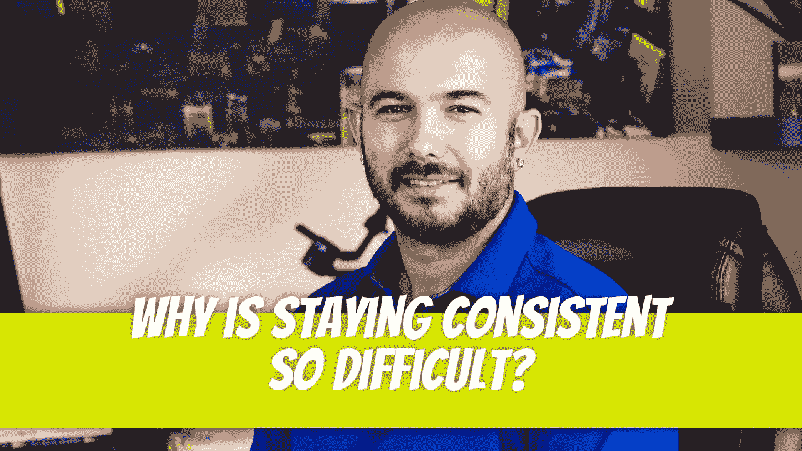

# 为什么保持一致如此困难？

> 原文：<https://medium.com/geekculture/why-is-staying-consistent-so-difficult-a153114de169?source=collection_archive---------17----------------------->

无论你走到哪里，你都会听到这句话:“保持一致，才能取得成功。”做一个 100 天的编码挑战来快速提升你的编程技能。在 Instagram 上连续 90 天发布 90 个卷轴，开始你的粉丝计数。接下来的 6 个月每天锻炼 1 小时，减掉 20 磅。