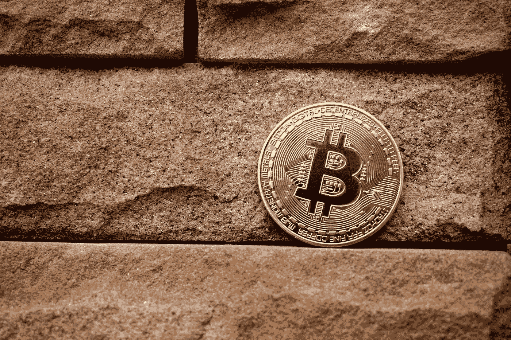
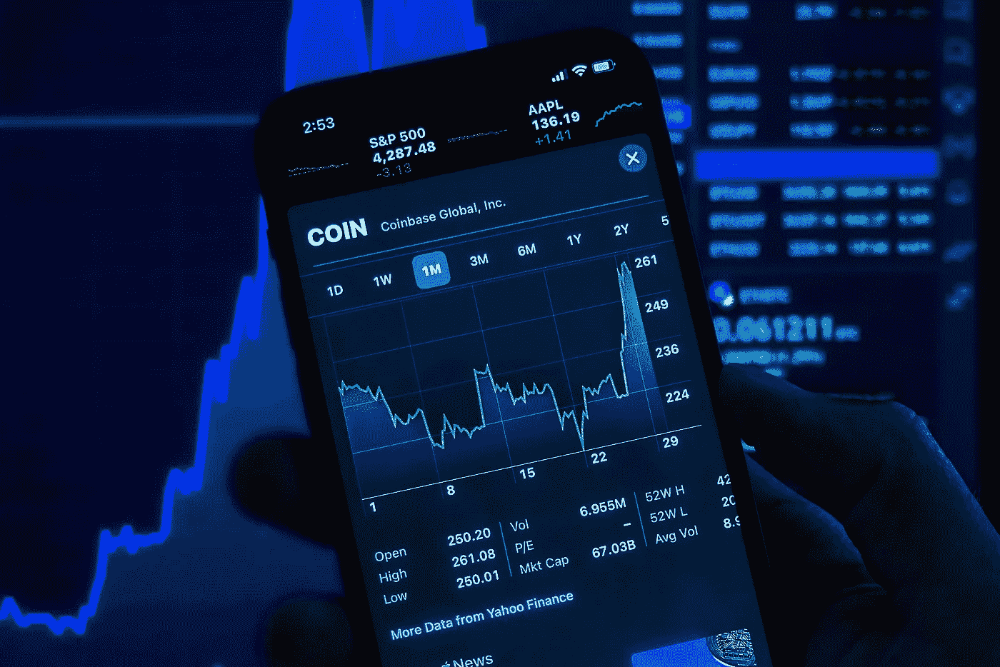

# 为什么密码市场如此疯狂？推动密码市场的因素。

> 原文：<https://medium.com/geekculture/why-is-the-crypto-market-so-wild-factors-that-move-the-crypto-market-10f9267e3d1c?source=collection_archive---------15----------------------->

Source: Unsplash.com

加密货币是投资的狂野西部。尽管加密货币像股票一样在股票市场上交易，但加密市场无法与道琼斯、纳斯达克或标准普尔 500 相比。

随着时间的推移，投资者最大的担忧是为什么加密资产的价格如此不可预测？据一些专家称，加密货币市场因投机而繁荣，加剧了市场的波动性。为了获利，投资者押注价格会上涨还是下跌。高波动性是由这些投机赌注造成的，它们会导致资金快速注入或突然流出。出于这个原因，购买加密货币就像在无休止的过山车上跳跃。据你所知，你可能会带着加密硬币来一次疯狂的旅行。

> **另见:** [**分权财政(DeFi) vs 集权财政(CeFi)。**](http://Decentralized Finance (DeFi) vs Centralized Finance (CeFi).)

**波动率定义**

Source: Unsplash.com

资产价格的变化被称为金融市场的波动。如果价格在一定范围内稳定上涨或下跌，这可能是一件好事。

然而，两个方向的极端价格变动也可能发生。
在市场中，健康的波动有助于实现多种目标，但最重要的一个目标是它提供了盈利机会。例如，股票价格变动允许交易者买入低价，卖出高价，或“卖空”他们认为价格会下跌的股票。

当一项资产的价格在短期内剧烈波动时，它被认为是极度不稳定的。加密货币市场经历了极度的波动。

加密货币市场的波动是不可思议的。截至目前，还没有跟踪加密货币价值波动的指数，但粗略地看一下价格图表就会发现，加密货币的价格波动比传统市场资产的价格波动更快、更剧烈。

根据 CoinMarketCap 的数据，比特币的价格在 2016 年飙升了 125%，然后在 2017 年超过了 2000%。在 2017 年创下历史新高一年后，比特币的价格再次下跌。2021 年，比特币的价格比 2017 年牛市峰值翻了三倍，创下历史新高。自 2022 年以来，比特币的价值没有显著增加。反而下降了 50%以上。

加密货币的价格受到其他市场不存在的因素的影响。如果你想用加密货币赚钱，你必须了解是什么导致它们的价格上涨和下跌。

**加密货币市场如何运作**

Source: Unsplash.com

像任何其他市场一样，加密货币市场是加密货币买卖的地方。特定市场上特定加密货币的需求和供应将决定其价格运动的方向，无论是向上还是向下。

与股票市场不同，加密货币交易交易所分为集中式(CEX)和分散式(DEX)两种。理解这一点是很重要的，因为每一种交易所的价格是不同的。

**在集中式和分散式加密交易所中，加密货币的价格是如何确定的？**

中央加密交易所由保护资产和促进交易的中介机构管理；交易所是市场参与者的渠道。通常，这里的交易在交易所的中央服务器上结算。

为了确保其运营合法，集中交易所还(通常)受金融机构监管，包括 KYC 和反洗钱规则。

另一方面，分散式加密货币交易所的运行不需要中央机构，因为它是建立在智能合同上的。分散的交易所是没有许可的，这意味着任何人都可以在没有交易所同意的情况下加入。因此，分散式交易所不受 KYC 或反洗钱法律的约束。

在集中式加密交易所中，加密资产的价格由双方使用传统交易所(如标准普尔 500)采用的传统订单簿模型来确定。

订单簿是特定加密货币的所有未结买卖订单的列表。在这种模式中，CEX 充当中间人来清算交易，并为您的加密资产提供托管服务。交易不是直接在区块链进行，而是在 CEX 的服务器上进行。

按交易量计算，币安是领先的集中交易市场。

**分散的交易所如何决定加密货币的价格？**

在分散交易所(dex)中，点对点交易通过自动智能合约(程序)进行，这种合约在没有中介的情况下执行交易。

dex 通过流动性池协议确定加密货币的价格。这些交换便利了用户之间即时和直接地从一个钱包到另一个钱包的交易或“交换”。与 CEX 不同，这里没有中间人。

通常，自动做市商(AMM)方法用于执行互换。AMMs 消除了交易对手确定价格的需要。相反，AMMs 使用算法来确定价格，这意味着无论是否有另一方参与交易，您都可以交易特定的硬币或代币。这是通过“流动性池”实现的。这些资金池向用户付费，让他们将一部分资金放在智能合约中，然后可以提取这些资金进行交易。

只有买家希望交易特定的加密货币对。

dex 是非托管的，因此您有责任保护您的加密货币。

通过利用硬件钱包和种子短语恢复钱包，您可以在分散式交易所交易时保护您的加密货币。一个流行的硬件钱包是莱杰纳米。

UniSwap 和 Pancakeswap 是目前最大的两个加密货币指数。

**影响加密货币市场的因素。**

Source: Unsplash.com

是什么促使人们在不同市场买卖资产，这是一个复杂的争论话题。人们容易受到市场情绪、新闻、环境、市场分析、交易信号等的影响。导致加密市场变动的因素包括:

1 **。比特币的价格**

比特币是加密货币之王，其双向价格波动会影响市场的其他部分。换句话说，比特币的走势影响了其他加密货币的价格。

**2。基本面消息**

密码市场对新闻高度敏感。项目新闻和开发里程碑导致加密货币价格上涨或下跌是很常见的。一般来说，hardfork、testnet 或 mainnet 发布的公告将显著影响任何加密货币的价格。在许多情况下，硬币的价格会在项目的 testnet 或 mainnet 发布日期之前上升，然后在 testnet 或 mainnet 发布之前下降。

类似地，如果错过了一个发布的里程碑，项目被黑，开发失败，或者以任何方式被利用，硬币的价格也会下降。

硬币市值是一个很好的资源，用于确定是否有任何即将到来的特定硬币或令牌的项目公告。

**3。空投**

空投是加密货币行业中用于增加特定项目或硬币曝光率的一种促销活动。通常，他们包括项目团队将免费硬币发送到现有硬币持有者的钱包中。所以本质上是一种奖励项目支持者的现金赠品。当这种情况发生时，特定硬币的价格可能会经历核价爆炸。

**4。令牌刻录**

代币焚烧是一种故意销毁或“烧毁”硬币以使其无法使用、减少该硬币的总市场供应量并提高其价值的过程。这相当于加密货币市场上传统市场的股票回购。硬币燃烧用于稳定硬币的价值，并经常提前安排，以鼓励买家持有硬币(并在硬币燃烧时从价格上涨中受益)。

**5。泵和倾卸组**

泵转储方案并不是加密货币独有的，但它们是操纵价格的一种相当普遍的方法。警惕泵和转储计划。它们大致遵循这样的格式:通常，在 Telegram 或其他社交平台如 Discord、WhatsApp、Twitter 和脸书上，一群投资者(组织者)串通起来购买一种低市值硬币，逐渐超时以推高价格。在说服其他投资者它的价值会暴涨后，组织者卖出，导致价格立即下跌。这是有组织和无组织之间的适者生存。

**结论**

这个列表并不详尽。最终，尽管有各种因素，加密货币的价值是由供需决定的，就像其他任何东西一样。

随着加密货币的可见性或效用增加，需求也会增加。此外，加密货币在全球的广泛采用也增加了需求。例如，当机构投资者在 2021 年初开始购买和持有比特币时，比特币的价格大幅上涨，因为需求超过了新硬币的创造速度，有效减少了比特币的总供应量。

类似地，随着更多的分散金融(DeFi)项目在以太坊区块链启动，对以太的需求也在增加。这是因为无论使用何种加密货币，在区块链上进行交易都需要以太网。