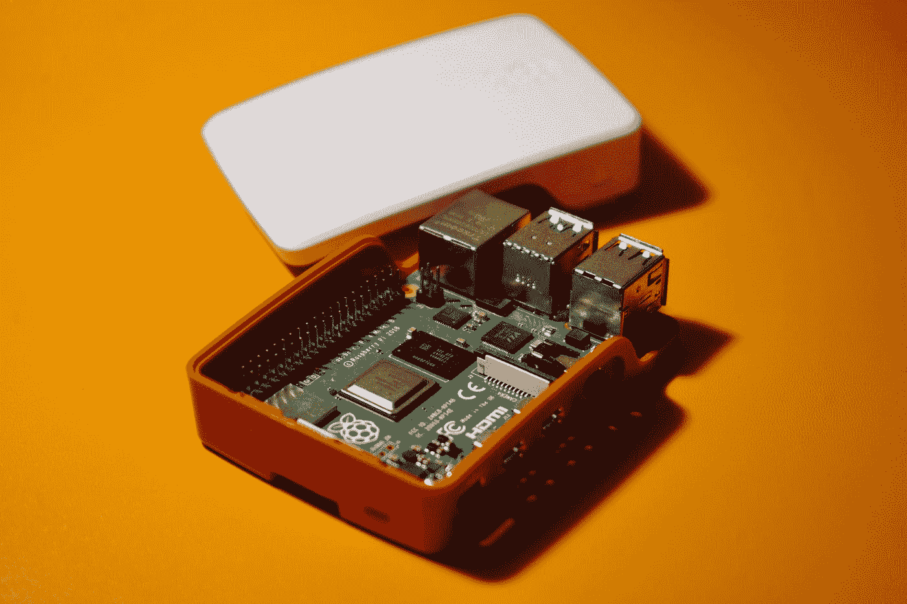

# 为什么树莓派是创业公司的绝佳平台？

> 原文：<https://medium.com/geekculture/why-is-the-raspberry-pi-a-great-platform-for-startups-2c2a6ff0a804?source=collection_archive---------14----------------------->

Raspberry Pi 是一台迷你电脑，最雄心勃勃的项目之一是将其用作云托管平台。

Photo by [Praveen Thirumurugan](https://unsplash.com/@praveentcom?utm_source=medium&utm_medium=referral) on [Unsplash](https://unsplash.com?utm_source=medium&utm_medium=referral)

Raspberry Pi 是一款小巧、经济、功能强大的电脑，可用于多种用途。

它已被用于物联网(IoT)传感器网络和家庭自动化等项目。