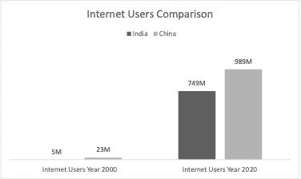
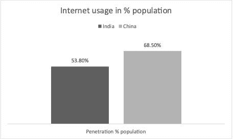
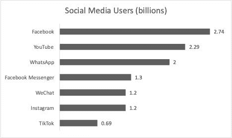
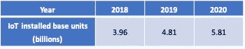

# 为什么世界上有这么多数据？

> 原文：<https://medium.com/geekculture/why-is-there-so-much-data-in-the-world-be526cdd54e8?source=collection_archive---------44----------------------->

## 千兆字节、千兆字节和千兆字节。这就是我们如何测量世界上的数据量。不要费心谷歌这意味着什么，我相信你已经猜到了，这些是一些不可思议的数字。

Photo by [**San Fermin Pamplona**](https://www.pexels.com/@san-fermin-pamplona-549332?utm_content=attributionCopyText&utm_medium=referral&utm_source=pexels) from [**Pexels**](https://www.pexels.com/photo/bird-s-eye-view-of-group-of-people-1299086/?utm_content=attributionCopyText&utm_medium=referral&utm_source=pexels)

但是为什么每天都会产生如此多的数据呢？

# 让我来帮你分析一下。在本周的博客中，我将分享为什么我们在世界上有丰富的数据的三个关键原因:

**#1 的万维网采用率**

**#2 社交媒体狂潮**

**#3 物联网**

让我们深入了解其中的每一项

# 万维网采用率排名第一

我们所知道的万维网自 20 世纪 90 年代初就已经存在了。

然而，这种现象主要集中在西方和较富裕的国家。

当人口大国开始采用数字化时，这种情况发生了变化。

亚洲有世界上 55%的人口，有两个人口最多的国家，中国和印度。

下图显示了这两个国家互联网使用率的大幅增长。

[Source](http://%3Chttps//www.internetworldstats.com/stats3.htm%3E)

> *…..因为改变人们的行为以采用新的工具和流程是一场艰苦的斗争……💭*
> 
> [*推文*](https://twitter.com/intent/tweet?text=.....because+changing+people%E2%80%99s+behaviours+to+adopt+new+tools+and+processes+is+an+uphill+struggle......%F0%9F%92%AD&url=https%3A%2F%2Fwww.hanzalaqureshi.com%2Fwhy-is-there-so-much-data-in-the-world-17%2F)

用户分别增长 15000%和 5000%。这种收养改变了这些国家许多人的生活，并有助于减少贫困。

更令人震惊的是，这两个国家还有很长的路要走。

下图显示了总人口的渗透率。

相比之下，在欧洲和北美，渗透率在 90%左右。

不言而喻，但是用户的急剧增加导致了数据捕获和生产的指数级增长。

这些用户为世界上最大的搜索引擎的使用做出了贡献。谷歌现在每秒处理超过 40，000 次搜索。当你读到这篇博客的第一部分时，已经进行了 480 万次搜索。

虽然搜索只是用户参与的活动之一；值得理解的是，一个简单的搜索会从用户那里获取大量数据。

位置、搜索术语、搜索频率、时间、日期、现有用户或新用户等数据点都有助于谷歌为用户索引正确的搜索结果。

整个商业模式是基于捕捉和处理实时数据。类似地，如果你登录了你的谷歌账户，历史记录会保留你之前的搜索记录。你使用谷歌地图访问过的所有地点的数据，或者你在 YouTube 上进行的任何搜索的数据也是如此。

这个数据量是一个搜索引擎的一个用户的。再乘以全世界使用各种不同在线服务的 45 亿多用户。难怪，数据跑到了 zettabytes。

# 第二大社交媒体狂潮

再来说说社交媒体平台。

这些也是数据生产指数增长的最大贡献者之一。

超过 50%的活跃互联网用户使用如下所示的社交媒体平台。

[Source](https://datareportal.com/reports/more-than-half-the-world-now-uses-social-media?rq=social%20media)

作为一名顾问，我知道进行有效的业务变革有多难。这主要是因为改变人们的行为以采用新的工具和流程是一场艰苦的斗争。

令人难以置信的是，人类采用社交媒体的速度可能比历史上任何时候都快。当然，伟大的疫情只是增加了这些平台的用户。

这里值得一提的另一个变化是智能手机的引入。这使得社交媒体的移动平台易于使用和交流。

现在，进入数据问题。

我从哪里开始？

一个更容易回答的问题是，这些平台**不**捕捉哪些数据点？

答案可能是什么都没有。

特定位置数据、用户姓名、出生日期、个人历史(如关系)、职业历史(如职业)等。通常在这些平台中被捕获。这也取决于用户实际上已经公开了他/她自己多少。

这些平台通常还会抓住你的兴趣，以及你与平台上其他内容的互动。这是，这样他们可以更好地为你服务，也可以更好地利用广告瞄准你。

就像#1:将数百个数据点乘以数十亿用户。现在你知道了。您在世界各地拥有 24 个数百万平方英尺的数据中心。

总而言之，这产生了大量的数据，用于实时的可操作的洞察。

# #3 物联网

尽管与上述两个项目相比，物联网是一个相当新的主题，但它确实会一直存在下去。

物联网就是所有连接到互联网的设备，现在被归类为*智能。*

你的打印机连接到你的无线网络，在墨水和纸张快用完时提前订购，这就是一台*智能打印机。*

你的灯泡在你的语音命令下变成各种颜色，这就是一个*智能灯泡。*

你的冰箱在你快吃完的时候给你的购物清单添加牛奶，这是一款*智能冰箱。*

一个*智能电表会实时捕捉您的用电量，并发送给您的能源提供商。*

这些是我们十年前可能没有想到的用例。

来自 Gartner 的下表显示了整体物联网单元(冰箱、电表等)。)在过去的 3 年里。

[Source](https://www.gartner.com/en/newsroom/press-releases/2019-08-29-gartner-says-5-8-billion-enterprise-and-automotive-io)

物联网设备的数量超过了全球互联网用户的总数。与人类不同，这些设备每秒都在基于传感器创建额外的数据。

随着 5G 带来更快的传输速度，更多的用例将被解锁。因此，这种趋势只会成倍增长！

根据物联网设备的不同，会捕获大量数据点。如位置数据、物联网设备配置数据、设备用户的行为等。

这可以帮助销售设备的公司更多地了解他们的产品如何被使用以及如何改善用户体验。它还可以让公司发现设备中常见故障的趋势。

同样，海量的数据、巨大的可操作见解的潜力，当然也是全球数据捕获增长的一大贡献者。

# 结论

因此，我们已经了解了发展中国家数字化的加速，以及移动和社交媒体的引入。此外，随着物联网设备的快速采用，以及它如何导致数据捕获和处理的巨大增长。

这为组织利用丰富的数据提供了无限的机会。这无疑给最终用户带来了隐私问题。

我在另一篇文章*中谈到了我对数据隐私的更多想法。*

如果你还在读这篇文章，我希望你已经在这篇博文中发现了一些价值。

如果你想了解更多类似的内容，请订阅我的时事通讯。

如果你有什么反馈或者只是想打声招呼，请随时联系我的电子邮件【hello@hanzalaqureshi.com！

另外，看看我的另一个关于[数据价值](https://www.hanzalaqureshi.com/what-is-the-value-of-your-data-13/)的博客