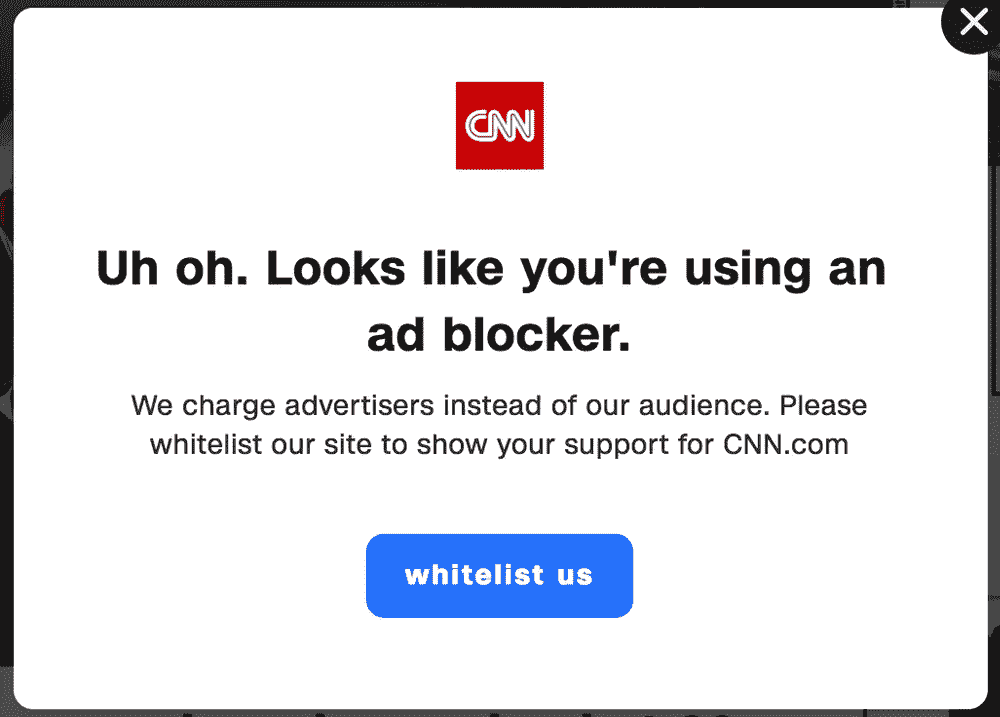

# 为什么当网站因为你使用广告拦截而让你感到内疚是可怕的

> 原文：<https://medium.com/geekculture/why-it-is-awful-when-websites-guilt-trip-you-for-using-ad-block-96f23a3be229?source=collection_archive---------7----------------------->

## 抱歉，但不是抱歉

Disable AdBlock Banner from [CNN](https://www.softwarehow.com/wp-content/uploads/disable-adblock13.png)

很多人讨厌广告(包括我)，很多人更讨厌订阅网站。这两个模型是有效的。

你猜怎么着我得到了 AdBlock，像许多其他人一样。所以我不在乎！除非网站强迫我禁用它…