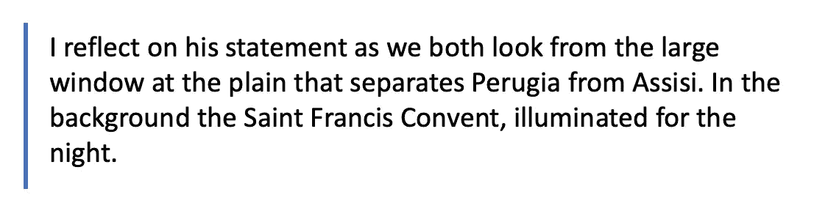
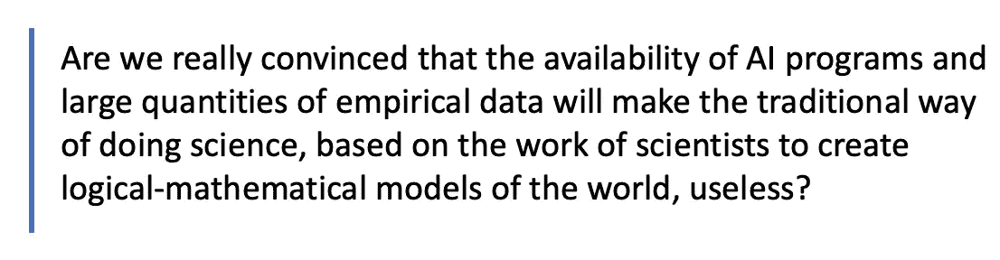
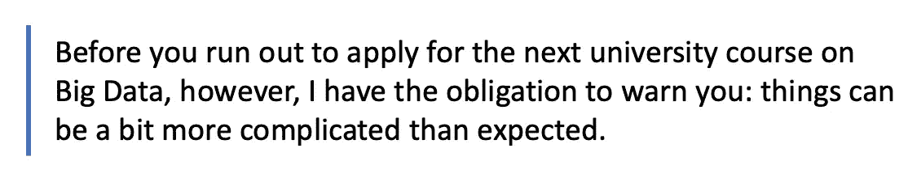

# 如果你不知道你在找什么，为什么很难找到

> 原文：<https://medium.com/geekculture/why-it-is-difficult-to-find-something-if-you-do-not-know-what-you-are-looking-for-1e7ca2f69da5?source=collection_archive---------28----------------------->

*大量的数据。到处都是。它们一定值一些钱。*

基于这个简单的假设，一个全新的学科眨眼之间就不知从哪里冒出来了。著名的“大数据”方法最初充斥着杂志，最终溢出到由受人尊敬的作者撰写的受人尊敬的期刊的科学版面。机器学习技术，即基于人工神经网络明智使用的数学工具，应用于大量可用数据的分析，为我们带来了极其高效的图像和语音识别工具，以及自动驾驶汽车和对某些疾病进行高效自动健康诊断的可能性。如今，大数据和机器学习是最先进的人工智能(AI)研究的基础。

Photo by [Iman Warsame](https://unsplash.com/@bobsy101?utm_source=medium&utm_medium=referral) on [Unsplash](https://unsplash.com?utm_source=medium&utm_medium=referral)

这样一种成功的方法很快激发了一个更大的野心:彻底克服老式的科学方法。根据美国杂志《连线》主编克里斯·安德森(Chris Anderson)在 2008 年写的一篇题为“理论的终结:数据的泛滥使科学方法过时”的文章，“实验”数据的巨大可用性让我们克服了基于物理模型创建的传统科学方法，即由科学家的大脑创建的基于数学关系的理论，并培养了一种基于大量使用人工智能技术的新方法。这个想法是跳过现有的隐藏模型的搜索阶段，直接识别数据中的模式。用谷歌研究总监、人工智能专家彼得·诺维格(Peter Norvig)的话来说:“所有模型都是错的，越来越多的时候，你不用它们也能找到解决方案”。信息是明确的:*亲爱的科学家，请不要试图弄清楚世界是如何运转的，计算机将为我们找到自然规律，这些规律不一定采取可理解的数学关系的形式，但同样会起作用。*

如果是这样的话，为什么不把它应用到寻找一个最难以捉摸的结果:引力波？第一次观测日期为 2014 年 9 月 15 日，是三十年来致力于建模、设计、建造和操作大规模光学干涉仪探测器的努力的结束。多年来，我一直在与数十名其他科学家一起工作，以模拟和减少影响探测器功能的噪声。这项任务具有战略重要性，因为引力波信号实际上隐藏在噪音的海洋中。噪声特性和衰减的持续改进最终导致了首次检测的目标。从那以后，从黑洞合并和双星中子星合并中已经探测到了许多其他的信号。对新信号的搜索仍在进行，一些科学家现在已经提议应用人工智能算法:“我们有很多积累的数据，我们计划使用机器学习技术来发现有趣的东西。我们正在寻找以前的分析没有发现的新信号。也许是一种新的物理学”。这是拜访我的巴里·巴里什在餐馆告诉我的。当我们从大窗户望向分隔佩鲁贾和阿西西的平原时，我思考着他的话。背景是夜晚灯火通明的圣弗朗西斯修道院。我对他的说法感到困惑，我非常谨慎地告诉他，因为无论如何，他已经获得了诺贝尔奖，并不是一个以轻率发言著称的人。

我的同事的想法很有趣:迄今为止，我们已经找到了引力波的证据，因为我们知道会发生什么，我们去噪音的海洋中寻找它们。现在让我们试着在同样的噪音海洋中找到其他东西，一些我们不知道是否存在但有可能存在的东西:由我们甚至无法想象的新现象发出的引力信号，这些信号甚至可能揭示新的物理定律。寻找某种东西的想法，我们不知道它是否存在，也不知道它究竟是如何存在的，这并不是一个新的想法，自上世纪 80 年代以来，它一直是物理学家和数学家工作的核心，他们处理所谓的曹氏理论。其中包括荷兰人芙罗莉丝·塔肯斯和比利时出生的大卫·鲁埃尔。当时，他们处理的问题是描述一堆明显随机的数据:它们是由某种随机过程(如热噪声)产生的，还是由某种显示混沌的动态模型产生的？

然而，如今，我们比 Ruelle 和 Takens 的计划领先了一步:事实上，现在流行的想法是跳过现有但隐藏的模型的搜索阶段，直接识别数据中的模式。这是通往新发现的可能路径吗？我不知道，巴里什和其他同事也非常谨慎。困扰我的是，这种方法背后的野心比寻找隐藏的信号要普遍得多。我们真的相信人工智能程序和大量经验数据的可用性会让基于科学家创造世界逻辑数学模型的传统科学方法变得无用吗？

有些人不相信，唉，我就是其中之一。

“大数据”计划(至少在其最激进的版本中)无法运行有几个原因。其中一些原因已经在 Hykel Hosni 和 Angelo Vulpiani 的一篇名为“[根据大数据进行预测](https://arxiv.org/abs/1705.11186)”的精美作品中进行了讨论，并发表在专业期刊“哲学&技术”上。

除了这些纯粹的技术原因，还有一个比其他原因更深层次的原因，我们想在这里讨论一下。为了更好地理解它的组成，我们将借助一个文学工具:豪尔赫·路易斯·博尔赫斯的著名故事，名为*巴别塔图书馆*。在这个故事中，他想象了一个巨大的图书馆的存在，它由大量的六角形房间组成，所有房间都一样，由走廊连接。正如博尔赫斯所解释的:*每个六边形的每面墙对应五个架子；每个书架包含三十二本统一格式的书；每本书四百一十页；每一页，四十行；每一排都有四十个黑色的字母。正如在故事中很快会发现的，每本书都是由一系列随机的符号组成的(22 个字母，加上逗号、点和空格)。该库包含这些符号的所有可能组合，因此包含满足上述长度条件的所有可写书籍。借用博尔赫斯的诗歌语言*，图书馆的书籍描述了一切:未来的详细历史，大天使的自传，图书馆的忠实目录，成千上万的虚假目录，这些目录的虚假性的证明，真实目录的虚假性的证明，巴西利德的诺斯替福音，这个福音的评注，这个福音的评注，你的死亡的真实描述，每本书的所有语言的翻译，每本书在所有书中的插入。**

图书馆的参观者面临的问题显然是解读这些书，因为正如你所想象的，从书架上随便拿走的一本书看起来是一系列随机组合的符号，组成无意义的单词。对我们来说没有意义，但也许用另一种未知和神秘的语言表达了我们生命的故事或预言，甚至是物理学的最终方程式。

如果你仔细想想，巴别塔图书馆的一本书看起来就像是从我的美国同事的实验中收集的一系列数据，前提是你给每个符号分配一个数字。这显然是一个随机数序列，但你永远不知道在噪音的海洋中是否隐藏着一些有希望的信号。因此，在实验数据系列中寻找一个新的信号与在图书馆的一本书中寻找一个合理而有趣的表达方式没有太大的不同。美妙之处就在这里:一旦这种类比成立(一本书是一堆数据)，巴别塔图书馆看起来真的像是大数据的天堂。它包含了我们潜在感兴趣的所有信息，问题是“只是”提取这些信息。

帮助我们的是意大利数学家卢西奥·伦巴多·拉迪切，他在 1981 年写了一本很好的小册子，题为《无限》，对我们的问题很有兴趣。伦巴多·拉迪切解释说，即使巴别塔图书馆中的书籍数量非常大，但仍然是有限的，这些书籍内容的意义数量是有限的。从技术上来说，这被称为“理查德悖论”,是导致逻辑数学家哥德尔形成他著名的不完全性定理的一系列结果的一部分。无限多的含义潜在地对应于有限的字符串，或者在我们的上下文中，某一组数据构成了无限多物理问题的潜在答案。如果不知道这个问题，答案可能毫无意义。

为了更好地理解这一点，我们来看一个例子。假设在其中一本书里，在毫无意义的字符串中间，终于出现了一个用熟悉的语言写的序列:“当音乐响起时，爱丽丝和鲍勃通过他们纠缠的旋转交换安全信息”。它的意义是什么？“纠缠旋转”这两个词表示两种截然不同的东西，这取决于你是用十九世纪的英语词典还是二十世纪晚期的词典来解释它们。在第一种情况下，这个短语表示两个恋人在华尔兹之旅中交流的秘密，也许是嘴对着耳朵窃窃私语。另一方面，在第二种情况下，它将具有完全不同的意义，因为在二十世纪，由于量子力学的创立，物理学出现了“纠缠自旋”的概念，这表明两个微观物理系统具有相关的属性，并可用于加密通信。因此，对于当代读者来说，这句话听起来就像:当音乐响起时，爱丽丝和鲍勃通过量子密码交换安全信息。这两种解释哪一种是正确的？这取决于应用程序，这取决于我使用的字典。

出于隐喻，科学模型(我们例子中的字典)的构建对于实验数据的解释至关重要。没有科学家的艰苦、复杂和“肮脏”的工作，没有真正知识的产生，科学家将直觉和归纳、天才和创造力结合在一起，设法提出随后将被数据否定或证实的假设。套用伟大的法国科学家庞加莱的话，我们可以说*科学家必须建立秩序:科学是由数据构成的，就像房子是用砖砌成的一样，但是数据的积累并不是科学，就像一堆砖不是房子一样*。

简而言之:如果你不知道自己在寻找什么，就很难找到新的东西，学会问有趣的问题通常比翻遍大量可用的答案有用得多。

*感谢我的同事 Arjendu Pattanayak 的有益讨论。*