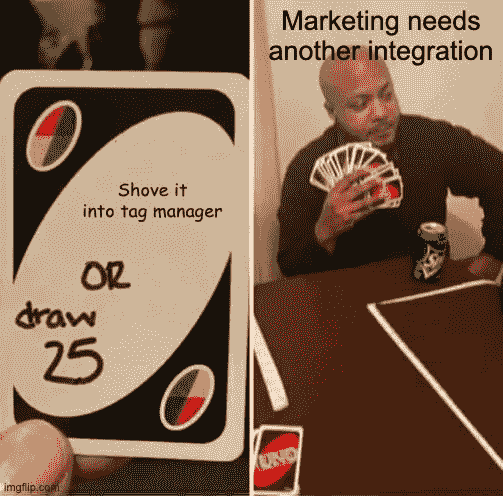

# 为什么工程很难支持营销

> 原文：<https://medium.com/geekculture/why-its-hard-for-engineering-to-support-marketing-727d40c41c03?source=collection_archive---------48----------------------->

营销团队经常受到工程部门的指责，原因是可以理解的。核心问题是，营销希望尽可能快地提供数据驱动的数字体验，但构建这些体验需要专门的开发人员和时间，而这往往是一家公司最稀缺的两项资源。结果是双方都感到沮丧。

正如我们在之前[所写的，这种紧张关系已经持续了十年之久，与不断变化的技术格局有着内在的联系。](https://rudderstack.com/blog/why-engineering-and-it-need-to-own-the-cdp)

# 首先，市场营销通常不具备理解技术复杂性的背景。

如今，我们已经习惯了非常好的软件，这意味着没有技术知识的人可能会误解解决技术项目有多难。例如，一个营销人员可能认为“从我们的电子邮件工具获取数据到我们的 CRM 中”的请求非常简单——毕竟，这只是两个工具中的数据点，对吗？

营销人员是善意的，但如果没有技术背景，他们可能不会考虑数据格式化、提取和加载数据的管道、处理不可避免的差异、调度、处理故障或损坏的数据等。—所有直接影响负责该项目的开发人员的事情。

即使有了最新的集成工具，这使得集成工作比五年前容易得多，但仍有许多技术问题需要回答。

# 第二，从开发的角度来看，营销实验的速度本来就很难支持。

今天的营销是关于数字实验。实验需要数据和某种数字接口，这两者几乎都需要某种程度的工程支持。然而，随着追踪能力让营销人员对其策略的有效性有了前所未有的了解，实验的步伐已经大幅加快。

开发过程在确定的周期、路线图和规格上工作得最好。虽然一些营销团队确实在循环中运行实验，但技术含义必然是反应性的，是基于新数据和自然原型的特别的。换句话说，营销人员需要实施足够的技术来看看一个想法是否会产生结果，这意味着大量的技术工作在这个过程中被丢弃了。

快速原型制作是获得营销结果的一种很好的方式，但通常与工程团队的运作方式背道而驰，这导致了紧张，尤其是在营销没有专用开发资源的情况下。

# 第三，技术营销工具往往使问题变得更糟，而不是更好。

上面提到的两种动力导致了 8000 多种“mar-tech”软件工具的产生，这些软件工具旨在为营销人员提供他们想要的东西，而不涉及工程设计。具有讽刺意味的是，“mar-tech”通过孤立数据、降低性能和创建更多(而不是更少)的集成工作(仅举几例)在许多方面使问题变得更糟。

# 这对开发者来说意味着什么

对于在日常工作中支持市场营销的开发人员和数据工程师来说，有许多技术问题。以下是我们从客户那里听到的最大挑战:

*   管理降低网站性能的多个第三方脚本的膨胀
*   构建和维护定制集成，将第一方数据纳入营销和分析工具
*   设置发送到 ad 平台的转换事件并排除故障
*   由于标签管理工具(如 Google Tag Manager 和 Tealium)使用不当而导致的故障排除和清理
*   跟踪来自多个来源的数据，以帮助澄清跨平台的报告差异
*   用于各种分析目的的数据点的检测和故障排除(用于 SaaS 和仓库/BI 设置)

如果你是一名从事营销项目的开发人员或数据工程师，你至少已经感受到了上述一个问题的痛苦。但是，希望并没有消失。开发商和营销人员实际上可以做的不仅仅是和平共处(即使这看起来是不可能的)。有了正确的工具，开发人员可以给营销带来竞争优势。下周，我们将向您展示如何操作。

# 免费注册并开始发送数据

测试我们的事件流、ELT 和反向 ETL 管道。使用我们的 HTTP 源在不到 5 分钟的时间内发送数据，或者在您的网站或应用程序中安装我们 12 个 SDK 中的一个。[入门](https://app.rudderlabs.com/signup?type=freetrial)。

本博客最初发表于:
[https://rudder stack . com/blog/why-it-s-hard-for-engineering-to-support-marketing](https://rudderstack.com/blog/why-it-s-hard-for-engineering-to-support-marketing)