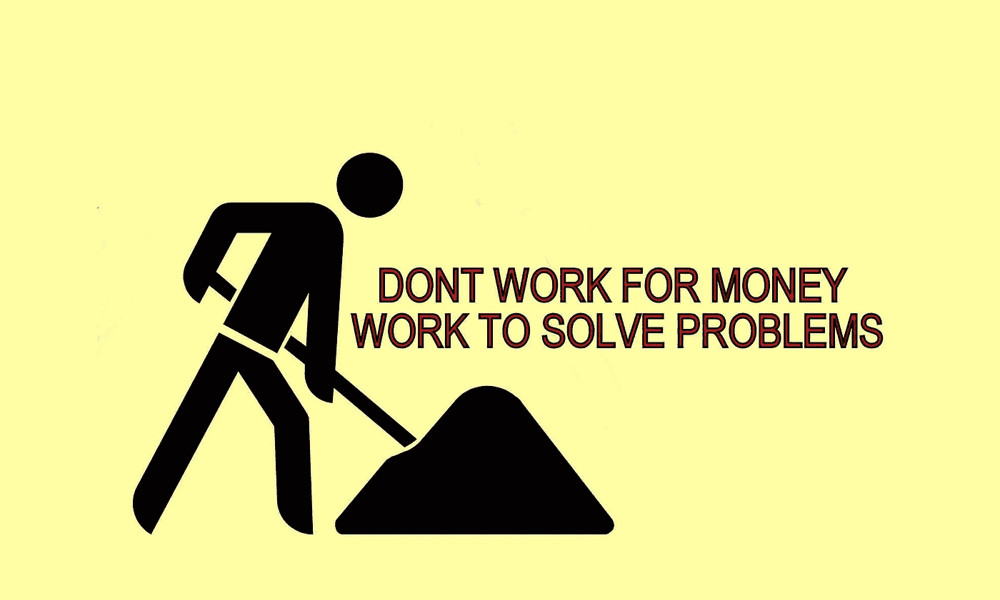

# 为什么清崎在《富爸爸穷爸爸》中关于“工作是为了学习，不要为了钱而工作”的建议值得你关注？

> 原文：<https://medium.com/geekculture/why-kiyosakis-advice-on-work-to-learn-don-t-work-for-money-in-rich-dad-poor-dad-is-worth-your-f02893bce82a?source=collection_archive---------1----------------------->

在成长过程中，当我想到成年人工作时，我意识到成年人总是匆匆忙忙地去上班，安排工作的优先次序，去工作，但他们似乎从来没有真正为此感到快乐或兴奋。如果工作是你一生中要花大部分时间去做的事情，难道它不应该是你喜欢做的事情吗…