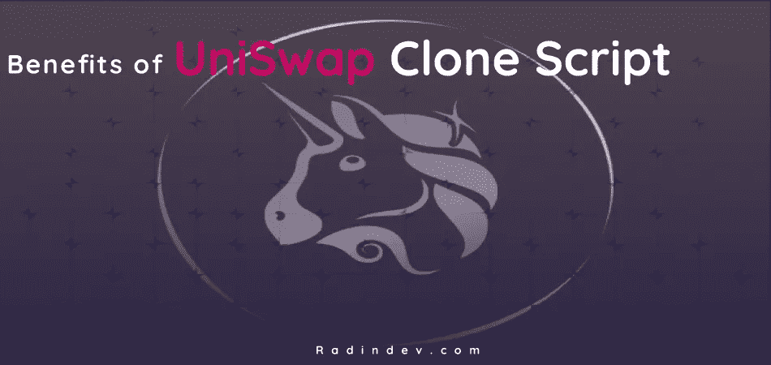
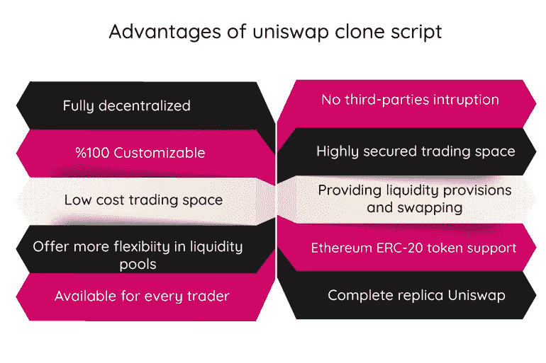
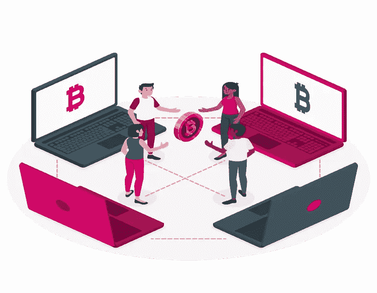
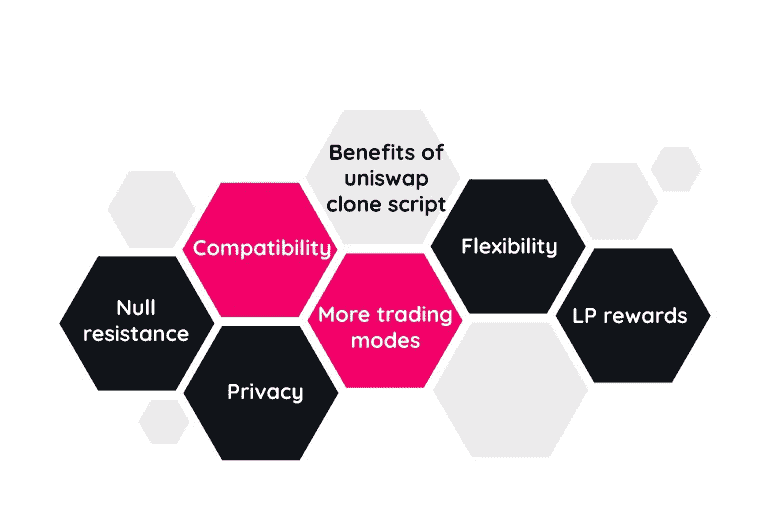

# 为什么启动 Uniswap 克隆脚本是一个明智的想法？

> 原文：<https://medium.com/geekculture/why-launching-uniswap-clone-script-is-a-smart-idea-dc3e83579259?source=collection_archive---------6----------------------->

uni WAP 克隆脚本是一个定制的现成市场，100%可定制的 uni WAP 副本。在 uniswap clone 中，您可以添加有助于满足您的业务需求的功能。附加功能将帮助用户获得更好的交易体验。

使用白标解决方案创建一个去中心化的 exchange 可以让您紧跟潮流，同时您可以使用一个可以开发任何附加功能和安全选项的预制版本。一个白色标签克隆 uniswap 可以帮助您将趋势扩展到原始平台的最新版本。它提供了包括所有应用内特性的全功能开发。

你可以通过在以太坊区块链上创建和启动一个可扩展和可定制的平台，如 uniswap，来加入一个分散的交换平台。Uniswap 克隆软件可用于开发和部署，以参与分散的财务领域。它是由区块链联邦理工学院授权的，所以你可以通过一个安全的环境在流动性池中进行互换和交易。

# **如何创建 uniswap 这样的 Defi 交易所？**

[**uni WAP 克隆脚本**](https://radindev.com/uniswap-clone-script/) 是一个自动化的流动性协议或者我们也可以把它定义为一个建立在以太坊区块链上的去中心化交换协议。在分散集中的交换过程中没有中介，这意味着没有订单簿，也没有集中的一方来监督活动。

创建一个像 uniswap 克隆软件一样的 DEX 克隆脚本是一种新的商业模式，可以在蓬勃发展的密码领域获得巨额收入。使用知名 Defi 平台的类似操作来构建分散式 exchange 的最佳解决方案是使用白标克隆脚本，该脚本可以在几天内部署您的分散式 exchange。

使用 scratch 开发这种具有高质量功能和安全协议的软件需要很长时间，因此，您可能需要支付比您考虑的预算更多的费用来启动 DEX 克隆。因此，使用白标软件是一个聪明的想法。

# **uni WAP 克隆脚本如何让企业受益？**

更少的努力和研究

可定制和可扩展

成功的可能性很大

性价比高

轻松快速启动

# **uni WAP 克隆脚本开发**

Uniswap clone script 是一个完全分散的交易所，旨在为参与者提供流动性。它可以根据您的业务需求和操作 Uniswap 的功能特性进行专门化。Uniswap 是一个升级的分散式金融交易所，提供用户友好的界面和高度安全的交换协议。

克隆 uniswap 是一个强大的，随时可以部署的 DeFi 克隆脚本，可以以各种方式定制，所以你可以启动你的交易平台，没有改变和麻烦。我们的 uni WAP 克隆软件附带了 uni WAP 的主要功能，这些功能完全可扩展且可靠。

# **uni WAP 克隆脚本的优势**

Uniswap clone script 是一个分散的 exchange，可以根据您的需求进行完全定制，以使您的业务受益。Uniswap 克隆是完全分散的，不依赖于第三方。每个人都可以加入 uniswap，通过 web3 创建一个帐户，并开始交易加密令牌。uni WAP 克隆软件是 uni WAP 原始平台的完整副本，可以执行和操作相同的功能。

Uniswap clone 支持在安全的环境中分析流动性池和令牌交换。它为用户提供流动性供应和互换。流动性池是每个人都可以通过 0.3%的佣金参与的地方，该佣金将在流动性池的所有参与者之间分配。可以根据客户的需要建立或扩大定制的流动性池。它们可以被开发以提供更多的灵活性。

与竞争对手相比，这是一个低成本的交易空间，它可以被授权建立一个分散的交易所以太坊 ERC-20 令牌标准。

# **使用 uniswap 克隆脚本的商业优惠**

premium clone uniswap 提供了一个吸引人的简单界面，让参与者可以轻松使用。

简单快速的 mainnet 启动过程

高度可扩展的产品

Uniswap 克隆脚本是高度可定制的，因此您可以根据您的业务需求定制用户界面、功能、插件选项、主题等。

该平台是完全分散的。

成功的可能性很大

需要更少的分析和研究

Uniswap 克隆由以太坊区块链技术提供支持，因此您的用户可以交换 ERC-20 令牌

这种架构设计消除了服务器的维护成本。

uniswap 的高级白标版本是没有麻烦的、免费的资源和免费的。

克隆 uniswap 脚本执行安全的智能合约，并提供最佳测试案例。

白色标签 uniswap clone 附带多种支持的钱包功能，使交易更容易。它支持各种钱包，包括 metamask 钱包、chain 钱包和币安钱包。

# **uni swap 克隆软件的特点**

当涉及到 uniswap 克隆脚本开发时，部署功能和插件选项对于系统操作的流畅性有着至关重要的作用。高级克隆 uniswap 包含所有基本功能，在定制版本中，您可以添加所需的功能。这里有一些非凡的功能，在您的 uniswap 克隆软件中展示它们可以吸引大量用户，并帮助您的平台在加密领域脱颖而出。

定义标桩

闪存交换

添加新令牌

轻松启动

对私钥的访问

神谕

拥有监护权

多加密交易支持

多语言支持

白色标签解决方案

多重加密钱包支持

匿名交换

令牌多功能性

虫子赏金奖励

高安全性机制

## **uni WAP 克隆脚本的安全功能**

多层安全性

任何包含数字资产的平台都容易受到网络攻击，因此，安全算法和功能在每个加密交换脚本中都是必不可少的。由于采用了多层协议，您的 uniswap 克隆脚本可以在多个功能级别上免受网络攻击。

端到端加密

端到端加密是保护通信的一个基本标准。这提供了没有安全漏洞的交易和通信。只有授权用户才能访问这些数据。

由智能合同提供支持

我们的克隆 uniswap 是由一个示范性的智能合约开发的，它可以基于一个预先制作的平台来匹配卖家和买家。智能合约反过来给平台带来快速的交易速度。

难以置信的匿名

在分散式 uniswap 克隆脚本中，没有开发 KYC/ AML 验证。完成注册不需要任何个人信息，只需要一个钱包地址就足以在 uniswap clone 交易空间开始交易。

双因素认证

大多数加密交换平台中启用的一个常见安全功能是双因素身份验证(2FA)。有了这个功能，用户需要输入一个发送的代码到他们的邮箱或者平台上的号码来进入他们的账户。另外，用户必须像往常一样登录并输入密码才能收到验证码。

完全分散

在 uniswap clone 这样的分散式交换平台中，分散式提供了没有中介的交易，并且消除了对第三方的需求。因此，基于这一点，任何人都可以使用 uniswap 克隆脚本并加入流动性池。

# **什么是流动性池？**

流动性池是智能合约中的代币池，通过提供流动性来帮助交易，它们被一些分散的交易所使用。在 [**uniswap**](https://uniswap.org/) **中，流动性池建立了恒定的流动性，被认为是通过降低代币对交易量的依赖来降低难度的最佳解决方案。**

# **uni WAP 克隆脚本的优势**

LP 奖励

平台向参与者收取费用，给予他们 LP 奖励。Uniswap 克隆平台能够通过交换费用与用户分享收入。

和睦相处

与脚本相关的实体计划通过与 API 的集成来提供对 ERC-20 令牌标准的遵从。API 提供了多种权衡策略的选择。

更多交易模式

uniswap 克隆脚本中的交易选项是基于适合价格和交易选项的算法开发和设计的。考虑到市场的近期需求，期权有助于提高收益。

零电阻

分散的技术允许参与者在权衡限制中超越标准。Uniswap 克隆软件无法单独解决可访问性资金分配和授予问题。

隐私

平台处理和 mainnet 目标的一个目的是发生在用户的隐私中。一个分散的交换平台运行高度安全的功能，以提高隐私。

灵活性

这些资产通过与像 ERC-2o 令牌标准这样的令牌配对获得了灵活性。通过平台参与的资产提供了灵活性。

# uniswap 安全吗？

Uniswap 克隆平台支持区块链联邦理工学院顶部的流动性池，并具有可靠的以太坊区块链技术的安全性。uniswap 克隆脚本的交易过程中没有第三方参与，交易双方都从自己的钱包中转移资产。因此，资金由可靠的保管人保管是安全的。

# **结论**

加密代币交易是近年来的趋势，这使得一个大的交易爱好者社区。创建一个分散的 exchange 克隆脚本被认为是加密领域的一个巨大进步。许多企业家通过引入 Defi 克隆脚本进入市场，这是一个绝妙的想法，许多其他人正计划创建一个。

克隆 uniswap 是一种现成的解决方案，具有成本效益。通过使用克隆脚本 uniswap，您可以以适中的成本和良好的定制启动您的分散融资。我们的专家开发团队可以根据客户的需求开发和部署一个准备上市的 DEX 克隆脚本。Uniswap clone 软件是一个定制的分散式交换平台，以最佳的表现形式执行原始平台的惊人功能。

您也可以访问我们网站上的 uniswap clone script，查看开发 uni WAP clone 软件的详细信息并获得演示。