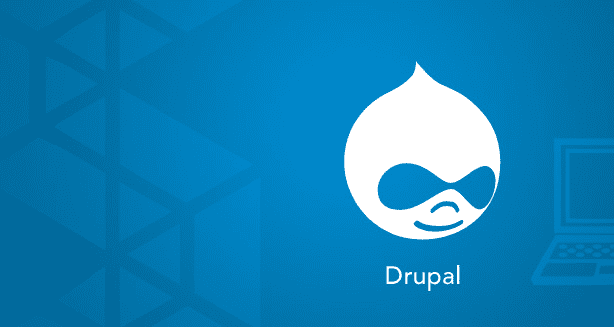
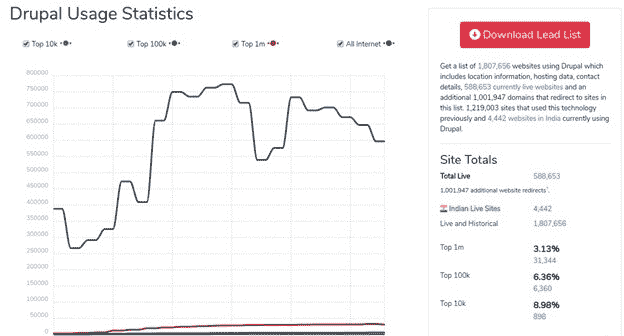
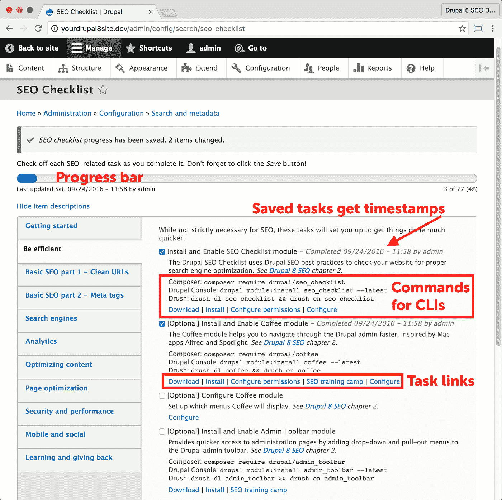
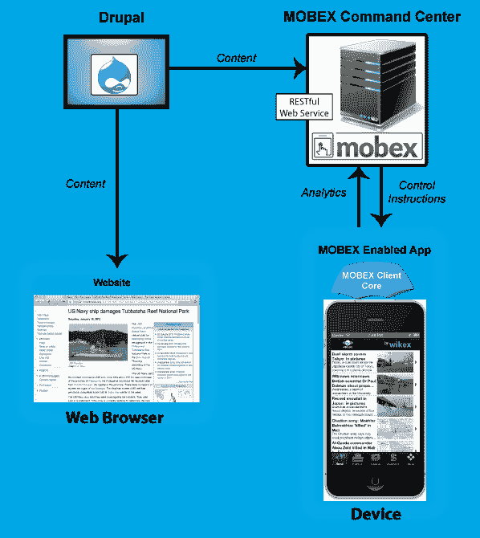
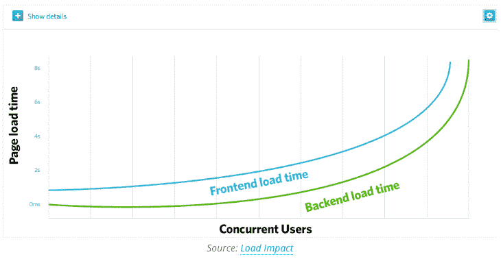

# 为什么您必须为您的下一个 Web 应用程序开发项目选择 Drupal CMS？

> 原文：<https://medium.com/geekculture/why-must-you-choose-drupal-cms-for-your-next-web-app-development-project-a9d09429407a?source=collection_archive---------17----------------------->

[图像来源](https://leopathu.com/blog-tag/drupal)

内容管理系统是每一个希望利用网络的力量来发展业务的企业取得成功的关键。此外，CMSs 中有大量选项可供选择，包括 WordPress、Joomla 和 Squarespace 等等。

但是当涉及到构建最好的网站时，许多企业会发现 Drupal CMS 提供了他们构建梦想网站所需的特性和功能——或者任何网站！

这篇详细的指南将解释为什么 Drupal CMS 是当今最好的 CMS 选项之一，以及为什么它在 2022 年及以后仍然是最好的选项之一。

[图片来源](https://codecondo.com/10-popular-websites-built-with-drupal-platform/image-1-3/)

**#1。更好的 SEO**

网站粘性的一个重要部分(以及它的成功)是搜索引擎优化(SEO)。这是指增加你的网站在像谷歌这样的搜索引擎中排名的因素。提高 SEO 的一个关键领域是内容。

通过在 Drupal 站点上创建丰富的、有针对性的关键字内容，您可以确保潜在客户在搜索像您这样的产品和服务时找到您。

您的企业也获得了更多展示专业知识、展示价值和引领解决方案的机会。页面越多/访问量越大=排名越好的等式应该很熟悉:

更多优质内容带来更多独特访客；更独特的访客意味着更高的排名；排名越高意味着曝光度越好；更好的曝光率会带来更多的流量。

Drupal CMS 使快速创建大量高质量内容变得容易，因为它允许您从模块(包含预先编写的代码块)构建网页，而不是从头开始。

添加多媒体元素、跟踪指标、通过社交媒体分享新闻以及通过评论直接与读者互动——所有这些都在一个专为管理多个作者和维护品牌完整性而构建的编辑环境中完成。

这一切都修正了你的业务利润。如果你想创建一个 web 应用，建议你**在印度雇佣 Drupal 开发者。**它们使您能够以最实惠的价格轻松获得应用程序开发。

还看[Drupal 最新版本是什么，有什么优点？](https://www.valuecoders.com/blog/ecommerce-cms/latest-drupal-version-and-advantages/?utm_source=latest_drupal&utm_medium=Guest_blog&utm_campaign=geekculture&utm_id=NKY)

**#2。提高转换率**

Drupal 对大多数组织的最大吸引力之一是，它可以通过简化流程和提供跨不同平台和设备的无缝用户体验来帮助提高转化率。

这意味着内容管理工具更容易使用，这反过来会让用户更满意，转化率更高。如果你的公司发现自己需要迅速扩大规模，

Drupal 也为您提供了这方面的帮助；有了对大型 web 应用程序开发项目的支持，无论您的企业发展到什么程度，Drupal 都会跟上您的步伐。

在寻找新的 CMS 解决方案时，这些只是 Drupal 从竞争对手中脱颖而出的一些原因。此外，如果你 [**雇佣 Drupal 开发者**](https://www.valuecoders.com/hire-developers/hire-drupal-developers?utm_source=hire_drupal&utm_medium=Guest_blog&utm_campaign=geekculture&utm_id=NKY)**，他们也可以帮你找到最适合网站转换的主题&特性。**

****#3。更简单的页面优化****

**Drupal 的开源平台比封闭的付费平台更容易为搜索引擎优化你的内容。**

**Drupal 自 2001 年就存在了，尽管它有一个庞大的用户和开发人员社区，可以帮助您解决实现或开发内容时遇到的任何问题，但掌握它的所有特性并不需要很长时间。**

**您可以开始构建您心目中的任何项目！另外，Drupal 是跨平台的；所以，想要建立一个网站，不需要额外购买软件。托管也是如此；报名就走！Drupal 负责其他一切。**

****看看 Drupal 上的 SEO 清单:****

****

**[图像来源](https://www.drupal.org/project/seo_checklist)**

**这种灵活性使得 Drupal 不仅成本低廉，而且高效易用。所有这些都使得 Drupal CMS 成为任何人在 2022 年选择 CMS 的首选。**

**通过选择 Drupal，您不会冒任何风险——您知道自己会陷入什么样的境地，因为 Drupal 已经有了良好的记录！**

**不管您的业务需求是大是小，Drupal 都会做需要做的事情，实现您的目标。总之， **drupal 开发人员的可用性**也将同步增加，以满足您的需求。**

****#4。综合证券****

**该平台被誉为最安全的内容管理系统之一。因为它是开源的，所以有许多安全专家为它的代码做贡献，并定期对它进行测试。**

**此外，Drupal 还提供了自动更新，让您和您的团队随时了解您的网站发生了什么，这样您就可以在黑客发现漏洞之前采取措施防范它们。**

**仅这两个因素就使 Drupal 比其他流行的内容管理系统如 WordPress 或 Shopify 安全得多。**

**此外，有了 Drupal，你就知道是谁构建了你的平台，以及他们采取了什么措施来确保它的安全——这是 WordPress 和 Shopify 都无法说的。**

**从 IT 和营销的角度来看，这让 Drupal 用户感到安心:当客户知道他们的个人信息会得到保护时，他们会觉得购买商品或服务是安全的。**

**当您选择 Drupal 作为您的内容管理系统时，您是有意识地选择在更不安全的平台上做生意。即使 Drupal 不能完全消除这些问题(没有什么能做到)，它肯定有助于减轻这些问题。**

**如果消费者的信任对你公司的品牌认同和客户维系很重要，那么选择 Drupal 而不是 WordPress 或 Shopify 可能是非常值得的！**

****#5。更好的移动可用性****

**Drupal 8 允许开发者用单一代码库构建原生移动应用。这使您能够为客户提供难以置信的用户体验，无论他们使用哪种设备。**

**用户期望快速和无痛的交互；不要发布让访问者失望的缓慢加载的页面和笨重的应用程序。**

**如果您的用户在智能手机或平板电脑上结账，请确保只需像在台式电脑上一样少点击。此外，试着在智能手机和平板电脑等小屏幕上测试所有网站内容的可读性。**

****MOBEX 是 Drupal CMS 的一个模块，用于更好的移动可用性:****

****

**[图片来源](https://www.drupal.org/project/mobex)**

**除了作为一种最佳实践，优化的移动浏览还可以在搜索引擎结果中获得更高的排名。越来越多的消费者在手机上转向谷歌！移动可用性应该在您的优先列表中占据很高的位置 Drupal 让这变得很容易。**

**如果你真的想利用 Drupal CMS 的全部潜力，你必须**雇佣印度的 Drupal development** 并获得丰硕的成果。**

****#6。更好的用户体验****

**Drupal 成为一个伟大的内容管理系统的原因之一是它有强大的用户体验。使用 Drupal，设计人员和开发人员可以创建一个直观的网站，而不会牺牲用户的功能或灵活性。**

**开发者也可以定制他们的网站，这有助于他们的网站在他们的领域中脱颖而出。此外，有许多贡献的模块可供选择，使开发定制功能变得容易，而不必从头开始。**

**此外，Drupal 还集成了一些第三方应用，如 Salesforce 和脸书。这些程序的用户会发现在它们之间共享数据相对简单。**

**他们还可以控制隐私设置，因此他们确切知道谁可以访问哪些信息。**

**最后，Drupal 提供了内置的安全工具来帮助防止外部未经授权的访问。网站所有者可以随时跟踪不同用户对其网站所做的任何更改。**

****#7。可扩展性/灵活性****

**Drupal 非常灵活，可以用来管理任何东西，从简单的博客到成熟的电子商务网站。由于 Drupal 内置了 API，它允许开发人员以几乎任何可以想象的方式扩展其功能。**

**仅仅因为 Drupal 可以处理一些事情并不意味着你想要或者需要它；拥有很大的灵活性给你提供了选择，这可能并不总是好的！**

**这种灵活性也意味着，对于较小的企业来说，Drupal 将能够随着它们扩大在线业务而发展。**

**Drupal 不仅仅是一种产品；这是一个内容管理框架，提供了 10，000 多个免费模块和主题(以及更多的付费模块和主题)来满足特定的业务需求。**

****Drupal 的可伸缩性是巨大的:****

****

**[图片来源](https://opensenselabs.com/blog/articles/scalable-cms-drupal-8)**

**这使得 Drupal CMS 成为一个极具可伸缩性的解决方案:即使在您的业务增长时，Drupal 也可以随您一起扩展，为您的用户提供他们继续使用您的产品和服务所需的一切。**

****它是免费的——它是开源的:**作为开源软件，Drupal 是完全免费的，可以免费获得——尽管有数千个不同价格的附加组件。**

****#8。丰富的功能/扩展选择****

**为了得到一个好的内容管理系统，寻找一个提供大量功能的内容管理系统是很重要的。Drupal 8 提供了 5200 多个模块和 400 多个主题，让您几乎可以做任何想做的事情，甚至可以与其他平台集成。**

**有这么多的选择在你的指尖，几乎没有限制你可以建立什么！**

**而且，实现 Drupal CMS 很容易；只需选择一个主题，就可以开始编写和在线发布，而不必担心编码或服务器空间(因为 Drupal 使用开源框架)。**

**这种灵活的平台允许您根据公司的品牌需求定制一切，因此您可以立即将其完全投入使用。额外的奖励？非技术用户很容易在短时间内学会 Drupal 的工作方式。**

**此外，你可以很容易地雇佣专门的 Drupal 开发人员来创建各种 web 应用程序。**

****#9。低成本****

**作为一个内置于 PHP 的 CMS，Drupal 提供了一个高效且低成本的平台，允许开发者使用模块、主题和集成来扩展其功能。**

**作为一个免费下载和使用的开源解决方案，你不必投资外部资源或雇佣专家来管理你的网站。**

**如果您需要进一步定制现有功能或从头创建的新功能，您可以随时添加它们。Drupal 提供了一些基本功能，这样企业就可以托管自己的网站，而无需支付托管费。**

**它还带有集成的安全选项，有助于抵御网络攻击，而无需投资购买 WAFs (web 应用程序防火墙)等额外的第三方工具。**

**最后，Drupal 提供了一个直观的内容管理界面，因此您不必依赖软件工程师进行日常更新或编辑，从而随着您的业务增长，帮助您降低 TCO(总拥有成本)。**

**您只需提供 HTML、CSS 和 JavaScript 文件等设计文件，然后 Drupal 将这些文件集成到一个完整的站点模板中。**

**有了 Drupal，企业不再需要担心许可问题，因为他们可以根据自己的喜好在 Apache License 2.0 和 GPLv2 许可之间自由转换。**

**组织也不必再完全依赖专有系统，因为如果他们希望以后不再使用 Drupal，Drupal 支持多种其他开源产品，如 MediaWiki 扩展和 Joomla 扩展。**

****#10。Drupal 将来会变得更好****

**随着时间的推移，内容管理系统已经有了很大的发展，但是 Drupal 仍然是我们心中的至爱。**

**Drupal 是当今市场上最好的内容管理系统之一(如果不是最好的话)的原因有很多:易于安装、强大的管理区、出色的移动支持等等。但是 Drupal 的未来版本会带来什么呢？**

**CMS 特性 Drupal 现在做的可能真的很棒，但是每个人都希望事情变得更好——对任何 CMS 来说都是如此。**

**自第一次发布以来，Drupal 已经有了巨大的改进；让我们来看看 Drupal 8 中的一些改进。**

**此外，**印度的 Drupal 开发公司**目前也是 web 应用开发的热门企业。所以，Drupal CMS 的前景是光明的。**

**还可以阅读[最有用的 Drupal 模块，让开发变得更容易](https://www.valuecoders.com/blog/technology-and-apps/top-useful-drupal-modules-that-make-development-easier/?utm_source=use_drupal&utm_medium=Guest_blog&utm_campaign=geekculture&utm_id=NKY)**

****包装****

**随着内容管理系统的兴起，许多人一直在寻找一个好的替代品。**

**Drupal 不仅仅是一个可以取代你当前系统的系统；这也是一个艺术丰富的当代画框，许多国际知名的领导人都使用这种 CMS，这有助于他们从竞争对手中脱颖而出，在商业上取得成功！**

**不存在任何像 Drupal CMS 这样健壮、灵活的媒介，因为每个功能都经过专家的仔细考虑，这些专家知道在与当今市场上可用的其他软件解决方案或主机提供商配对时什么最有效。**

**使用 Drupal，您可以轻松地创建一个网站，提供出色的用户体验，同时还具有足够的可伸缩性和灵活性来满足您不断增长的业务需求。但是！确保与印度最好的 **drupal 开发公司建立联系。****