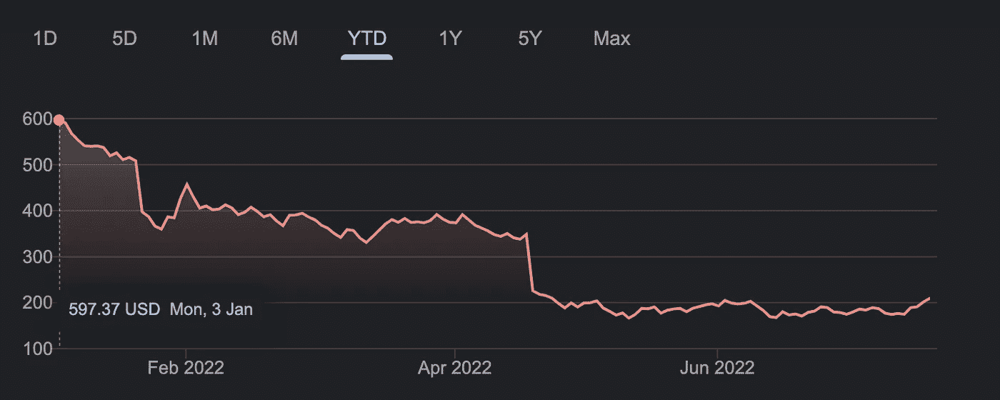

# 为什么网飞正处于艰难时期。

> 原文：<https://medium.com/geekculture/why-netflix-is-having-a-tough-time-b1ee6f1c3b3a?source=collection_archive---------15----------------------->

Photo by [Thibault Penin](https://unsplash.com/@thibaultpenin?utm_source=unsplash&utm_medium=referral&utm_content=creditCopyText) on [Unsplash](https://unsplash.com/s/photos/netflix?utm_source=unsplash&utm_medium=referral&utm_content=creditCopyText)

在过去十年中，网飞主导着流媒体市场，但现在流媒体市场正在快速变化，新的参与者正在推出自己的内容。

网飞的目标是 2022 年在 Q1 增加 200 万新用户，但在他们最近的收益报告显示，他们已经失去了 20 万用户。市场反应就像人们预料的那样残酷，网飞股票一天之内下跌了 25%。

由于用户不断流失，网飞最终想出了一个计划，用**广告**为网飞提供更便宜的服务。请记住，这是同一个网飞，它曾强烈否认在其平台上有广告，并被贴上流媒体市场上的*优质服务的标签。*

*这种下降的主要原因是有许多新的玩家进入了流媒体市场。早些时候，网飞有来自 HBO、迪士尼和许多其他主要制作的内容，但现在一切都变了。每个主要的制作都从网飞获取内容，并在他们的流媒体平台上展示这些内容。现在，网飞别无选择，只能提高产能，快速生产越来越多的内容。*

*从网飞获取的非常受欢迎的内容的例子有*

*《老友记》现已在 HBO Max 播出。*

**【办公室】*孔雀开屏*

**所有迪士尼内容*现已在 Disney+上提供*

*网飞一年前也涉足视频游戏，因为仅仅是内容还不足以在他们的平台上留住客户。*

*网飞真的在努力重新站起来，制作越来越多的原创作品，并试图打击密码共享，因为它正在吞噬他们的新订户。*

**

*From 2016*

*如果网飞要在这个旅程中保持强大，现在它已经受到了来自亚马逊 Prime Video、迪士尼+等非常大的参与者的激烈竞争，只有时间会到来。*

*干杯！！*