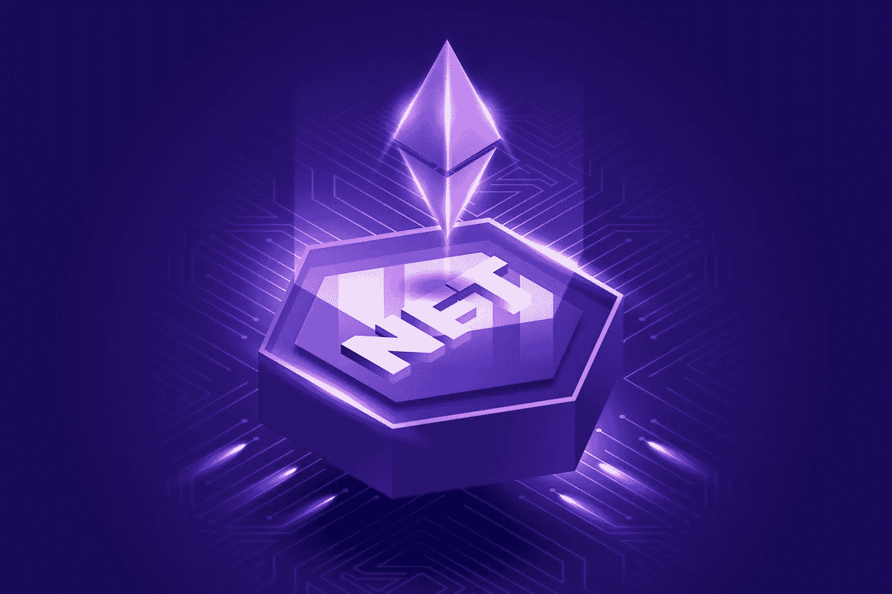
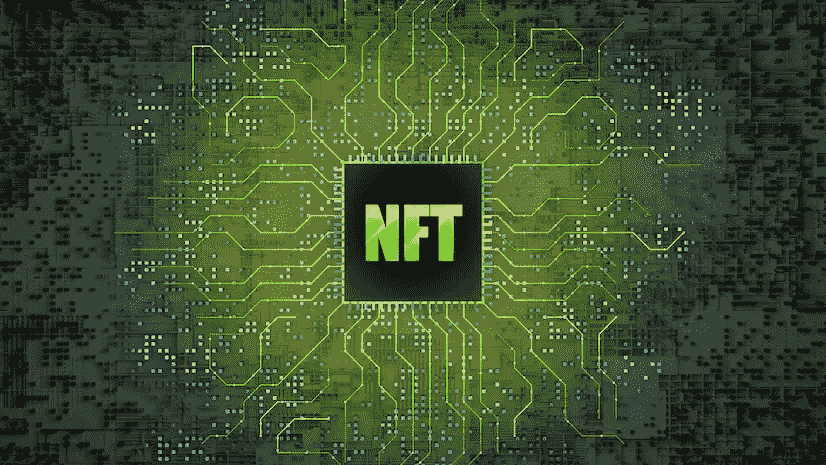

# 为什么 NFTs 将升级一切

> 原文：<https://medium.com/geekculture/why-nfts-will-upgrade-everything-2dc42bd7aca?source=collection_archive---------15----------------------->

这个世界一直在进化，不管我们喜不喜欢，它都将持续一段时间。确切地说，在这个进化阶段，有几件事情会发生变化。比如，想想我们在过去的 20 年里走了多远。在乞讨时，智能手机很少或没有，因为它们是奢侈品，有电动汽车，但它们很小，不像今天市场上的那些给人留下深刻印象，甚至更多。那么，顶端的樱桃会是什么呢？它会把我们带到比现在更高的水平？随着 NFTs、Web3 平台、 [**NFT 游戏市场**](https://www.jump.trade/) 和区块链成为人们谈论的话题，我们很自然地认为它在世界上扮演着重要角色，但它到底是如何做到的呢？

不管我们喜不喜欢，这个世界一直在不断发展，而且在一段时间内还会继续发展。准确地说，在进化的这个阶段，许多事情都发生了变化。想想我们在过去 20 年中取得的进步。最初很少有或没有智能手机，因为它们被视为奢侈品，电动汽车比今天可用的汽车更小，更不引人注目，还有许多其他东西。那么，什么是锦上添花，让我们比现在走得更远呢？

【NFTs 如何统治世界:

NFT 最初是作为不可复制的独一无二的艺术品创建的，旨在成为数字收藏品，它有不止一个方面。不可替换的令牌有无数不同的应用，而且种类繁多。由于区块链的安全加密，它使人不可能伪造，复制，复制，甚至伪造任何与他们有关的东西。然而，由于其前身加密货币的明显联系，有很多猜测。一个值得注意的因素是，这些 NFT 在过去几年中没有经历任何大幅下降，有些甚至设法以不敬的价格出售。因此，如果有什么能让 crypto 和 NFT 用户放心的话，那就是他们非常有价值，并且不会受到 crypto 价值的上升或下降的影响。

NFT 有几个不同的方面，它们原本是数字收藏品和不可复制的独一无二的艺术作品。不可替代的代币非常多样化，有各种各样的用途。很难伪造，复制，复制，甚至伪造任何与他们有关的东西，因为区块链的加密牢不可破。然而，由于与它的前身加密货币有明显的联系，所以有很多投机活动。在过去的几年里，这些非功能性股票的价值并没有出现任何明显的下跌，有些甚至以疯狂的价格卖出。因此，如果有什么能让加密货币和 NFT 用户放心的话，那就是

**升级系数**

随着时间的推移，非正规金融机构不断扮演新的角色。例如，起初，NFT 仅仅是出售的艺术收藏品，今天价格高得惊人，有**的 NFT 市场出售无数不同的东西。事情变化很快，因为它们是革命性的，但事实上，它们甚至接管了游戏世界的一部分，这绝对令人震惊。因此，这无论如何都不坏，它有无数的好处，我们还可以谈论更多的事情，如使用 NFT 作为实际的门票或令牌，允许人们参加或进入各种活动或项目。**

****NFTs 在 P2E 领域的影响力:****

**无论你怎么看，NFT 都是一种升级。一个很好的例子就是 P2E 博彩业正在经历的彻底变革。虽然最初一个靠运气繁荣的领域现在主要被 NFT 游戏公司接管。所以，如果这还不能告诉你世界正在被非功能性思维严重影响着，那么我想知道什么会。它甚至到了这样的地步，曾经只被用作收藏品的 NFT 现在也被用于电影、活动等等的售票。**

**原因很简单。虽然一个以上的人很容易使用同一张票。如果他们是 NFT，这是不可能的。这样做的原因是，一旦使用 NFT 是烧伤。烧录指的是当一次性工具被使用时被擦除的点。也就是说，这只是 NFTs 实际上升级像票务这样基本东西的一种方式。**

****

****我们所知的 NFT 升级****

*   ****NFTs 进入票务行业****

**将门票发展为非金融票据可以更好地控制二级市场，更安全地储存。将门票视为数字宝藏的可能性。门票收入流中数字部分的增长将是该行业最大的转变之一。在接下来的五年里。门票销售与 NFTs 的结合就是一个很好的例子。客户除了有机会观看现场娱乐节目外，还将获得独一无二的个性化数字资产。**

**签名簿和 t 恤桌的时代结束了。通过音乐会，你可以看到试图捕捉这种体验的吸引力。在你最喜欢的歌曲的音乐录影带播放完之后。表演者的亲笔签名，或特殊表演者/巡演/城市纪念。此外，NFT 票务走得更远。票务中的 NFTs 有可能为客户提供终身价值、独家使用权和额外的激励。**

*   ****宋 NFTs****

**歌曲 NFT 有细分的选项，允许音乐人保留大多数兴趣。同时向歌迷和投资者出售这首歌的一部分。细分资产的各种所有者将从歌曲的流媒体中获得一部分版税。这使得音乐家能够用他们收入的一部分来奖励他们最热情的追随者。当歌曲在商业上获得成功时，允许粉丝投资和支持他们喜欢的艺术家。**

****结论****

**NFT 已经在几个不同领域得到广泛应用，以至于出现了特定的 NFT 市场。NFT 有体育市场， [**博彩市场，**](https://www.jump.trade/) 等等。随着时间的推移，国家森林公园的使用和普及。它将逐渐增加，这也意味着他们的公用事业也将大幅改善。这虽然现在还不熟悉，但很快就会成为常态。所以，是的，NFT 正在升级我们所知道的世界上的一切。不管我们喜不喜欢，这一切的发生都是最好的。**

**由于 NFT 以前已经被用于许多不同领域，所以有特定的 NFT 市场。体育 NFT 市场，游戏 NFT 市场，以及其他大量存在。随着时间的推移，非功能性测试正变得越来越广泛使用和普及。由于它将逐渐上升，他们已经使用的设施也将显著改善。虽然现在还不熟悉，但这将很快成为标准。毫无疑问，NFT 正在更新我们已经知道的一切。不管我们喜不喜欢，它的发生是最好的。**