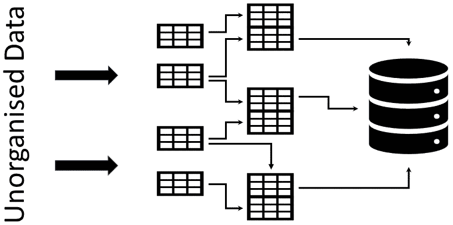

# 为什么规范化对数据完整性至关重要？

> 原文：<https://medium.com/geekculture/why-normalization-is-vital-for-data-integrity-ef524c32f5ad?source=collection_archive---------12----------------------->

Image describing some part of normalization (Image Credit: Author)

给那些不懂正常化的人；标准化是维护数据完整性和消除重复的必要过程。

您实施 RDBMS 原则以确保数据质量不受损害，而是得到维护。网上有很多关于什么是规范化和 RDBMS 原则的文章。但在这里，让我们坚持为什么正常化。

我们用一个例子来理解这个。

您需要从不同部门数据库的多个原始、非结构化数据转储中提取数据，放入一个一致的表中。

在数据转储表中，几乎 80%的列都是相同的。键列中的一些帐户在多个数据表中是通用的。但是数据没有组织、结构化或干净，有多个空值、重复条目和不正确的数据。

您必须创建一个数据库或视图，以便 Tableau 或 Power BI 开发人员可以构建一个仪表板，从数据库中为不同的部门以及组织的管理层解释组织的关键绩效指标(KPI)。

***场景一:***

在应用了所有业务条件之后，您继续对这些原始数据编写一个全面的 SQL 查询，合并来自所有单元的所有数据。请记住，除了业务逻辑之外，您还需要应用处理空值、重复值或不正确数据的条件，并确保方法到位，以便用户只能查看他们有权查看的数据。

久而久之:经过几个月(也许几年)，实现了更多的业务变更，并且您继续在原始查询中进行变更。因此，随着每一个新业务条件的实现或变化，复杂性的层次会加深。最终，一个“新”业务逻辑的插入会扭曲查询的另一部分，导致不正确的输出——这通常是无法识别的，因为在添加“新”业务逻辑之前输出是正确的。

***场景二:***

您不用编写 SQL 查询，而是规范化数据库和表，定义主表和事务表，指定记录的键、约束和其他必要条件。例如，所有帐户详细信息都将放在帐户主表中，而销售代表详细信息将插入销售代表主表中。事务表将收集所有销售代表各自帐户的活动。只有这样，最终才会编写一个 SQL 查询来从这个主表和事务表中提取数据，并创建一个可以在 Tableau 或 Power BI 中使用的数据库、表或视图。

现在，让我们来评估与数据相关的两种情形:

1.数据质量

数据可靠性和准确性决定了数据质量。让我们考虑一个场景——您必须在一个操作单元上应用一个条件，在另一个操作单元上应用另一个条件。

在场景 1 中，有大量的连接，添加一个连接与另一个连接相矛盾的可能性更高。团队中有一个技术高超的 SQL 开发人员，这是一个可以实现的目标。然而，从长远来看，这并不是一个非常有益和具有成本效益的过程。但是在场景 2 中，这种完全不同的情况被视为不同的作业，这些作业将从不相互依赖的不同操作单元中提取数据。因此，数据质量不会受到影响。如果出现任何数据问题，人们可以轻松确定根本原因，从而缩短解决时间。

2.数据完整性

数据质量是数据完整性的一个子集。它包括质量，但也包括上下文、完整性和一致性。

在场景 1 中，损害数据完整性的可能性更大。这包括复制。有了多层次的复杂性，它将导致不是一个而是多个实例，其中一个变化将扰乱任何先前的条件/逻辑。开发人员会发现自己多次处理类似的问题。在场景 2 中，可以有效地处理这种质量折衷。它还将确保资源和时间的适当优化。

3.数据可扩展性

在场景 1 中，添加新的业务条件会增加已经很复杂的 SQL 查询的复杂性，根据数据大小和需求，这可能会使整个模型崩溃。

在相同的内容中，场景 2 使系统在复杂性方面可伸缩，而插入更多业务条件的努力保持不变(或更容易)。也许新的变化会导致创建更多的表或添加更多的列；但是 SQL 查询的大小仍然是可管理的。

是的，有时在 Tableau 和 Power BI front 上对非规范化表的需求和偏好是最重要的，但我最后要说的是，在确保和实践数据完整性和质量时，必须实践规范化和实施所有 RDBMS 原则。最好在反规格化之前先规格化。再见！！