# 为什么在你的“和”从句中条件的顺序是至关重要的

> 原文：<https://medium.com/geekculture/why-order-of-conditions-in-your-and-clause-is-a-crucial-one-7e8eeb91ca9?source=collection_archive---------17----------------------->

Photo by [Sunder Muthukumaran](https://unsplash.com/@sunder_2k25?utm_source=medium&utm_medium=referral) on [Unsplash](https://unsplash.com/?utm_source=medium&utm_medium=referral)

## 更好地理解您的数据

这只是我在玩 **Olympics** 数据集时观察到的结果，因为这是一个相对较小的数据集(大约 20 万条记录)，所以差异很小，但当相同的概念应用于更大的数据集时，我相信这会产生巨大的差异。

所以，我想获得在**第二次世界大战(1945)** 后获得奥运会奖牌的德国男性的名单，有两个查询可以获得我们想要的结果，

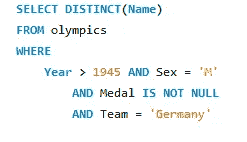

1st Query

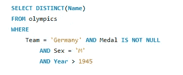

2nd Query

这两个查询给出了相同的结果，但是在分析查询运行时，我们可以看到明显的差异。

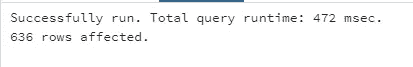

Query runtime for the 1st Query

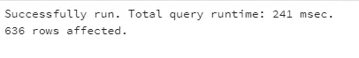

Query runtime for the 2nd Query

第一个查询的运行时间几乎是第二个查询的两倍。

> **那么为什么会发生这种情况呢？？？？**

因此，让我们计算一下满足 AND 子句中每个条件的记录总数。

a)1945 年以上的记录数量

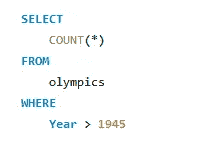

Returning count of records having value of the column Year>1945

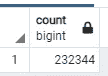

There are total of 232344 Records that have value of the column Year>1945

b)发生性行为的记录数量='M '

Returning count of records having value of the column Sex=’M’

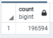

There are total of 196594 Records that have value of the column Sex=’M’

c)奖牌栏中具有非空值的记录的数量

Returning count of records having non null values in the column Medal

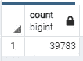

There are total of 39783 records that have non null values in the Medal column

d)团队=“德国”的记录数量

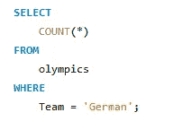

Returning count of records that have the value of the column Team = ‘Germany’

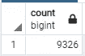

There are a total of 9326 records that have the value Germany in the team column

从上面的结果中，您可以大致了解为什么第二个查询的运行时间较短，这是因为在第一个查询中，第一个条件总共满足 2，32，344 条记录，然后检查第二个条件，依此类推，而在第二个查询中，第一个条件仅满足 9，326 条记录，然后检查第二个条件，依此类推…

让我们更深入地研究一下，找到满足两个查询的每个步骤的记录数

> **第一次查询:**
> 
> 1)年份> 1945 且性别='M '的记录数

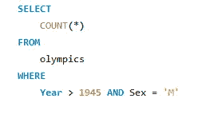

Returning count of records having year>1945 and value of Sex column = ‘M’

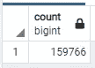

There are total of 159766 records that satisfies both of this condition

> 2)年份> 1945 年、性别='M '且奖牌栏中的值不为空的记录数

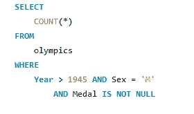

Returning count of records having year>1945 and value of Sex column = ‘M’ and non null values in Medal column

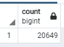

There are total of 20649 records that satisfies these 3 condition

> 3)年份> 1945 年、性别='M '以及奖牌列和团队= '德国'中的非空值的记录数

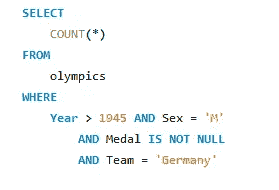

Returning count of records having year>1945 and value of Sex column = ‘M’ and non null values in Medal column and value of Team column = ‘Germany’

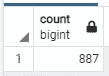

There are total of 887 records that satisfies the 4 conditions

***因此，第一个查询将首先处理 2，32，344 条记录，然后处理 1，59，766 条记录，然后处理 20，649 条记录，最后处理 887 条记录，然后从这 887 条记录中返回运动员的不同姓名。***

现在，我们将对第二个查询进行同样的检查

> 第二次查询:
> 
> 1)在奖牌栏中具有团队=“德国”和非空值的记录的数量

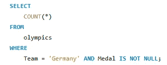

Returning the count of records that have value of column team as Germany and non null values in Medal columns

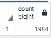

There are total of 1984 records that satisfies both of the above condition

> 2)在奖牌列中具有团队= '德国'和非空值以及性别列的值='M '的记录数

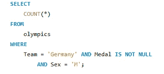

Returning the count of records that have value of column team as Germany and non null values in Medal columns and value of the column sex=’M’

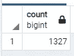

There are total of 1327 records that satisfies the above conditions

> 3)在奖牌列中具有团队= '德国'和非空值以及性别列的值='M '和年份> 1945 的记录数

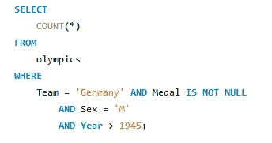

Returning the count of records that have value of column team as Germany and non null values in Medal columns and value of the column sex=’M’ and Year>1945

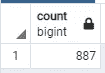

There are total of 887 records that satisfies the above condition

***因此，第二个查询将首先处理 9326 条记录，然后处理 1984 条记录，再处理 1327 条记录，然后处理 887 条记录并找到运动员的不同姓名。***

这就是为什么第二个查询比第一个查询只花了一半的时间。

## 总结:

最后要说明的是，这是一个人对数据的理解至关重要的原因之一，因为看起来很小的变化会在查询运行时产生巨大的变化，所以当相同的 and 条件放在更复杂的查询中时，会在运行时产生很大的变化。

如果你觉得这篇文章很有帮助，请拍下这篇文章，如果你对这篇文章有什么建议，可以发表评论。

> 谢谢你