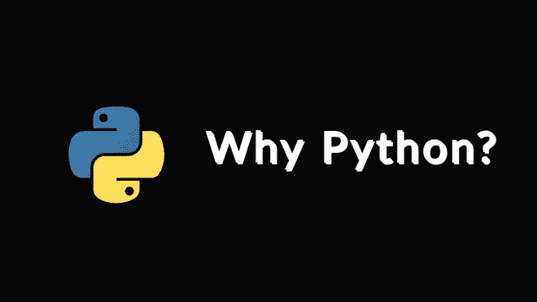

# 为什么使用 Python 语言:Python 发展和成功背后的 7 个原因

> 原文：<https://medium.com/geekculture/why-python-language-7-reasons-behind-the-growth-and-success-of-python-b864a80f5d97?source=collection_archive---------7----------------------->

Python 的旅程始于 80 年代末，第一次实现始于 1989 年 12 月。从此，Python 就没有回头路了。这种语言通过超越 Java、C 等语言显示出了巨大的增长。而且受欢迎程度还在与日俱增。2016 年之后，python 在使用量方面呈现出了急剧的增长，6 月…