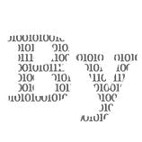

# 为什么 Python 还是一团糟

> 原文：<https://medium.com/geekculture/why-python-still-is-a-mess-1f7bf5bca281?source=collection_archive---------2----------------------->

## 意见

## 是的，这是初学者友好的…直到困惑袭来

Python is majestic, but also confusing for beginners. Image by author

 受到 业界领袖和学术研究人员的一致好评，Python 被吹捧为对新手程序员来说绝对最好的[语言](https://coderdojo.com/2015/03/20/top-5-programming-languages-for-beginners/)。他们没有错——但这并不意味着它不会让编程新手感到困惑。