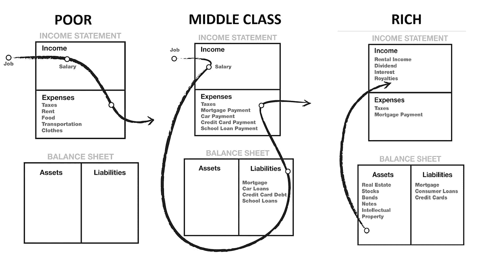

# 为什么罗伯特清崎的现金流如此有意义？

> 原文：<https://medium.com/geekculture/why-robert-kiyosakis-cash-flow-makes-so-much-sense-fbd49a0bb090?source=collection_archive---------2----------------------->

Photo from Rich Dad Poor Dad- Robert Kiyosaki

大约一年前，我开始阅读罗伯特·清崎的书，当时我并没有真正理清自己的财务。当然，我尽可能地追踪我的钱。我知道我必须支付房租和食物，贷款和生活费用，但我总是想知道为什么我每个月都只能勉强度日，靠薪水过活。