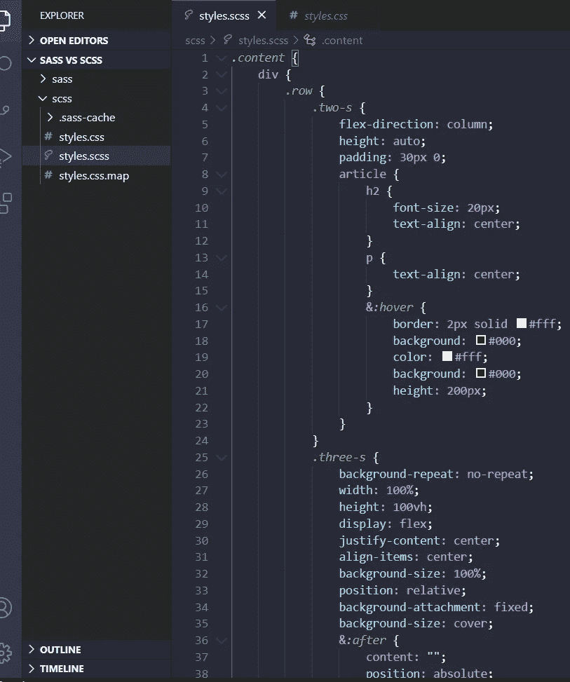
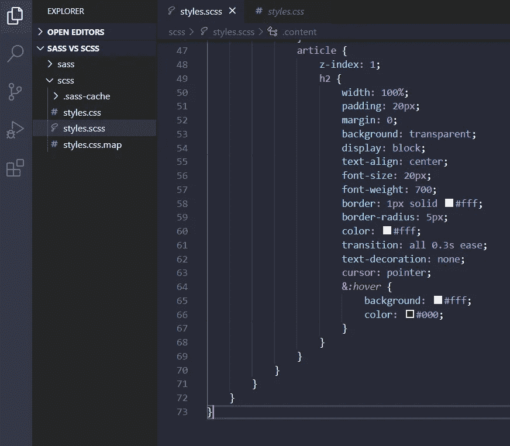
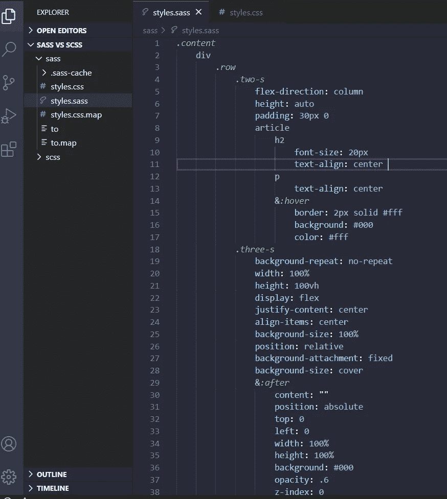
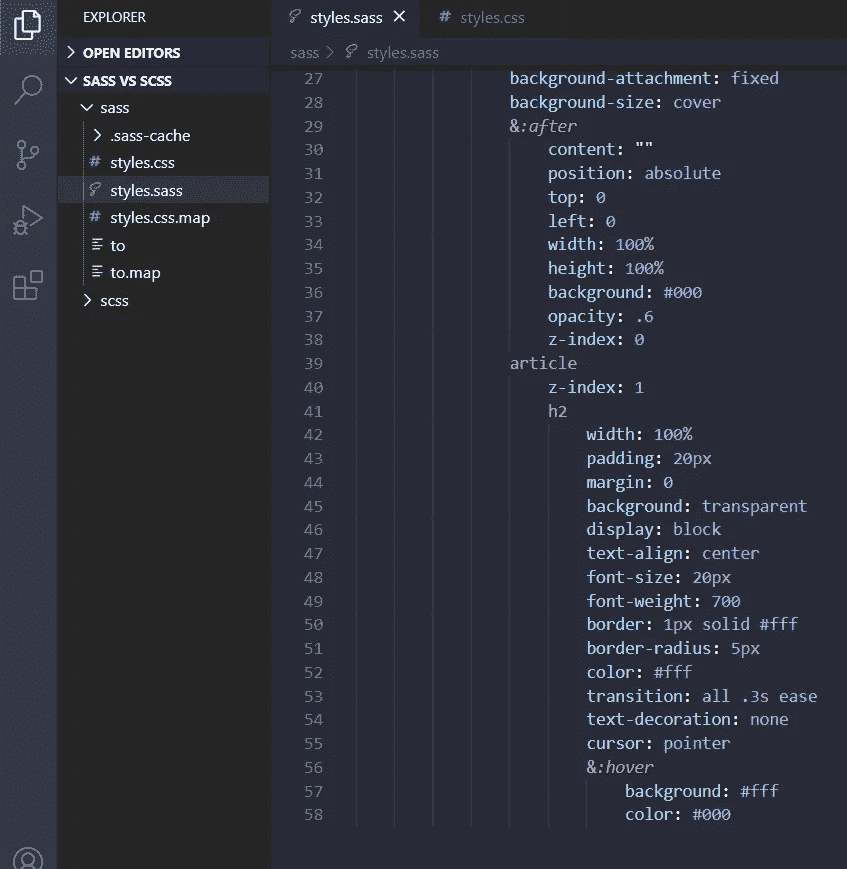

# 为什么 Sass 比 Scss 干净一点

> 原文：<https://medium.com/geekculture/why-sass-is-a-little-cleaner-than-scss-d5c1d4cba0d4?source=collection_archive---------0----------------------->

有时候当我在做一个项目时，有很多开发人员更喜欢 Scss，但是为什么呢？是因为类似于 CSS 吗？或者他们想在无穷远处加上花括号。

让我告诉你为什么它真的可以改变你的代码一点点，你可以看到两者之间的区别。

首先让我向你展示双方，你可以告诉我为什么你更喜欢 Sass 或 Scss。

# SCSS

我只有文档 styles.scss 和 styles.css

```
sass --watch styles.scss:styles.css
```

styles.scss 的代码看起来有点乱，那些花括号在我看来会产生更多的问题，如果你不小心删除了一些东西，会有很多行，看起来无穷无尽



Scss is a little messy

它有很多花括号和 73 行代码



SCSS with all his curly braces

# 厚颜无耻

但是如果我们检查 Sass，我们可以看到一点整洁，可怕的花括号不见了，我喜欢这种方式，因为它有助于快速找到类或其他 CSS 样式



Sass is neat

只有 58 行代码



Completely Neat

# 结论

我喜欢 sass，因为它方便、快速、简洁，我们可以跳过花括号和分号，它看起来很适合我，这是我为什么使用 Sass 的一个快速视图。

# 来源

[https://sass-lang.com/install](https://sass-lang.com/install)