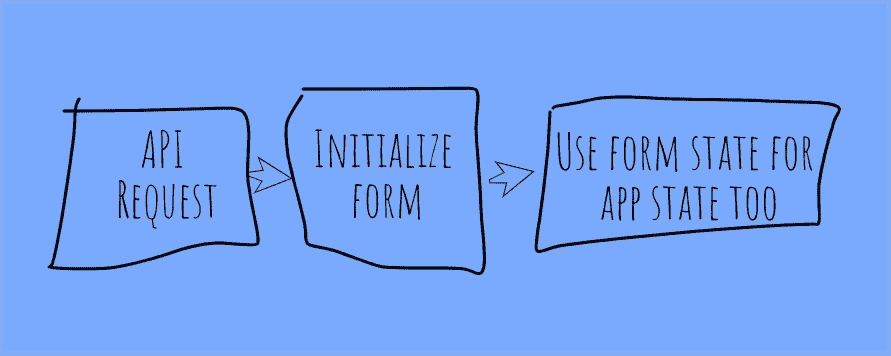
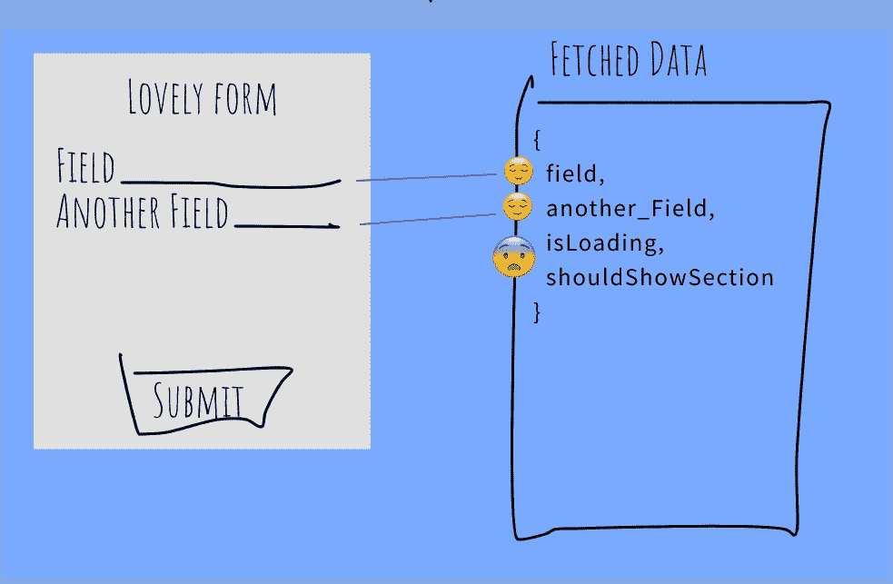

# 为什么以 Redux 形式保存应用程序状态是个坏主意

> 原文：<https://medium.com/geekculture/why-saving-application-state-in-redux-form-can-be-a-bad-idea-41d64291b16b?source=collection_archive---------5----------------------->

Photo by [Annie Spratt](https://unsplash.com/@anniespratt?utm_source=unsplash&utm_medium=referral&utm_content=creditCopyText) on [Unsplash](https://unsplash.com/s/photos/storage?utm_source=unsplash&utm_medium=referral&utm_content=creditCopyText)

今天我和另一个开发人员在工作中聊天，我们讨论了我最近看过的一份公关。它包含了这个简单的流程，这让我很困扰，但是除了声明以 redux-form 保存应用程序状态感觉不太好之外，我并不认为我有充分的理由要求修改这个代码。

The simple flow had a smell, but what was it?

所以我开始思考为什么这对我来说是一个危险信号。这里有一些值得考虑的事情。

# 初始化时间

由于状态存储在 redux-form 中，除非该表单被显式初始化，或者该表单被加载并具有一个`initialValues`属性，否则应用程序将无法使用该部分状态。当你的应用程序很小的时候，这可能是可行的，因为你唯一需要状态的地方是在页面上，呈现保存状态的表单。嗯。

# 今后

我看到不少项目从婴儿变成了巨人，通常将应用程序状态存储在 redux-form 状态是很吸引人的。自然地，当一个项目足够小时，存储在表单中的数据几乎就是你对某个实体的全部了解，也是你需要知道的全部。随着项目的发展，很多时候实体、数据和 API 也是如此，形式和实体之间的关系不再是 1:1。在 redux-form 中存储与该实体相关的应用程序状态不再是一个可行的选择，因为该表单不能表示全部数据。但是，一想到未来可能永远不会到来，就足以要求重构吗？

# 更改会立即反映出来

当表单状态也是应用程序状态时，您对表单所做的更改会立即反映在应用程序中。这有时是一件好事，就像当你想预览你还没有接受的改变时；有时这是一件坏事，比如当你改变整个应用程序的字体时，你只是浏览字体下拉列表，而不是选择一种字体来预览。这些类型的突然 UI 变化可能会让没有预料到的用户感到非常不安。这绝对是需要考虑的。

# 意图

redux-form 的目的是表示表单的状态。这就是为什么它的许多方法和选择器都围绕着对这些值的更改。但是这就足以说“这不是用来这样用的”吗？

I did not intend for this to happen! — via [GIPHY](https://giphy.com/gifs/26DNgbKMsws7FWQX6/html5)

# 单一责任

虽然表单状态的目的是让*保持表单状态*，但是它也是应用程序状态的一部分。如果它们完全一样，也许我可以忽略这个。如果应用程序中唯一需要数据的部分是表单，我不会考虑这个问题。我想你可以从几个角度来看待它，但是当这两个条件不成立时，我觉得这是滥用而不是重用。

# 应用程序状态位于何处？

这是一个有趣的问题，因为在 Redux 中，应用程序状态在所有 reducers 中是不连贯的。将应用程序状态的一部分存储在 redux-form 为您创建的一个不可见的 reducer 中，使得理解一般的应用程序状态变得更加困难。真理的唯一来源是什么？啊，没有了。这听起来是一个避免它的好理由。

# 维护

你还记得如何在六个月内处理/改变/获得应用程序状态的这一特定部分吗？你会记得为什么吗？当你在一个根本不显示任何表单的应用程序中使用这种状态时，它还有意义吗？

# 结论

如果您唯一需要呈现的是一个表单，并且您存储的数据完全代表了该表单，那么将状态存储在 redux-form 中没有任何害处。另一方面，如果您呈现的表单数据只是您存储的数据的一部分，这不是一个好主意，并且很可能成为下一个开发人员维护代码的陷阱。更糟糕的是，那个开发者可能就是你！

## 我打赌你对此有自己的看法。说来听听！

via [GIPHY](https://giphy.com/gifs/snl-saturday-night-live-episode-4-3oriNRqnlzW4LwLUqI)