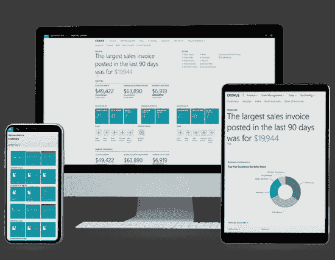
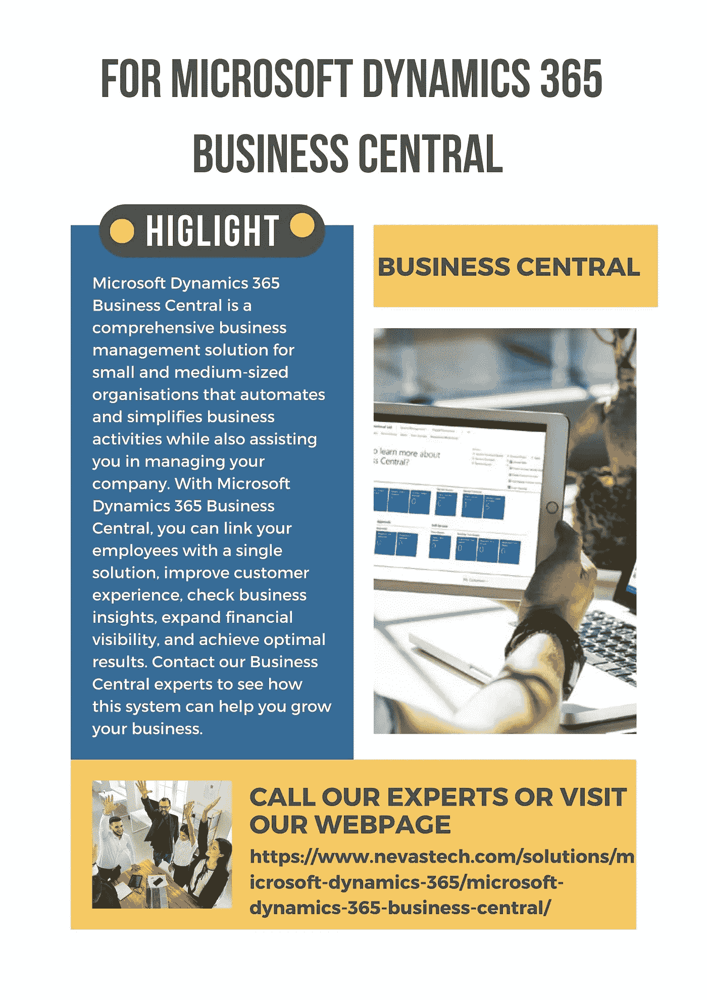

# 我为什么要将业务从 Dynamics GP 迁移到 Dynamics 365 Business Central？

> 原文：<https://medium.com/geekculture/why-should-i-migrate-my-business-from-dynamics-gp-to-dynamics-365-business-central-954825fd0164?source=collection_archive---------13----------------------->

## **我为什么要将业务从 Dynamics GP 迁移到 Dynamics 365 Business Central？**

Microsoft Dynamics 365 Business Central 是一款基于云的 ERP 解决方案，提供单一平台来管理您公司的所有财务、运营、销售和客户服务。帮助企业简化业务流程、改善客户关系并实现增长。主要是因为许多原因，客户正在转移到[Microsoft Dynamics 365 Business Central](https://www.nevastech.com/solutions/microsoft-dynamics-365/microsoft-dynamics-365-business-central/?utm_source=google&utm_medium=medium+&utm_campaign=monika)，其中一些原因是:-

## **更高级的集成与最高级别的安全性相结合**

流行的第三方云应用程序，如 Office 365、Microsoft 365 和 Microsoft Power Platform，都与 Dynamics 365 Business Central 完全集成。如果某个应用程序的集成并不适合使用，用户可以使用 Business Central 的开发环境快速创建一个。微软的团队处理一切，因此中小企业不必担心升级服务器软件或解决其他安全风险。微软拥有并管理着存储敏感公司数据的最先进的数据中心。它还使用透明数据加密和备份加密来加密其客户的数据。

## **全面报告选项，包括关键升级**

借助内置的 Power BI 仪表板，Microsoft Dynamics 365 提供了数据和高级报告功能，允许用户组合来自众多来源的数据。组织可以检查他们的个性化仪表板、分析数据并生成报告，而不是依赖外部资源。升级是从 Dynamics GP 转换到 Business Central 的众多原因之一。Dynamics 365 Business Central 内部部署系统的升级成本更高且耗时更长，尤其是在当前解决方案有多个版本的情况下，因为它是云服务，所以微软会自动提供增强功能、错误修复和更新。

## **功能增强的云平台**

Microsoft Dynamics 365 Business Central 是微软基于 Dynamics NAV 代码库的业务解决方案的最新版本。它可以根据公司的预算和基础架构要求进行部署。与 Dynamics GP 和多个实体、采购订单和仓库管理相比，Dynamics 365 Business Central 的核心财务更加灵活。Microsoft Business Central Premium 许可证还允许访问其他功能，如通过应用程序和集成预算进行服务工资单，从而确保有效管理核心业务流程。因此，企业在历史上一直使用本地遗留系统来简化企业运营。由于技术进步和对信息 24/7 可用性的要求，使用内部 ERP 软件的组织正在向云转移。

## **易于与外部平台集成**

Dynamics 365 Business Central 提供了与各种流行的第三方应用程序的出色本地集成。如果在许多情况下不能通过开发环境获得集成，它也给了消费者构建集成的自由和能力。您还可以使用 Microsoft App Source business applications market place 来连接专门满足您业务需求的其他应用程序。它可以与 Microsoft Office 365、Outlook、Microsoft Business PowerApps BI 和 SharePoint 以及其他 Microsoft 产品顺利集成。用户还可以使用 Outlook、网络浏览器和移动设备访问数据，更容易地在程序之间切换，证明与其他微软产品的集成是完美的。此外，它们的特性、功能和用户界面都具有可比性。因此，由于众多应用之间存在许多运营共性，因此在员工培训方面节省了大量时间和金钱。

## 本地化和定制功能提供实时的可操作见解

Dynamics 365 Business Central 目前支持 25 种语言、本地化和无代码用户界面更新。它还附带了许多预构建的工作流，您可以使用它们来满足您公司的需求。您可以使用这些工作流来自动化许多业务流程中的操作，并且如果您需要为自己的目的创建过程，您可以通过向系统添加新数据和对象，使用内置工具来修改它们。Business Central 中包含针对特定用户角色的实时仪表板和 KPI。它使非技术人员能够轻松地创建和修改报告。它还保证在没有 It 团队或外部专家帮助的情况下，尽可能迅速地提供这些报告。

它还可以为用户提供可操作的信息，帮助他们更高效、更成功地工作。让我们看一个销售人员每天都会经历的真实场景，其中 Microsoft Dynamics 365 Business Central 将帮助他们发现购买信号，分析关于潜在客户的复杂数据，并提供关于潜在客户购买机会的预测知识。

## 提高员工生产力

它还允许员工每天必须执行的重复性操作的自动化。相反，他们可以将这些额外的时间和知识用于解决挑战，并为现实世界的问题提出新颖的解决方案。**Dynamics 365 Business Central**是一组产品，旨在促进沟通，帮助团队更高效、更有效地工作。任何重要信息都可以轻松检索，与团队成员共享信息也只需点击几下鼠标。

此外，如果您使用基于云的解决方案，您的员工可以随时随地开展工作。这两个选项都在移动、桌面和平板设备上提供了完整的功能。没有理由担心这些设备是 Windows、Android 还是 iOS。员工从这种类型的商业智能中受益，因为它允许他们提高绩效。

 [## Business Central 是企业最佳云 ERP 解决方案的 8 个理由？

### 时代已经变了，对技术的依赖已经成倍增长，尤其是在…

medium.com](/geekculture/8-reasons-why-business-central-is-the-best-cloud-erp-solution-for-businesses-9f6285b0bb07) 

## 财务管理更加简单

Dynamics 365 Business Central 允许企业实时跟踪其财务表现。利益相关者可以使用内置报告、Excel 或 Power BI 来获取现金流数据并分析财务模式。因为它是一个整合的平台，所以可以轻松访问会计、采购、销售和库存报告。客户可以全面了解自己的财务状况，从而更快地做出更好的财务决策。对于具有多国设置的组织，它可以轻松适应不同的货币、汇率、税法、公司间事务等。因此，公司可以完全控制高效运营公司所需的任何财务数据。

> 要提供真正的服务，你必须添加一些无法用金钱买到或衡量的东西，那就是真诚和正直。

## 提供卓越的客户体验

Dynamics 365 商务中心为您提供客户的全面视图。它可以创建、维护和管理客户数据库，以及跟踪以前的客户交互和购买模式，以及以前的订单、反馈等。这些系统还可以为销售团队提供预测分析，使他们能够识别和优先考虑最有可能成为目标的消费者。营销团队可以跨各种接触点进行个性化通信，以确保客户在需要时能够访问相关信息。在各种渠道上，这种一致的信息是基于客户的需求而个性化的。由于基于云的解决方案，客户端数据始终是可访问的。当消费者有问题或投诉时，它可以帮助管理人员查看记录并更快地解决问题，从而带来积极的客户体验。

## 减去

总之，[**Microsoft Dynamics 365 Business Central**](https://www.nevastech.com/solutions/microsoft-dynamics-365/microsoft-dynamics-365-business-central/?utm_source=google&utm_medium=medium+&utm_campaign=monika)是最终的答案，因为它确保信息在所有部门之间无缝流动，并提供众多业务接触点的单一画面，并确保公司内部没有因数据孤岛而导致的瓶颈。