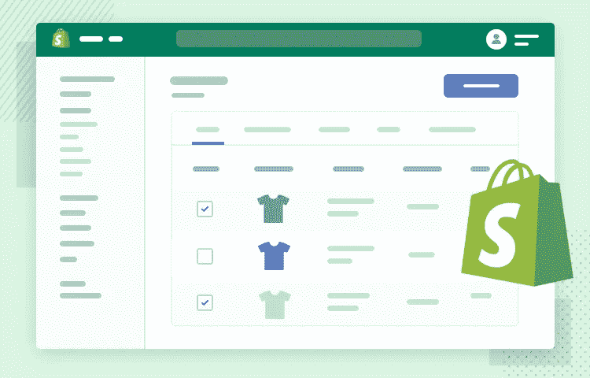
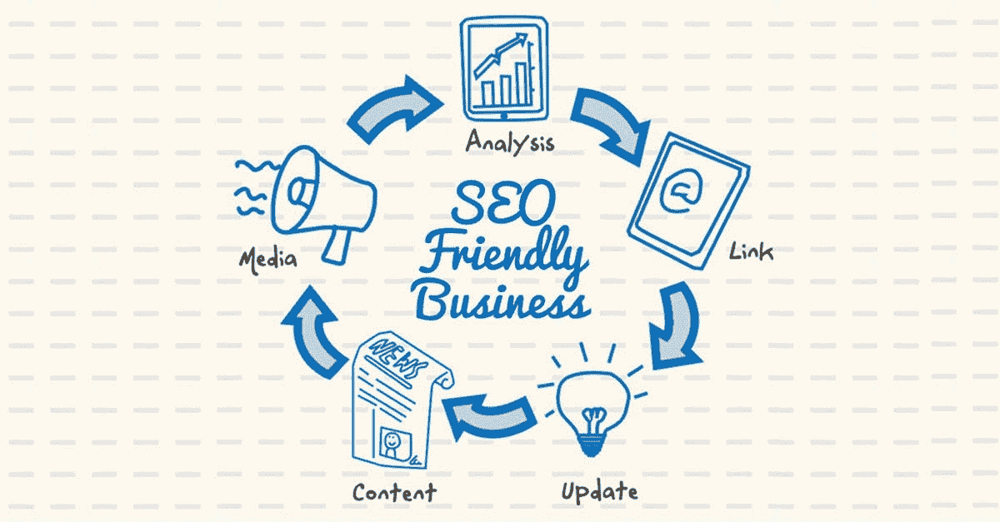

# 创业公司为什么要选择 Shopify 进行电子商务应用开发？

> 原文：<https://medium.com/geekculture/why-should-startups-choose-shopify-for-ecommerce-app-development-5559252f2a98?source=collection_archive---------8----------------------->

[Image Source](https://www.valuecoders.com/blog/ecommerce-cms/shopify-analysis-for-ecommerce-business/)

我们现在处于科技时代。数字应用程序的使用正在快速增长，越来越多的人转向它们来满足日常需求。最近在 Shopify 上开设的电子商务商店增加了 40%,这意味着用这个平台开发应用程序有很多好处。

*   *3613329*[*直播网站*](https://trends.builtwith.com/shop/Shopify) *正在利用 Shopify 平台；此外，历史上有 1，658，655 个站点使用过它。*
*   Shopify 是优秀的电子商务平台之一，拥有约 20%的市场份额。

在本文中，我们将讨论为什么创业公司应该选择像 Shopify 网站开发这样的电子商务平台！！！

所以让我们开始吧…

# 创业公司应该选择 Shopify 进行电子商务应用开发的 10 多个理由

创业公司应该使用 Shopify 应用开发平台的原因如下:

## **1。用户友好平台**

Shopify 是一个用户友好的[电子商务平台](/nerd-for-tech/top-5-ecommerce-software-solutions-to-build-your-ecommerce-store-8cfb54d5cdb3)，几乎没有经验或没有经验的初创公司都可以使用。Shopify 的目的是帮助创业者创业，而不要求他们具备编码知识。

这个平台本身很容易导航，应用程序也一样简单。该应用程序的用户友好性使其非常适合初创公司，因为他们可能没有大量的资源或时间来开发电子商务商店。

## **2。清洁接口**

Shopify 非常适合初创公司的另一个原因是，它的界面不会让网站变得杂乱。这很重要，因为它为使用他们平台的所有企业提供了一个干净统一的外观。

这种统一设计的目的是给每个公司或企业一个平等的成功机会，所以他们不应该被不必要的元素所阻碍，例如他们网站主页上的弹出窗口和广告。

## **3。支持**

使用 Shopify 进行应用程序开发的一个额外好处是，它为其用户提供了 24 小时的支持。这使得企业可以在需要帮助或对其应用程序的工作方式有任何疑问时联系该平台，这意味着创业公司可以在陷入困境时获得帮助，而不必等到早上客户服务代表可能会出现的时候。

## **4。广泛使用**

Shopify 是电子商务商店使用最广泛的平台之一，这使得它非常适合初创公司。该平台目前拥有 20%以上的市场份额，这意味着在他们的应用商店上营销产品时竞争将会减少。

由于他们已经有大量用户使用 Shopify 提供的服务，大多数客户已经熟悉了这个平台，这意味着初创公司更容易营销自己。

如果您现在也想使用 Shopify 进行电子商务在线商店开发，请使用顶级定制 Shopify 开发公司的Shopify 开发服务。这将帮助你更有效地利用平台，而不用担心最终的结果。

## **5。低成本解决方案**

Shopify 是一种低成本的解决方案，允许企业在不花费数千美元购买昂贵的软件或应用程序的情况下获得高质量的功能。

这对大公司和小公司来说都很好，因为他们可以轻松地创建一个电子商务商店，而不用担心他们的预算。

## **6。全面的解决方案**

Shopify 为初创公司提供了一个很好的解决方案，因为它很全面，拥有企业在线成功所需的所有工具，如无限带宽、24 小时支持、分析和报告功能等。

这使得公司更容易专注于他们业务的其他方面，而不必担心他们的电子商务商店的技术细节。

## **7。多语言支持**

使用 Shopify 的另一个好处是，他们提供 20 多种不同语言的服务。这使得企业可以拥有全球影响力，而不必担心他们的电子商务商店是否与其他语言兼容。

由于说英语的人很多，这使得公司更容易扩大客户群，增加收入。

## **8。简单迁移**

Shopify 的一个优点是，它的应用开发服务附带了一个简单的迁移工具，允许企业从其他电子商务平台转移，而不必为此付出高昂的代价。

这对创业公司来说更容易，因为他们可以将业务转移到 Shopify，而不必担心会花多少钱。

## **9。搜索引擎友好**

使用 Shopify 的另一个好处是它对搜索引擎优化友好。这意味着企业将能够从许多不同的设备访问他们的电子商务商店，这使他们更容易在应用开发平台内推广产品，并从长远来看增加收入。

这为用户提供了出色的客户服务技能，并使公司更容易通过他们的移动应用程序在电子商务商店内推广产品。

如果你也想为你的垂直业务开发一个搜索引擎优化友好的在线商店，联系 Shopify 应用程序开发者；这将帮助您获得创新的电子商务软件解决方案，最终帮助您形成一个独特的多功能网站。

## **10。高转换率**

Shopify 平台最好的一点就是为用户提供了高转化率。这意味着客户可以轻松地通过他们的电子商务商店购买产品，而不必担心网站本身是否可靠。

由于 Shopify 商店开发平台中的每个页面都应该快速加载，因此企业可以预期最小的用户下降率，这使他们可以看到高转化率。

## 11。高信任等级

使用 Shopify 的另一个好处是它有很高的信任度，这意味着用户会知道他们购买的平台是可信和可靠的。这使得他们更有可能通过电子商务商店购买产品，因为他们可以期待优秀的客户服务技能以及优惠的价格。

由于 Shopify 的信任评级为 4.8/5，用户可以预期他们的电子商务应用程序开发平台是可靠和值得信赖的，这将使他们更有可能通过商店的网站购买产品。

## **12。完全可定制**

创业公司在寻找电子商务应用时应该记住的另一个好处是，它能够为用户提供完全可定制的平台。

这意味着 Shopify 提供多种语言的服务，这使得企业更容易扩大客户群，增加收入，就像上文提到的那样。由于有这么多的人说英语，这使得公司更容易扩大他们的客户群，因为世界上大多数人口都说英语。

他们还提供了一个完全可定制的平台，这意味着用户可以随心所欲地定制他们的网站，而不必担心他们所做的改变是否会损害他们网站的其他部分。这对公司来说更容易，因为他们可以根据最适合自己的方式个性化运输和支付方式等方面。

## **13*。稳健的营销工具***

使用 Shopify 的另一个好处是用户可以期待强大的营销工具。这对企业来说更容易，因为他们将能够在旅途中访问他们的网站，这意味着即使客户在度假或与朋友在家时通过电子商务应用开发平台查看产品，公司也不会错过任何销售机会。

由于用户可以在旅途中访问他们的电子商务应用程序，只要客户仍然在线购物，他们就不必担心错过任何销售机会。这为他们提供了出色的客户服务技能，并使公司更容易通过移动应用程序扩展业务。

此外，由于 Shopify 拥有强大的营销工具，用户可以预期获得诸如废弃购物车回收、定制优惠券活动和电子邮件营销等功能。这使得企业可以轻松地从失去的销售机会中恢复过来，从而更容易增加长期收入和客户群。

# 使用 Shopify 的知名品牌

使用 Shopify 进行电子商务应用开发的品牌有很多，从小型到大型都有，其中一些如下:

*   街头信誉
*   埃森哲
*   特斯拉汽车公司
*   维基百科(一个基于 wiki 技术的多语言的百科全书协作计划ˌ也是一部用不同语言写成的网络百科全书ˌ 其目标及宗旨是为全人类提供自由的百科全书)ˌ开放性的百科全书
*   家庭影院（Home Box Office 的缩写）
*   发送云
*   图罗
*   暴乱游戏，等等。

# 结尾词

Shopify 已经存在多年了，它提供了各种各样的解决方案，可以根据任何初创公司的需求进行扩展。如果你正在考虑一个电子商务网站或应用程序开发，那么它可能是值得你花时间来探索如何这个解决方案可以为你工作。

此外，如果您正在寻找一个易于使用的平台，可以随着公司的发展而发展，那么这可能是您的正确选择！为了在电子商务网站开发中高效、充分地使用该平台，您可以利用来自 best [**custom Shopify 开发公司**](https://www.valuecoders.com/hire-developers/hire-shopify-developers) 的**电子商务开发服务。通过这样做，您将能够获得与您的业务需求相匹配的最终结果。**