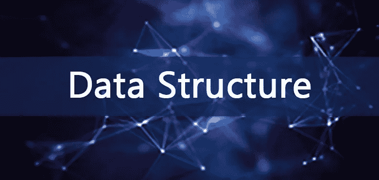

# 为什么要学数据结构和算法？

> 原文：<https://medium.com/geekculture/why-should-you-learn-data-structures-and-algorithms-39ef684cb4b6?source=collection_archive---------3----------------------->

Why Should you learn Data Structures and Algorithms?

在这篇文章中，我们将看看为什么你应该学习数据结构和算法来促进你的职业生涯。

> 什么是数据结构？

数据结构可以描述为“在计算机上存储数据的不同方式”或“表示和组织数据的结构化方式”重要的是，每个数据结构都应该能够在任何情况下正常工作。扫描、转换信息、删除、刷新等。

> 数据结构的重要性是什么？

*   一个好的软件开发人员的个性是数据结构和算法。
*   数据结构和算法提高了你解决问题的能力。
*   一个精心选择的数据结构可以大大提高计算机程序或算法的效率。
*   谷歌、脸书、亚马逊和 Flipkart 等公司的技术职位面试更侧重于评估候选人对数据结构和算法的理解。

> 数据结构的特征

根据它们的用途，你可以对数据结构的三种不同属性进行分类。

*   **时间复杂度:**一个任务的时间复杂度称为运行时间或执行时间。为了尽可能降低时间复杂度，我们可以对给定的上下文使用尽可能好的数据结构。
*   **基于特定接口的正确性:**任何数据结构都有一个定义数据结构支持的过程的接口。同样，数据结构可以根据正确的接口适当地应用。原则上，数据结构可以提供定义良好的接口和描述性实现。
*   **空间复杂度:**一个数据结构的内存使用是由空间复杂度决定的。最后，对于包含大量数据集的问题，我们可以改进我们的算法方法，以尽可能消除空间复杂性。

感谢阅读。如果你发现这篇文章有用，别忘了**鼓掌**和与你的朋友和同事分享。:)如果你有任何问题，请随时联系我。
**与我接通👉**[**LinkedIn**](https://linkedin.com/in/hiteshmishra708)**，**[**Github**](https://github.com/hiteshmishra708)**:)**