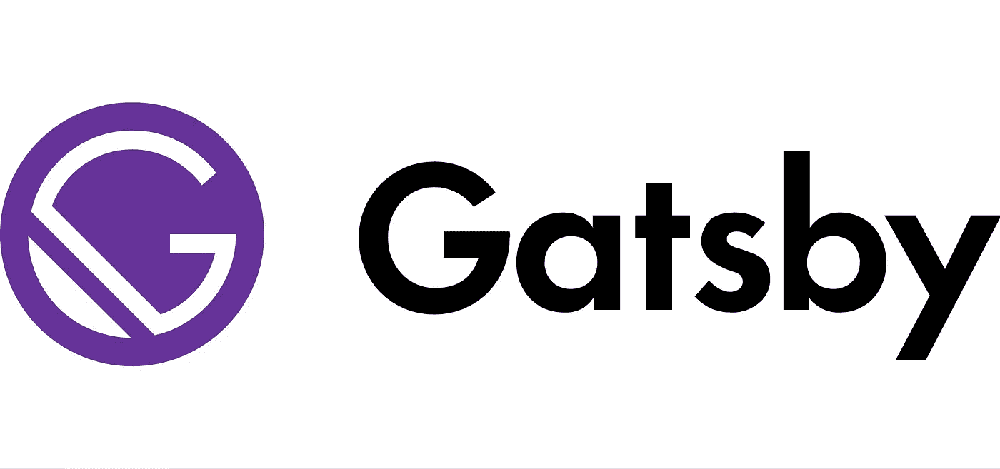

# 2021 年为什么要学盖茨比？有什么好处？

> 原文：<https://medium.com/geekculture/why-should-you-learn-gatsby-in-2021-what-are-the-benefits-448231c61fe4?source=collection_archive---------11----------------------->

# 什么是盖茨比？

Gatsby 是一个开源的前端框架，使开发人员能够利用 React、Webpack、GraphQL 和其他前端工具的最佳部分来开发优化的网站。Gatsby 结合了静态生成网站的速度和框架的功能。因此，它只使用静态文件来加快加载时间、代码分割、服务器端渲染、资产优化、智能图像加载和数据预取。因此，页面加载速度非常快。

Gatsby 将网站代码转换成一个目录，其中包含一个 HTML 文件和静态资产。这个文件然后被上传到主机提供商，瞧，你的应用程序一样的网站准备好了！

# 盖茨比的特征

> 快速页面加载速度
> 
> SEO 效率
> 
> 出色的用户体验
> 
> 数据安全
> 
> 易于扩展(在流量峰值的情况下)
> 
> 开发者的良好体验
> 
> 静态站点生成(SSG)
> 
> 良好的现场性能
> 
> 更好的生态系统
> 
> 世界级文档
> 
> 使用和学习都很有趣

# **为什么选择盖茨比？有什么优势？**

我列出了使用 Gatsby 的最大优点，这会给你很多理由成为一名专业的 Gatsby 开发人员。

**1。组合来自任何地方的数据**

它使用基于 GraphQL 的创新数据层来组合来自不同来源的数据，并将它们一起呈现。因此，使开发人员能够将不同的内容、API 和服务集成到单个 web 中。

**2。无与伦比的速度和响应能力**

它结合了静态网站生成和智能页面渲染的优势，只加载重要的部分，从而为网站提供流畅的导航。因此，使用 Gatsby 建立的网站有更好的搜索引擎排名、可用性评分和更高的转化率。

**3。快速启动**

凭借插件、主题和启动器的庞大生态系统，Gatsby 允许开发人员立即开发和部署网站。

**4。惊人的开发体验**

Gatsby 利用 web 技术和工具，如 Git、JavaScript 和 API，允许开发人员将更多时间用于应用程序代码，而不是维护和优化。

**5。易于扩展**

Gatsby 采用的技术可以在流量高峰期间立即提供可扩展性，同时保护您的数据免受传统服务器端漏洞的影响。因此，每次都能为您的用户带来超快的网络体验。

**6。获得超出预期的收获**

其灵活和显著的特性允许开发者、营销者和公司在他们的预算范围内按时给他们的客户提供难以置信的 web 体验。

**7。盖茨比生态系统:插件、主题和启动器**

插件使开发人员能够将 Gatsby 与第三方平台集成，并通过 GraphQL 层传输数据。开发人员喜欢 Gatsby 的原因之一是它是一个基于 react 的框架，因此允许他们使用任何与 NPM 一起使用的包。

# -用盖茨比建立的伟大网站:-

 [## Figma:协作界面设计工具。

### Figma 将您的团队聚集在一起，从开始到结束设计更好的产品。免费试用 Figma 会见我们的客户…

www.figma.com](http://www.figma.com)  [## 前端框架，速度令人愉悦| Gatsby

### 1 快速从想法到生产从想法到生产用更少的时间启动，主题和超过 2500 个插件…

www.gatsbyjs.com](http://www.gatsbyjs.com)  [## react——用于构建用户界面的 JavaScript 库

### React 使得创建交互式 ui 变得不那么痛苦。为应用程序中的每个状态设计简单的视图，并反应…

www.reactjs.org](http://www.reactjs.org)  [## Airbnb 工程和数据科学

### 创意工程师和数据科学家构建一个世界，让您可以属于任何地方

airbnb.io](https://airbnb.io/)  [## SEOmonitor

### SEO 预测您提议的 SEO 性能。客户的业务成果。直接连接。

seomonitor.com](https://seomonitor.com/)  [## 不可能的食物:植物制成的肉

### 不可能的汉堡是由简单的植物原料制成的。为了人类和地球的健康。

impossiblefoods.com](https://impossiblefoods.com/) 

# 盖茨比和 Next.js 的相似之处

Gatsby 和 Next.js 都是开源的 React.js 框架，对于构建具有良好 SEO 和性能的静态站点非常有用。两者之间有一些相似之处，具体如下

> 生成高性能的网站。
> 
> 创建现成的 SPA。
> 
> 创建现成的优秀 SEO
> 
> 拥有令人敬畏的开发者体验。

# **结论**

如果你已经阅读了整篇文章，那么你可能会完全理解盖茨比提供的好处。毫无疑问，这是一项最新的技术，这给了营销人员、商人、企业和零售商使用它的一大堆理由。

最后，我们可以说，如果你开始学习它是为了你的职业或知识，那么你不会有任何损失。