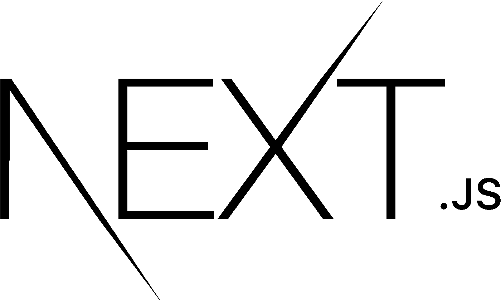

# 下一个 js 是什么？下一个 js 教程。2021 年下一个 js 有什么好处？

> 原文：<https://medium.com/geekculture/why-should-you-learn-next-js-in-2021-what-are-the-benefits-8292d79bc50c?source=collection_archive---------1----------------------->

# 接下来是什么。JS？

Next.js 框架基于 React 框架。Next.js 是一个服务器呈现的 React 框架，几乎不需要配置。现在，越来越多的人正在学习下一个 js 教程。Next.js 与其说是关于性能，不如说是关于改善开发人员的体验，让构建成熟的、SSR 友好的 web 应用程序变得更加容易。

Next.js 也支持静态构建，但它们不是主要目标。当我们谈到缺点时，我们会谈到它们。

# 什么是 Express js？

Express.js，或简称 Express，是 Node.js 的后端 web 应用程序框架，在 MIT 许可下作为免费开源软件发布。它旨在开发 web 应用程序和 API。它被称为 Node.js 事实上的标准服务器框架。

Next JS 有自己的内置服务器，因此你不需要使用 express js。然而，由于 express js 应用如此广泛，它使得开发人员可以轻松地与数据库进行交互并执行其他后端任务。

# Next 的特性。射流研究…

> 服务器端呈现(SSR)
> 
> 静态站点生成(SSG)
> 
> 单页应用程序(SPA)
> 
> 开发更快的应用程序
> 
> 页面优化
> 
> 搜索引擎优化网站
> 
> 自动代码分割

# Next js 是做什么用的？

现在的问题是，我们应该在什么时候使用 Next.Js，我们可以看到 Next 的很多特性和优点。Js 有。在下列情况下我们可以用 Next。Js 来开发我们的 web 应用程序。

## 1.下一个 js 电子商务

几周前，Next JS 发布了一个强大的电子商务初学者工具包，允许你创建高性能、用户友好和谷歌友好的网上商店。

## 2.SEO 至关重要的时候。

在互联网上注册任何网站时，SEO 总是被考虑在内。由于这些网站是在客户端制作的，SEO 在大多数单页面应用程序中无法正常运行。当谷歌抓取索引时，它只是简单地挑选一堆 JS 文件和带有 id 的 Div 标签，使得不可能索引一个网站。因此，请继续。js 是一种用来解决问题的编程语言。

## 3.登录页面

当我们需要建立一个登陆页面时，我们可以使用 Next。Js，因为它对营销人员制作以营销为中心的页面有很大帮助。

## 4.营销网站

因为我们的应用程序将在服务器上呈现，所以加载时间可以显著缩短。尤其是在访问者使用较慢设备的情况下。

## 5.静态网站

完全用 HTML 编写网站不仅困难而且耗时，而且你不可能写出比机器更好的代码(至少在包的大小方面)。

# 下一个 js 示例

在接下来的 js 教程中，您将看到一些使用该框架创建的精彩网站。以下是具体情况:

 [## 抖音——让你的一天快乐

### 抖音——趋势从这里开始。在设备或网络上，观众可以观看和发现数以百万计的个性化短片…

www.tiktok.com](http://www.tiktok.com)  [## 加密货币价格、图表和市值

### Crypto.com DeFi 钱包—管理、置换和出售 DeFi 令牌的最佳场所安全管理、置换和出售 DeFi 令牌…

www.coinmarketcap.com](http://www.coinmarketcap.com)  [## 比特币交易所|加密货币交易所|币安

### 币安加密货币交易所的全部力量，尽在你的掌握之中。下载币安手机加密…

www.binance.com](http://www.binance.com)  [## 见见梅尔卡利。销售应用程序。

### 市场是你的市场。这是整理和发现独特物品的绝佳场所。说…

www.mercari.com](http://www.mercari.com)  [## Zapier |自动化工作的最简单方法

### 聘请 Zapier 专家帮助您改进流程和自动化工作流程。

www.zapier.com](http://www.zapier.com) 

# 盖茨比（姓）

Gatsby 和 Next.js 都是开源的 React.js 框架，对于构建具有良好 SEO 和性能的静态站点非常有用。两者之间有一些相似之处，具体如下

> 创建高性能的网站。
> 
> *创建现成的 SPA。*
> 
> *创造出优秀的现成 SEO*
> 
> *拥有出色的开发者体验。*

# 下一个 js vs 盖茨比

1.主要区别在于，Next 需要一个服务器才能工作(为了提供 SSR 功能)，而 Gatsby 可能不需要服务器就能运行。

2.Next 是服务器端渲染网站和静态站点生成器的混合工具，而 Gatsby 是静态站点生成器。

3.说到数据处理，Next 给了用户完全的控制权。另一方面，Gatsby 指导消费者如何处理应用程序中的数据。

4.Gatsby 在构建时提供纯 HTML/JS/CSS，而 Next 可以在运行时生成 HTML/JS/CSS。

# Next 的优势。射流研究…

我列出了使用 Next 的 10 大优势。Js，它会给你一大堆理由成为下一个专业人士。Js 开发者。

## 1.拆分代码

它会自动中断代码以加快页面加载速度。这也是为什么上面提到的大部分网站都有较快的加载页面能力，因为它们是为大量受众而构建的。

## 2.带来有机交通

用 Next JS 开发的网站不仅快如闪电，而且搜索机器人也很简单，提供了很好的用户体验。这三个因素——速度、结构和用户体验——是提升网站搜索引擎排名的重要因素。

## 3.丰富的用户体验

使用 Next JS 最有利的方面是用户体验，仅次于 pace。营销人员崇拜设计独立性，尤其是在电子商务行业，许多在线商店看起来都一样，拥有一个独特的店面将有助于他们从竞争中脱颖而出。

## 4.安全性

静态站点是完全安全的，因为它没有到数据库、依赖项、用户数据或其他机密信息的直接链接。

## 5.更快的加载页面时间

其次，由于 JS 网站是静态的，所以速度非常快，访问者会对结果非常满意。它还可以在需要时自动优化页面。

## 6.快速支持

下一个。Js 是 React 框架，所以在最需要的时候很容易得到快速支持。您不需要从头开始构建它，因为总会有 React 开发人员为您提供快速支持。

## 7.服务器端渲染

改进的数据保护和 PIPA 合规性。客户端渲染应用程序希望数据字段以 JSON 对象的形式提供给浏览器…
-减少网络延迟以增加页面加载时间。
-可以预期的服务器端处理效率。
-准确的用户测量。
-浏览器兼容性问题较少。

## 8.响应式网站

接下来，基于 JS 的网站和应用程序可以在任何平台上运行，并适应任何屏幕尺寸。因此，用户可以使用他们选择的电脑访问您的网站或应用程序。

## 9.帮助建立多用户网站

考虑到用户实时产生的数据量，一个广泛的多用户平台最重要的方面是其效率，这并不奇怪。

此外，“实时”意味着渲染必须使用最新数据连续进行。

## 10.易接近

接下来，JS 网站和 web 应用程序可以在任何平台上运行，使它们可以普遍访问。

# 结论

如果你已经阅读了整个下一个 js 教程，那么你可能会完全理解接下来的好处。Js 提供。毫无疑问，它是下一级(这就是为什么他们称之为 next)技术，因为它给了营销人员、商人、企业和零售商一大堆使用它的理由。

最后，我们可以说，如果你开始学习它是为了你的职业或知识，那么你不会有任何损失。