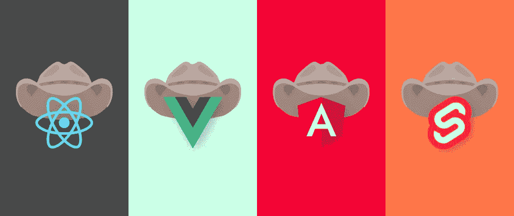

# 为什么要慢慢学习编码？

> 原文：<https://medium.com/geekculture/why-should-you-learn-to-code-slowly-e135a6b27fa6?source=collection_archive---------17----------------------->

论工作学习和再学习

在 Javascript Valley 中走了几年弯路之后，我决定是时候重新加入 Java 高速公路了。当我在 NodeJS 的灌木丛中寻找通往 Java 的道路时，我偶然发现了 Jamie Chan 的一本令人愉快的书， [**一天学会 Java 并学好它**](https://www.amazon.com.au/Java-Beginners-Hands-Project-Project-ebook/dp/B01LZOCVN9) 。我可以抽出一天时间。当我遇到 [**在几分钟内重新学习 Java**](https://www.issacc.com/relearn-java-in-few-minutes/)**时，我的千禧年心态让我寻找一种更快的方法。**果然，几分钟**后**，我准备尝试 [OCJP](https://education.oracle.com/oracle-certified-professional-java-se-11-developer-upgrade-from-ocp-java-6-7-8/trackp_817) 。**不是！**

过去几年，Javascript 及其不断变化的框架环境让我相信这样一种现象:在学习一门技术时**过度投入**,但不久后却发现它变得无关紧要。

Source: [https://dev.to/ryansmith/the-cost-of-investing-too-heavily-in-a-javascript-framework-2121](https://dev.to/ryansmith/the-cost-of-investing-too-heavily-in-a-javascript-framework-2121)

这种“并非完全没有根据”的恐惧症伴随着从**基础到幻想的漂移，**承蒙美女们的青睐，比如[自举](https://getbootstrap.com/)、 [lodash](https://lodash.com/) 、 [fs-extra](https://www.npmjs.com/package/fs-extra) 、[护照](https://www.npmjs.com/package/passport)和[猫鼬](https://www.npmjs.com/package/mongoose)等等，这让我在 La La Land 中漂移。毫无疑问，使用这些包的目的是为了节省时间，否则这些时间会被用于构建特性或提高系统性能。但是，它们开始是高跟鞋，最后变成拐杖。

# 当你放手时，真正的知识就会到来

> “没有人真的希望一次性将所有信息下载到他们的大脑中，并保留大量信息。那是不合理的，尝试是愚蠢的”
> 
> 凯尔·辛普森

不要误解我的意思，我并不是建议花数周时间研究语言/框架/工具的每一个方面。相反，定期重温**你的代码**和**你对它的理解**。

Source: [https://fuckyeahkathandkim.tumblr.com/post/2738389232](https://fuckyeahkathandkim.tumblr.com/post/2738389232)

# 两个极其简单的步骤:

**(1)开始快速编写代码**

每次我们获得一项新技术(或重新使用旧技术)，这个过程都类似于乞讨、借用或偷窃的行为。快速阅读文档、项目中要附带的现有文件，以及剩余部分的堆栈溢出。在早期阶段，重要的是**把事情做好**和**保持高昂的士气**。

**(2)回来理解你写的东西**

我们在改变**意识和遗忘**的过程中编写代码。在适当的时候，它会赶上来，我们最终会得到比其他部分更远离我们理解的部分代码。这就是学习缓慢的原因。定期重温代码的这些部分，目的是**完全理解**它们。

让我们面对现实吧，一份全职的开发工作不会给你留下太多的时间(或精力)来发展专业技能，即使你可能会接触到尖端技术。

> 但是，截止日期是平庸的原因。

快速启动会让你继续交付。复习行程虽然**慢**，但是能够学习。