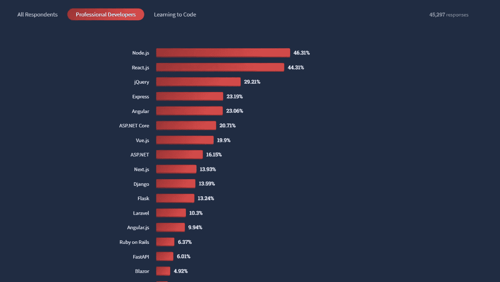
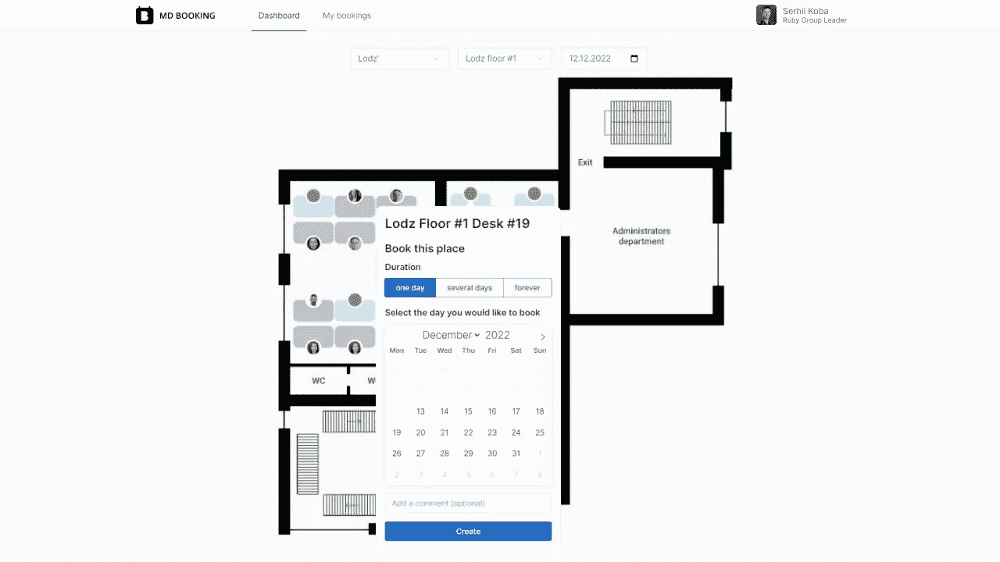

# 在 2023 年，你为什么还要选择 Ruby on Rails 来开发你的产品

> 原文：<https://medium.com/geekculture/why-should-you-still-choose-ruby-on-rails-to-develop-your-product-in-2023-d868d7706246?source=collection_archive---------16----------------------->

随着 2023 年的临近，Ruby on Rails 正在成为一项更加成熟的技术，因为它的最初发布是在 18 年前。作为 web 应用程序开发领域的白衣骑士，Ruby on Rails 仍在使用，但对其相关性和受欢迎程度的担忧越来越多。因此，在本文中，我们将回答以下问题:

*   Ruby on Rails 是死了还是还活着？
*   为什么要在 2023 年利用 Ruby on Rails？
*   什么时候使用 Ruby on Rails，什么时候放弃它，转而使用更有竞争力的技术？

# 2023 年 Ruby 还活着吗？

Rails 7.0.4、6.1.7、6.0.6 [于 2022 年 9 月](https://rubyonrails.org/2022/9/9/Rails-7-0-4-6-1-7-6-0-6-have-been-released)发布。这些版本包括修复的错误、性能改进和其他增强功能。一年前，Rails 7 的第一个 alpha 版本发布。我们可以看到一个活跃的社区，它已经成功地将想法转化为行动，并通过 web 开发方法实现了一个完整的堆栈，解决了前端和后端的挑战。但是版本并不能完全反映软件开发的情况，所以为了弄清楚 Ruby on Rails 是死了还是还活着，我们来看看统计数据。

堆栈溢出[揭示了](https://survey.stackoverflow.co/2022/#most-popular-technologies-misc-tech-prof)最受欢迎的技术，Ruby 排在第 14 位:6.37%的受访者(专业开发人员)使用它。

Stack Overlow list with Ruby in the 14th place

[来源](https://survey.stackoverflow.co/2022/#most-popular-technologies-misc-tech-prof)

根据 2022 年 11 月的 TIOBE 指数(一个正在形成的编程语言受欢迎程度的条件指标，考虑了软件开发人员、第三方供应商和与特定技术相关的课程的总数)，Ruby 进入了前 20 种最常用的编程语言。

统计数据证明，在市场上所有可用的选项中，在 2023 年为您的产品选择 Ruby on Rails 是有意义的。至于 Ruby 的过时，这并不重要，RoR 帮助解决业务任务，并作为 MVP、内容管理系统、动态网站、电子商务解决方案、预订、社交网络和其他应用的核心技术。然而，技术之间的竞争加剧了，在为产品选择技术组合时，我们应该考虑许多标准。尽管 Ruby 相对较慢的性能和可伸缩性是它的主要缺点，但许多世界知名的公司仍然在他们的应用程序中使用它。

# 他们仍然在使用 Ruby

**Github**

在 C、Shell、Ruby 和 MySQL 的支持下，Github 已经成为软件开发人员中领先的托管源代码服务。使用 GitHub 的公司数量已经达到 180 万，其中既有知名企业，也有初创公司。在这里你可以找到 Github 下的[项目，并确保 Ruby 还在。](https://github.com/collections/projects-that-power-github)

**Airbnb**

Airbnb 从竞争对手中脱颖而出的是它的功能，而不是技术堆栈。这项服务代表了一个在线市场，让您在旅行时找到合适的住宿地点或通过招待客人赚钱。截至 2022 年秋季，Airbnb 在 191 个国家开展业务，技术堆栈包括用于网络开发的 Ruby on Rails，因为尽管数据大量涌入，它仍允许该公司有效地管理预订和交易。

**购物化**

作为一家领先的电子商务公司，Shopify 自 2006 年成立以来一直在获得关注。目前，它为参与在线销售的各种规模的企业提供服务，因此对在线商店感兴趣。Shopify 的技术体系是围绕几十种技术解决方案和组件构建的，尽管 Ruby 因其灵活性和运营管理的成本效益而处于平台的核心。

**运球**

Dribble 是一个面向设计师的社交网络平台，他们可以在这里分享和发现模型和动画，雇佣其他设计师，或获得对他们工作的反馈。该平台自 2009 年以来一直由 Ruby on Rails 提供支持，并且仍然受到青睐。更令人印象深刻的是，网络上出现的运球克隆人利用了同样的技术。这些克隆人计划在阳光下占据一席之地，并受到增长最快的平台中列出的运球的启发，他们依赖 RoR 作为合适的技术解决方案。

**安永&扬**

据 Statista 称，安永是一家拥有 359，449 名员工的专业服务网络，目前在欧洲、中东、美洲和其他地区开展业务。安永网站仍在使用 Ruby on Rails，在其复杂的架构中发挥着至关重要的作用。

Ruby on Rails 的使用不仅仅局限于上面提到的公司:Groupon、比特币基地、Gitlab、Zendesk、Etsy、Crunchbase、Ask.fm、Fab 以及许多其他知名公司都是从 RoR 开始他们的旅程，逐渐用 Go、Python、Java 等补充他们的技术栈。此外，今年，企业仍然在正确的轨道上开发基于 Ruby on Rails 的产品。

# 使用还是不使用 Ruby on Rails，这是一个问题

在选择正确的技术组合时，您应该关注对产品提出的功能性和非功能性需求，以及在特定路线上可能遇到的风险。记住这一点，我们将从正反两方面分析 Ruby on Rails，并找出为什么关于 Ruby 是否还活着的观点如此有争议。

多年来，由于 Ruby on Rails 的性能和可伸缩性问题，对它的批评层出不穷。与 C++、Golang 或任何其他编译过的编程技术相比，Ruby 的性能较低并不是一个神话:它需要更多的时间来执行代码，当处理大型高负载项目时，我们可以感受到这种差异。尽管 Ruby 速度较慢，但 Rails 应用程序优化可能会改善性能。缓存、避免过度的内存消耗和有效的扩展对 RoR 应用程序来说是必不可少的。

但是 Ruby on Rails 的可扩展性不够这个事实呢？Shopify 能够同时支持 50 多万家企业，驳斥了这种说法。因此，如果你有合适的团队支持你的软件开发，RoR 应用程序即使花费最小的成本也是足够可扩展的。

这个团队能够提供 RoR 可伸缩性的是代码简化，将模块化方法应用于开发，并在客户端保存应用程序状态。然而，扩展的复杂性取决于架构，从头选择一个合适的架构可以显著简化与扩展相关的未来任务。因此，公司需要更加注意不要在一开始就忽略解决方案的生态系统，同时要记住用户请求可能会大量涌入。在下面的段落中，我们将提供 RoR 的优点和缺点的一瞥，这可能有利于产品开发的框架应用程序。

# Ruby 的优点和缺点

我们将看看没有修饰的 Ruby 的缺点，同时提出解决这些问题的方法。在对 Ruby on Rails 的所有负面评价中，你经常可以看到三种抱怨占据了主要位置:

*   低运行速度和性能问题(我们已经描述了通过优化 RoR 应用程序来处理这些问题的方法)
*   受欢迎程度下降(寻找经验丰富的 Ruby on Rails 开发人员可能会成为一个艰巨的挑战，因为他们应该经历一个曲折的学习过程；然而，Ruby on Rails 的受欢迎程度正在下降，这主要是因为不断发展的竞争性技术，如 Lavarel、Django 和 Node.js)

Ruby on Rails 的缺点部分是传统的，全球成千上万的公司将它作为主要技术。

Ruby on Rails usage by website in 2022

[来源](https://www.similartech.com/technologies/ruby-on-rails)

为什么这些公司觉得 Ruby on Rails 很有吸引力？实际上，它的优势数量仍然令人印象深刻，但是我们将重点介绍其中最重要的五个:

# 1.快速发展

有了 Ruby on Rails 作为核心产品技术，开发速度变得令人印象深刻。这是因为语法和现成的解决方案，所谓的 gems，[编号为 174，319](https://rubygems.org/stats) 。因为时间意味着金钱，甚至象征着 MVP 开发和初创公司的一条紧密的绳索，一个小失误或任何延迟都可能导致失败，Ruby on Rails 似乎是一个战略选择。至于企业，他们也仍然使用 Ruby on Rails 从头开始构建产品或增强他们的解决方案。

# 2.高级别的安全性

企业遭遇安全漏洞，遭受社会工程和网络钓鱼的危害。由于网络安全漏洞会引发声誉问题和财务损失，因此在开始开发时选择正确的技术至关重要。有了 Ruby on Rails 的支持，就有可能最小化与跨站脚本、跨站请求伪造、SQL 注入和点击劫持相关的风险，尽管你需要一个能够保护 RoR 应用的成熟团队。

# 3.简单性的使用

由于语法简单明了，Ruby on Rails 程序员可以用更少的代码行解决复杂的任务。根据[的 Rails 教条](https://rubyonrails.org/doctrine)，在 RoR 所依赖的主要支柱中，程序员的快乐似乎是最主要的一个。清晰的语法允许 RoR 开发人员在项目之间切换，而不会被冗长的入职时间分散注意力。因此，Ruby on Rails 最大的优点是它的便利性，以及开发和维护代码的简单性。

# 4.强大而有凝聚力的社区

社区团结在 Ruby on Rails 作为一种技术开发的理念周围，努力并永久地改进框架。[核心团队](https://rubyonrails.org/community)由自 2003 年以来一直致力于 Rails 改进的贡献者组成。超过 6，000 名工程师为 RoR 做出了贡献，帮助他们稳步解决问题，增加新功能，加快发布速度。更直白地说:凭借强大的社区，RoR 正在成为一项成熟的技术，因此开发人员在解决复杂问题时，可以通过课程、论坛或其他教育材料轻松找到帮助或问题的答案。

# 5.业务逻辑的简单实现以及与其他技术的兼容性

作为一个具有控制器和模块的全栈框架，Ruby on Rails 使开发人员能够实现 web 应用程序背后复杂的业务逻辑。API 和 gem 为此做出了贡献。此外，如果您需要添加前端框架并将其与 RoR 一起使用，这不会花费太多精力。这里我们再次回到 RoR 的主要优势——成本效益和开发速度。

# 用 Ruby 做什么？

作为一项技术，Ruby 在以下几个领域占据了强势地位:

*   Web 应用程序(特别是作为 MVP 和初创公司开发的)
*   移动应用的后端开发(Java、Kotlin 和 Swift 是移动开发最常见的选择，但是在这种情况下 Ruby 可以有效地支持后端开发)
*   电子商务产品(Ruby 不仅可以推动在线商店，这项技术还能够支持其他模块，从客户关系管理和支付工具到库存和营销组件)
*   静态站点生成器(这些生成器应用模板和原始数据生成静态 HTML 网站，Ruby 可以作为它们的核心技术，14 年前发布的 Jekyll 就证明了这一点)
*   自动化和 DevOps(如果您需要简化和自动化应用程序的安装和配置，Ruby 可以提供帮助。看看 Heroku，流浪者，厨师和木偶——都是自动化和 DevOps 任务的神奇工具)
*   Web 服务器(用 Ruby 处理请求是常见的情况)
*   数据处理(虽然解析、分析和存储数据是在 Python 的帮助下完成的，但是如果我们需要清理、转换和验证数据，Ruby 就派上了用场)
*   Web 抓取(复杂的研究和分析可以用 Ruby 来执行，它被用来提取和解析信息)

无论你用 Ruby——一个社交网络应用程序、 [fintech 软件](https://mobidev.biz/blog/how-to-build-fintech-app-approach-architecture-scalability)或 edTech 平台——构建什么样的解决方案，安全性都是首要问题。正如我们已经提到的，安全性是 Ruby 的一个关键优势，让我们进一步阐述这个观点。

# RoR 安全

从安全性和抗攻击性的角度来看，Ruby on Rails 已经被证明是足够平衡的。针对跨站点脚本的保护在于以自动模式执行的潜在恶意组件的筛选。RoR 采用不同的方法来抵御风险。例如，用标志 html_safe 标记每一行(没有设置标志的行在输出前会被 Rails 过滤掉)。或者通过利用特殊的代码结构来实现安全的数据输出。

至于跨站点请求，Ruby on Rails 有令牌认证来处理这类攻击。此外，遵守与 POST 和 DELETE 查询相关的其他安全建议也很重要。

RoR 漏洞之一与批量分配功能有关，这使得攻击者能够改变数据库列中的值并在表中创建新记录。但是经验丰富的 ROR 开发人员可以很容易地将这种情况下的风险最小化。

无论 Ruby on Rails 的环境和语法有多么规避风险，您的 web 应用程序——无论是在线商店、静态站点生成器，还是 Ruby 支持的其他产品——只有当参与开发的团队预见到潜在的风险和处理它们的方法时，才能得到保护。尽管有高安全性和其他 RoR 优势，但在与 Django、Laravel、Node.js 和其他竞争技术进行比较之前，您不应该对技术堆栈做出最终决定。

# Ruby 与其他/替代产品

在 [Hotwire](https://www.hotrails.dev/) 发布后，使用 Ruby 进行 Fullstack web 开发已经成为现实，Hotwire 适用于构建应用程序的交互前端。所以现在我们可以看到越来越多的基于 Ruby 的全栈网络应用。然而，专注于 Ruby 而非竞争性编程语言仍然是合理的。让我们看看 Ruby 与竞争对手的关系。

# RUBY/RAILS VS JAVASCRIPT/NODE。射流研究…

就性能而言，JavaScript 比 Ruby 更强大。JS 是低延迟应用程序的绝佳选择，因为它支持异步编程，所以您不必等到函数被执行。反过来，Ruby 是一种解释型语言，它在运行时的解释以及 CPU 处理的特性使它功能不那么强大。

Ruby 和 JavaScript 社区都很强大且多样化。JS 开发人员拥有自己的模块和包，而 Ruby 开发人员拥有 gem。然而，Ruby 的社区被认为是更加用户友好的，目前正在参与聚会、会议和播客。至于与编程语言相关的安全漏洞，JS 有更多，尤其是在客户端。就成本效益而言，这两种技术都没有吸引力:不过，Ruby 可能是建立 MVP 和创业公司的最佳工具。同时，JS 是一项必需的技术，连续十年被 Stack Overflow 社区认为是最常用的编程语言。

Node.js 是一个 Javascript 运行时环境，允许用 JavaScript 编写服务器端代码。使用 Node.js，您可以与浏览器和后端共享代码，并同时处理不同的操作。例如，传入的请求。这就是为什么 Node.js 可以驱动任何实时应用程序，例如信使、聊天室、在线游戏。

在安全性方面，Node.js 不如 Ruby，因为 npm 包可能包含不同性质的漏洞，这些漏洞在使用前没有被检测到。虽然 Node.js 在性能方面胜出，但 Ruby 仍然可以被考虑用于解决以下任务:

*   全栈 web 应用开发
*   电子商务项目
*   样机研究
*   Web 爬行和抓取
*   社交网络发展

# RUBY/RAILS VS PHP/LARAVEL

作为一种通用脚本语言，PHP 被应用于 web 开发已经超过 25 年了。大量的框架和库使它成为一种灵活的编程语言，拥有庞大的社区。2011 年，Taylor Otwell 发布了 Laravel，这是一个 PHP 框架，旨在促进身份验证、路由、会话和缓存等 web 开发任务。所以，让我们找出 PHP 和 Ruby 以及它们的框架之间的力量平衡。

从性能的角度来看，PHP 战胜了 Ruby。但是不管 Laravel 有多快，Ruby on Rails 在开发速度上是领先的。这些框架的核心原则在很大程度上是重叠的。Laravel 已经证明了它在企业级应用领域的有效性，但是 Ruby 的社区更加广泛和强大。

# RUBY/RAILS VS PYTHON/DJANGO

Python 是一种通用编程语言，自从 AI 进入新的发展阶段以来，它一直在获得牵引力。31 年前出现的 Python 正在成为构建 ML 模型的银弹算法。但是当我们将其与 Ruby 进行比较时，我们应该强调关键的区别:

*   Ruby 服务于函数式编程和 web 开发，而 Python 已经在 AI 和学术编程的不同分支中找到了应用。
*   Ruby 是 100%面向对象的语言，而在 Python 中，这些原则只得到部分实现。
*   声明变量和使用变量的原则是不同的。

Django 是一个用于后端开发的 Python 框架。与 Ruby on Rails 不同，它不支持全栈开发。在性能方面，这些框架是相似的。支持 Python 和 Ruby 的社区既强大又广泛。

# 为什么 Ruby 对创业公司来说很棒？

有了 Ruby on Rails，启动实现不会落后于计划。Ruby on Rails 非常适合 MVP 开发、快速迭代和产品扩展。企业可以很快爬上坚实的土地，由于创业的时机是一个关键的成功因素，RoR 看起来像一个理想的技术。它是开源的，对 API 来说很棒，并且可以缩短上市时间。

一些使用 Ruby 的著名创业公司包括以下大牌:

*   种类
*   开源代码库
*   菲格玛
*   爱彼迎（美国短租平台）
*   购物化
*   五元
*   特里瓦格

这些初创公司不仅用 Ruby 取得了巨大成功，还成功地扩展和改造了他们的技术堆栈。而且由于它的成熟和稳定，Ruby 仍然可以让那些参与从零开始建立创业公司的开发人员感到高兴。

一个人在 RoR 发展方面的专长的最大特点是什么？真实案例研究和项目。所以，让我们看一下我们用 Ruby 开发的产品。

# RoR 案例研究#1:云提供商应用

该项目是一流的公共云服务，但当您需要时，电话或电子邮件那头会有一个经验丰富、易于联系的个人支持团队。

对于许多公共云服务，这种关键的支持元素完全缺失，或者只有在您支付额外的昂贵月费时才会包括在内。大多数时候，你经常被留下来自己照顾自己。

借助云服务，您可以获得高度可扩展、安全、快速的基于云的部署平台的所有优势，但更加强调安全性、数据完整性，当然还有非常重要的个人支持。

该系统是使用最新的技术及其版本创建的，如 Rails 7、Hotwire、PostgreSQL 和 Sidekiq，它为客户提供了一个 web 界面来创建不同的云并为其付费。Cloudstack 用于创建虚拟机和其他资源。此外，它有一个用户友好的管理面板界面来管理发票，客户等。

# RoR 案例研究#2:社交网络应用

大型社交网络应用程序，旨在通过帮助组合导致人类进步的活动来发展人与技术之间的关系。我们通过改变社交网络对我们生活的影响，扩大它提供的积极影响，弥补它的消极影响来做到这一点。

它带来了社交网络行业中最好的创新 UI 实践和用户体验。

主要特点是:

*   带有自定义设置的注册/登录/用户配置文件
*   公共和私人发布功能
*   评论和反应
*   复杂的用户反馈取决于大量的功能
*   实时聊天
*   地理定位和地图
*   邀请功能

这些技术包括:

*   原生 iOS: Swift、Combine、CoreData、NetworkFramework、Alamofire
*   原生 Android: Kotlin，Dagger 2，Litho，RxJava
*   Ruby 后端:Ruby/Ruby on Rails、PostgreSQL、Redis、Docker、Kubernetes

# RoR 案例研究#3:办公空间预订申请

这个网络应用程序帮助管理和预订办公室的桌子和会议室。技术栈由最新的技术及其版本组成:Rails 7、Hotwire、Stimulus、Dry-monads、Sidekiq、administration、Oauth 等。

**核心功能**

用户可以管理空间可用性的预订和安排。因此，手动操作不会有任何麻烦。授权用户可以选择一张桌子并预订一段时间(或定期)。该系统可以分布到任何公司的设施中，无论是边界游戏还是房间。

用户可以看到任何一天谁在工作区，以便同事可以轻松协调他们的存在。

该应用程序在一个仪表板上为用户提供了所有空间可用性的完整视图，并具有房间预订功能，可控制谁有权访问特定空间以及何时访问。

Ruby-based Office Booking App

该应用程序提供了一个机会，通过使用日历来预订整个会议室的确切时间段，这是该系统的一个关键点。在这里，用户可以通过在几天、几周和几个月之间移动来轻松查看和管理预订。

该系统使用户能够通过首选位置、容量和可用设施过滤来搜索可用的会议室。因此，人们总能找到合适的合作空间，充分利用他们的会议。

如果任何桌子坏了或者人们缺少一些公用设施，也可以留下反馈。有了这些信息，办公室管理人员将继续努力消除上述障碍。

由 [MobiDev](https://mobidev.biz/services/web-application-development) 的 Ruby 团队负责人 [Liubov Derevianko](https://mobidev.biz/our-team/liubov-derevianko) 撰写。

*全文原载于*[*https://mobidev . biz*](https://mobidev.biz/blog/ruby-on-rails-not-dead-still-good-for-your-product-development)*，基于 mobi dev 技术研究。*