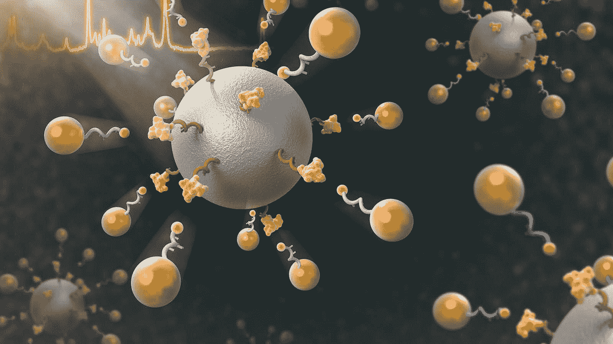
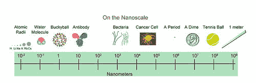
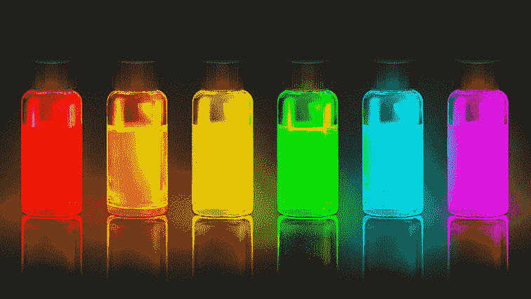
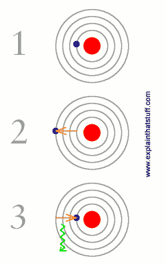
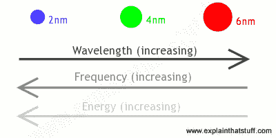
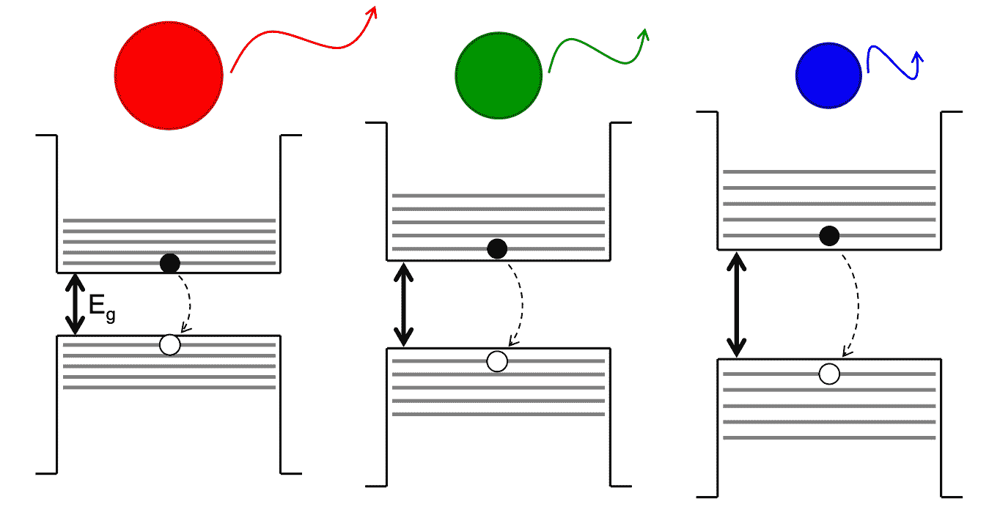
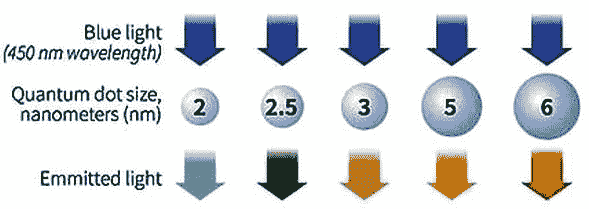
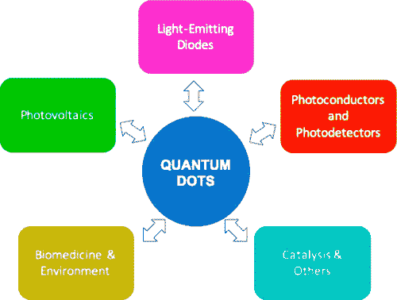
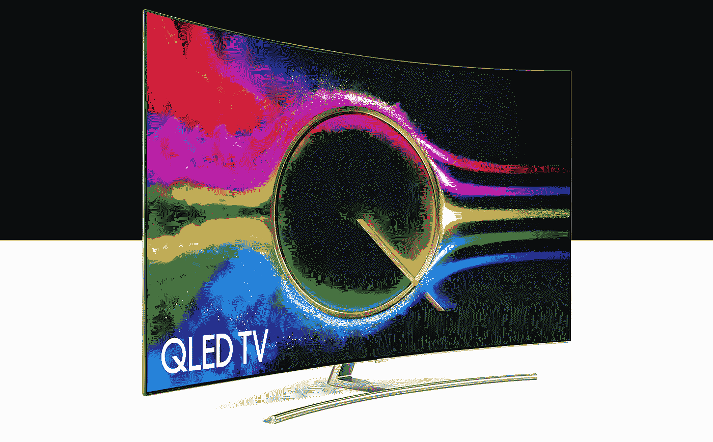
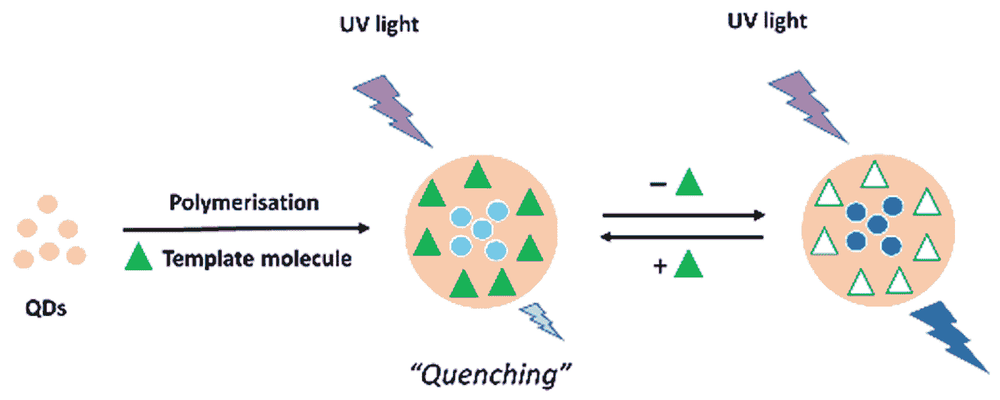

# 为什么尺寸很重要:量子点介绍

> 原文：<https://medium.com/geekculture/why-size-matters-1adbf342075f?source=collection_archive---------0----------------------->

## STEM 中的宝石:量子点介绍

尺寸重要吗？这是所有领域的一个老问题。总是“越大越好”吗？(如果你这么想，你可能会喜欢德州！)或者，小个子能战胜高个子吗(就像大卫诉歌利亚式的击败)？老实说，这场辩论的答案因人而异。

我们不断对我们的宏观世界进行观察，幸运的是，我们可以随时探索这个世界。但是在过去的一个世纪里，科学家们已经开始把事情提高一个档次，或者更准确地说，降低一个档次。他们开始放大这个世界，看看在微观和纳米尺度上所有神秘和有趣的事情发生在哪里。

这是纳米技术的基础，纳米技术是研究我们如何在原子和分子尺度上操纵物质。与你的侧视镜不同，这里的物体比它们看起来(在你脑海中)要小得多*。*

那张让你被纸划伤的邪恶的纸？10 万纳米厚。你(希望是不小心)踩到的蚂蚁？一百万纳米长。明白了吗，一米与一纳米的比率(十亿分之一)大约是一颗弹珠与地球的比率。所以，是的，纳米不是一个玩笑。

这个不算小的想法是从哪里来的呢？大多数科学家认为，著名物理学家理查德·费曼在他的演讲中首次介绍了纳米技术的概念，“底部有足够的空间。”(其标题，乍一看，似乎是一种悲观的世界观。)在这次演讲中，费曼谈到了小型化机器和在微小空间内编码大量数据的可能性，这在当时似乎几乎是不可思议的——这正是纳米技术如此令人兴奋的原因。

因为纳米尺度非常小(大约 1 到 100 纳米)，在这个世界上操纵物质并不容易。如果我们可以指挥一群单独的原子，从告诉它们何时“打开”和关闭来存储信息，或者用不同的颜色照亮它们(这将是一场奇妙的发光秀)，或者只是以某种方式指挥它们，这将是一件非常酷的事情。目前这还不太可能，但是不要绝望——我们有下一个最好的东西:量子点！

# **量子-嗯…什么？**

量子点通常被称为*人造原子*，是尺寸在 2-10 纳米之间的微小晶体。它们非常小，我们基本上可以认为它们是一个集中的单点，这就是为什么它们通常被称为零维的原因。量子点是由半导体材料(如硅)制成的——它们不是真正的导体或绝缘体，但可以通过化学处理表现出这两种特性。

量子点证明了你不需要变得很大才有趣，所以看起来大小的确不重要…或者是吗？

量子点能够吸收光，所以当你用光照射它们时，它们会将吸收的能量释放为独特而精确的颜色，这取决于量子点的大小、形状和材料。谈谈聚光灯下的闪耀！

现在，我只有几个问题:什么？为什么？在哪里？什么时候？怎么会？

亲爱的读者，不要害怕，我们将一起回答这些问题，但现在我会给你一个神秘的答案，每个人都说，但似乎从来没有真正解释:“因为量子！”

具体来说，**量子禁闭**是量子点颜色与其尺寸+材料之间这种光学关联背后的罪魁祸首。

## **量子点受激时令人兴奋**

看到这里，我们先来了解一下为什么量子点会被昵称为人造原子！你可能已经在物理或化学课上学过，当原子内部的电子跃迁到更高能级/电子层时，原子是如何被能量激发的(就像小孩子一样)(…不像小孩子)。然而，在较高的层次，它们通常是不稳定的，因此最终会下降(或放松)到更稳定的较低层次(像小孩子一样)。为了做到这一点，他们需要摆脱这种额外的能量，所以原子发射出一个光子的光，其能量与它吸收的能量相同！

这种发射光的波长和频率，以及因此产生的颜色，取决于基于原子的**量子化**(即设定)能级值之间的差异。你可以把它想象成爬梯子上的横档！

就像原子一样，量子点同样可以被光学激发！量子点也有量子化的能级，但即使它们由相同的材料制成，它们也可以根据大小发出不同颜色的光。更小的量子点(~2 nm)产生更短的波长和更高的频率(更蓝)，更大的量子点(~6 nm)产生更长的波长和更低的频率(更红)。中等尺寸的量子点(大约 4 纳米)发出绿光——去光致发光(这就是我们所说的发光过程)！

事实证明，量子点具有很宽的吸收光谱，这意味着它们可以在很宽的光波长范围内被激发。然而，量子点发出的光实际上只有相当有限的光谱，这就是为什么我们会得到这些超级微调的颜色(就像我们在上面看到的充满活力的彩虹)。这意味着我们不会看到重叠的颜色，这为使用这些不同的量子点实时跟踪和标记生物分子的一些疯狂的应用让路(我们将在下一部分的应用中详细讨论)！它特别有用，因为量子点光致褪色非常慢，这意味着与其他分子标记相比，它们的颜色强度持续更长时间，因此我们可以跟踪更长的过程。

现在让我们回到量子的意义上来。

基本上，量子点显示量子效应是因为它们的尺寸非常小，这意味着它们内部的电子只能处于我们刚刚谈到的离散能级。在这个纳米尺度上，我们正在限制，又名**，*电子在所有三个空间方向上的运动和行为——基本上是掉进兔子洞到量子*仙境*(在这一点上还不如把我们的名字改成爱丽丝，喝任何说“喝我”的东西)。*

## ***带隙不只是 1D 才有，量子点也有！***

*由于量子限制的这种迷人效果，随着纳米晶体尺寸的减小，它们的**带隙**增加，这就是赋予它们彩虹力量的原因。*

*澄清一下，这个带隙不是一个乐队在不可避免地失去一个成员后的间隙。(我正看着你，一个方向——你的“中断”已经持续了 7 年之久，看不到尽头，这非常令人沮丧。)*

*实际上，带隙是释放材料中的电子使其能够通过电流的最小能量。因此，由于它们具有更强的限制，较小的量子点具有更大的带隙，这意味着它们需要更多的能量来兴奋(像成年人一样)。然后它们发出更高的频率和更短的波长，因此更蓝…也有点像成年人:(。正如所料，较大的量子点的带隙较小，因此需要的能量较少，频率较低，波长较长，这也是它们更红的原因。*

**

*当一束光照射在 QD 上时，其中的一个电子被激发到更高的能级，然后当它以光发射的形式释放这种能量时，该能级下降，这被称为光致发光。光的颜色取决于能量差，对于更小的纳米晶体，能量差更大。*

*由于量子点的带隙难以置信地依赖于它们的尺寸，因此量子点可以根据我们的喜好进行调节。就像我们刚刚谈到的，通过减小点的尺寸，你可以增加带隙，反之亦然，这意味着我们可以通过改变它们的尺寸来制作不同颜色的量子点(即使它们由相同的材料制成)。*

**

*(Image: RNGS Reuters/Nanosys).*

*注意，吸收和发射波长是不同的，因为吸收波长涉及特定的光子能量，而发射波长代表这些带能隙。*

*这个故事的寓意是:当事物变成纳米时，它就变成了量子。这些量子效应给了我们超能力去调整量子点的光学、电学和磁学特性来改变我们所知道的世界——就在纳米尺度上。*

# ***QDs 疯了***

*量子点不仅仅是有趣的灯光秀，它们独特的光学特性和能量可调性意味着我们可以用它们做各种事情！尤其是精确控制光线非常重要的情况，如光伏、成像、检测、生物学中的发光标签等等！由于时间关系，我们在这里只看三个应用领域:太阳能电池、电视和医药。*

**

## ***太阳能电池我的灵魂变成量子点***

*量子点在捕捉光线并将其有效转化为电能方面非常出色，更好的是，它们比更标准的材料需要更少的空间！谈论突破性技术——现在人们对量子点能为太阳能电池做什么非常兴奋。*

**

*在传统的太阳能电池中，太阳光的光子将半导体中的电子踢到电路中，以较低的效率产生电能。QDs 来拯救世界了！量子点可以在撞击它们的每个光子上产生不止一个电子空穴对(或*激子*，这提高了它们将阳光转化为能量的效率。这种效应被称为**多激子产生** (MEG)，比传统太阳能电池每个入射光子产生一个电子更受欢迎。*

*除了我们的朋友 MEG，量子点可以更容易地用不需要大量提纯的廉价材料(如硅)制造，并可以应用于廉价和柔性的基底(又称底层)，如轻质塑料。*

*就当我是 QDs 上卖的太阳能吧！*

## *让我们看电视上的量子点吧*

*如果引导字面上的太阳还不够，量子点现在也被放入液晶电视，使图像更加丰富多彩和充满活力(像我的个性…也有点像迷幻药)。*

**

*它们的精确可调性为我们提供了更真实、更精确的颜色，而传统的 LCD 由红色、蓝色和绿色晶体的微小组合制成，从明亮的背光背后照亮(不一定能捕捉到我们看到的精确颜色)。量子点甚至不需要背光，它们自己产生光，所以它们更节能！这对于节省像手机这样的小型便携设备的电池有很大的作用(并且有助于确保它不会在你需要的时候没电)。QDs 还能让你以更高的分辨率观看可爱的狗狗和猫咪视频。*

*从更纯净的颜色到更长的电池寿命，再到价格便宜但质量不差，量子点被认为是各种尺寸显示器的未来。这就是量子化。*

## ***让有光……来探测***

*因为量子点可以映射成彩虹，科学家可以用它们来瞄准细胞并对细胞进行颜色编码，帮助它们可视化并跟踪细胞内的分子表面。*

*与大多数有机染料(通常具有有限的颜色范围并快速降解)不同，量子点可以被各种光源激发，因为它们具有宽的吸收光谱，并且它们的光发射也可以容易地区分，因为发射光谱比传统染料窄。它们基本上非常明亮，几乎可以产生任何颜色，并且对光稳定(这意味着理论上它们可以永远使用)。总而言之，量子点就像纳米灯泡——对于生物成像、标记、传感等等来说是一个奇妙的发现！*

**

*与其他标记相比，量子点的颜色强度随着时间的推移也变得更慢，这意味着它们可以长期跟踪分子在细胞内的移动。我们还可以随着时间的推移识别单分子结合事件(这通常很难)，因为量子点具有闪烁的特性，让我们可以识别样品中的单个量子点。*

*让我们来看看其他一些有趣的应用:量子点可以用作神经科学传感器，表明治疗 X 射线束何时被正确定位，或者用于靶向药物输送和细胞标记。他们也有潜力作为安全的辐射探测器，因为量子点在辐射附近发光。此外，量子点还被测试为化学和生物战剂的传感器，这太疯狂了。QDs 绝对史酷比杜疯了！*

*所有这一切听起来好得不像是真的——事实的确如此！在这种医疗情况下使用量子点会引发一些安全问题。为了可行，量子点必须无毒，并且在不伤害患者的情况下消散或留在患者体内。然而，目前用于制造量子点的许多材料不符合这一标准，可能会导致健康问题，但其他元素组合可能更昂贵。*

*我们不仅要考虑我们自己的健康，我们还要关心环境的健康。随着我们开始更多地使用纳米材料，我们还必须解决并仔细监测它们的潜在污染和毒性——让我们为我们的地球做好准备。*

*好吧，让我们最终爬出这个兔子洞，回到我们的宏观世界。如果说我们在这次量子仙境之旅中学到了什么，大小有时很重要！(但也不尽然。❤)*

*等等！在你离开之前，我有最后一个问题要问你:你*是半导体纳米晶体吗？因为你是 QD &我生命中的光。< 3**

# *号外！号外！阅读所有相关内容！*

*如果你想了解量子点更有趣的应用，不用再看了！像朵拉一样，探索下面的链接。*

> *[https://exciton science . com/news/Goldilocks-and-three-quantum-dots-one-just-right-peak-solar-panel-performance](https://excitonscience.com/news/goldilocks-and-three-quantum-dots-ones-just-right-peak-solar-panel-performance)*
> 
> *[https://spectrum . IEEE . org/quantum-dots-shift-sunlights-spectrum-to-speed-plant-growth](https://spectrum.ieee.org/quantum-dots-shift-sunlights-spectrum-to-speed-plant-growth)*
> 
> *[https://www . CNET . com/tech/tech-industry/how-quantum-dots-super charge-farming-medicine-and-solar-too/](https://www.cnet.com/tech/tech-industry/how-quantum-dots-supercharge-farming-medicine-and-solar-too/)*
> 
> *[https://Gabriel-Silva . medium . com/量子点点亮大脑-379e73058dbc](https://gabriel-silva.medium.com/quantum-dots-light-up-the-brain-379e73058dbc)*
> 
> *[https://www.wired.com/2015/01/primer-quantum-dot/](https://www.wired.com/2015/01/primer-quantum-dot/)*
> 
> *石墨烯量子点:[https://en.wikipedia.org/wiki/Graphene_quantum_dot](https://en.wikipedia.org/wiki/Graphene_quantum_dot)*
> 
> *[https://phys . org/news/2021-12-单工艺平台-石墨烯-量子点. html](https://phys.org/news/2021-12-single-process-platform-graphene-quantum-dots.html)*
> 
> *[SafeStamp](https://safestamp.com/) 的使命是通过使用量子点拯救每年死于假冒药物的[100 万人。有了量子点，他们可以构建纳米技术指示器，当购买的是假货时，它会发出蓝光。](https://scienceinpoland.pap.pl/en/news/news%2C28780%2Cexpert-counterfeit-drugs-kill-1-million-people-each-year.html)*

*下次见！如果你觉得这很有趣，请确保关注下一篇。*

*与此同时，在我的专栏 [**中查看其他文章，点击这里**](https://apoorvapanidapu.medium.com/list/gems-in-stem-e5f24767d315) ！如果你有任何问题或意见，请发电子邮件到 apoorvapwrites@gmail.com 给我。*

*要成为第一个听到我所有新文章、最近事件和最新项目的人，请务必订阅我的简讯: [**信？我几乎不认识她！**](http://apoorvapanidapu.substack.com/)*

**提醒一下:这个* [*专栏*](https://apoorvapanidapu.medium.com/list/gems-in-stem-e5f24767d315) *，STEM 中的瑰宝，是一个了解各种 STEM 主题的地方，我发现这些主题很令人兴奋，我希望也会让你兴奋！它总是会被写得相当容易理解，所以你不必担心没有背景知识。然而，它偶尔会在接近尾声时变得更高级。感谢阅读！**