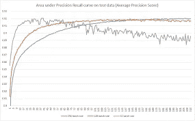
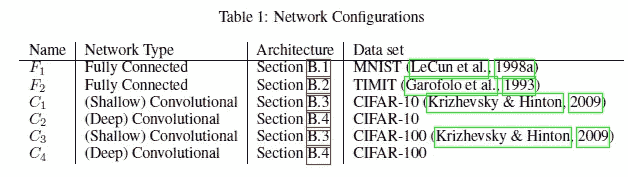
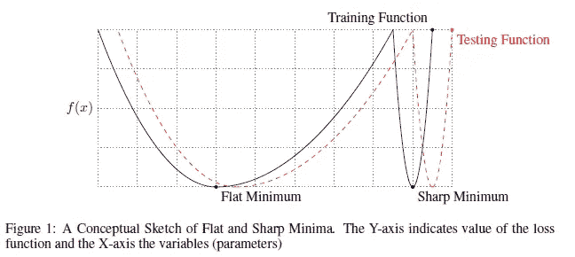
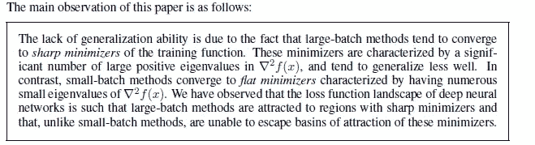
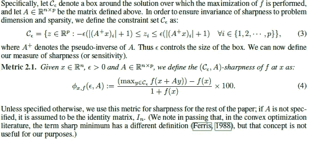
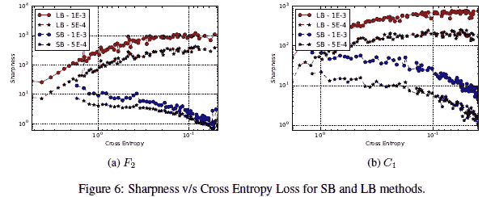
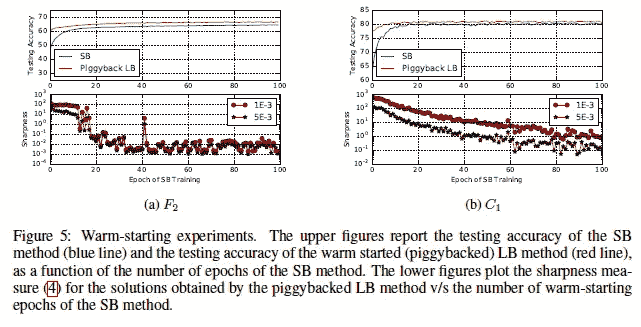
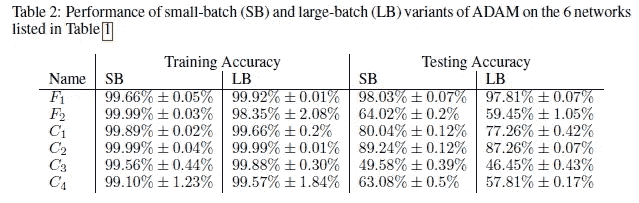
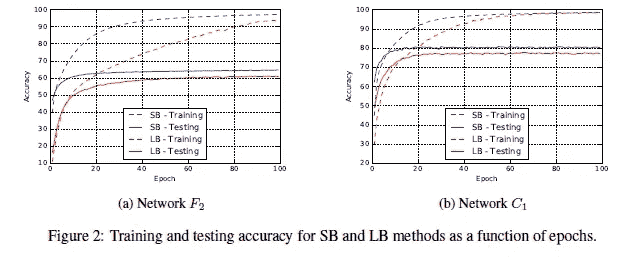
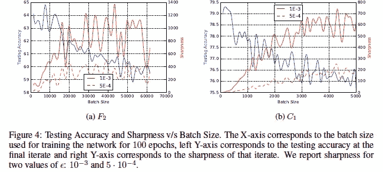

# 为什么小批量导致深度学习中更大的泛化

> 原文：<https://medium.com/geekculture/why-small-batch-sizes-lead-to-greater-generalization-in-deep-learning-a00a32251a4f?source=collection_archive---------2----------------------->

## 批量越大，有什么固有的问题吗？

批量是机器学习中重要的超参数之一。超参数定义了在更新内部模型参数之前要处理的样本数。

An example of experiments testing different batch sizes for SGD.

批量大小可以决定许多基于深度学习的神经网络的性能。因此，有很多研究都在为你的学习代理评估最佳批量协议，这并不奇怪。例如，对于 SGD，您可以使用批量梯度下降(使用批量中的所有训练样本)或小批量(使用部分训练数据)，甚至在每个样本后更新。而这些可以改变你的学习者的效果。

Different networks used by the authors. Notice all problems are classification based

准确性不是我们关心的唯一性能指标。一般化就是这样一种度量。毕竟，如果我们的模型不能在看不见的数据上表现良好，它就没有用。并且已经注意到，使用更大的批量会导致更差的网络泛化。论文的作者“关于深度学习的大批量训练:泛化差距和尖锐极小值”试图调查这一现象，并发现为什么会发生这种情况。他们的发现很有趣，我将在本文中向您展示。理解这一点将允许你为你自己的神经网络和 ML 管道做出更好的决定。

# 理解假设

要理解任何一篇论文，重要的是首先要理解作者试图证明什么。作者声称他们能够发现为什么大批量会导致更差的泛化能力。他们，“*提出了数字证据，支持大批量方法倾向于收敛到训练和测试函数的尖锐极小值的观点——众所周知，尖锐极小值导致较差的泛化能力。相比之下，小批量方法始终收敛于平坦极小值，我们的实验支持一个普遍持有的观点，即这是由于梯度估计中的固有噪声。*“这里陈述的很多，我们一步一步来。下图是尖锐的极小值和平坦的极小值之间的差别的一个优雅的描述。

With sharp minima, relatively small changes in X lead to greater changes in loss

一旦你理解了这一点，让我们来理解作者验证的两个(相关的)主要观点:

1.  使用大批量将会使你的代理人损失惨重。这种急剧的损失将会降低网络的概化能力。
2.  批量越小，景观越平坦。这是由于梯度估计中的噪声。

作者在论文中强调了这一点，陈述如下:

我们现在将检查他们提供的证据。他们设置实验的一些方法很有趣，会教你很多关于设置实验的知识。

# 定义清晰度

锐度似乎是一个直观的概念，可以理解和形象化。然而，它确实有一些并发症。请记住，机器学习是对高维数据进行操作的。跨此的计算/可视化可能会很昂贵。作者甚至承认计算特征向量的大小是多么昂贵。因此，他们使用更简单的启发式。他们在解决方案的邻域内进行检查。函数可以达到的最大值用于计算灵敏度。

> 我们采用了一种灵敏度测量，虽然不完美，但在计算上是可行的，即使对于大型网络也是如此。它是基于探索一个解的一个小邻域，并计算函数 f 在那个邻域中能达到的最大值。我们使用该值来测量训练函数在给定的局部极小值处的灵敏度。现在，由于最大化过程是不精确的，并且为了避免被仅在 Rn 的微小子空间中获得 f 的大值的情况误导，我们在整个空间 Rn 以及随机流形中执行最大化。

请注意，作者将一定程度的交叉验证整合到程序中。虽然仅仅从您的解决方案空间获取多个样本似乎过于简单，但这是一个非常强大的方法，适用于大多数情况。如果你对他们计算的正式符号感兴趣，它看起来像这样

And they claim that Machine Learning does not need math.

# 审查证据

既然我们已经理解了作者们起诉的基本术语/定义，让我们来看看一些证据。显然，我无法分享论文/附录中的所有内容。如果你对所有的细节都感兴趣，你可以看看报纸。如果你想要这篇论文的完整注释版本，突出重要的方面+我的想法，请联系我。

Look at the axis values. As we move right, the values get smaller. It goes 10⁰, 10^-1 …

在左边，你可以看到交叉熵损失与清晰度的关系图。需要注意的是，当你向右移动时，我们的损失实际上变小了。那么图表是什么意思呢？我们注意到，随着我们的学习者成熟(损失减少)，大批量学习者的锐度增加。用作者的话说，“*对于损失函数的较大值，即在初始点附近，SB 和 LB 方法产生相似的锐度值。随着损失函数的减小，对应于 LB 方法的迭代的锐度迅速增加，而对于 SB 方法，锐度最初保持相对恒定，然后减小，表明探索阶段之后收敛到平坦的极小值。*

作者还有其他几个实验来展示结果。除了在不同类型的网络上进行测试，他们还在小批量和大批量网络上使用了热启动。结果与我们目前所看到的相当一致。

我在论文中发现的一个有趣的方法是，他们证明了当使用较大批量时，这种较低的泛化能力与模型的过度拟合或过度训练无关。很容易假设过度拟合是泛化能力较低的原因(这通常很容易)，但作者反对这一点。要理解他们的论点，请看这张表

Small Batches outperform when it comes to testing accuracy.

请注意，小批量训练通常具有更好的训练效果。即使在我们对 SB 训练具有较低训练精度的网络中，我们也注意到较高的训练精度。阅读作者的下面一段话，“*我们强调，泛化差距并不是由于统计学中通常观察到的过度拟合或过度训练。这种现象以测试精度曲线的形式表现出来，在某个迭代点达到峰值，然后由于训练数据的模型学习特性而衰减。这不是我们在实验中观察到的；F2 和 C1 网络的训练-测试曲线见图 2，它们是其余网络的代表。因此，旨在防止模型过度拟合的早期停止试探法无助于缩小泛化差距。*

Look at how quickly the networks converge to their testing accuracies

简而言之，如果这是一个过度拟合的例子，我们将不会看到 LB 方法的持续较低的性能。相反，通过更早地停止，我们将避免过度拟合，并且性能将更接近。这不是我们观察到的。我们的学习曲线描绘了一幅非常不同的画面。如果你想学习如何使用/分析学习曲线，看看下面的[视频。在这里，我结合我多年来学到的各种东西，分析了 LCs 的细微差别。我从我的项目中使用真实生活的例子，以及我如何应对我们看到的不同挑战。](https://youtu.be/TQAC0VEe8k8)

One final plot to validate the author’s argument

如果你喜欢这篇文章，看看我的其他内容。我定期在 Medium、YouTube、Twitter 和 Substack 上发帖(所有链接都在下面)。我专注于人工智能、机器学习、技术和软件开发。如果你正在准备编码面试，看看:[编码面试变得简单](https://codinginterviewsmadesimple.substack.com/)，我的免费每周简讯。

为一次性支持我的工作，以下是我的 Venmo 和 Paypal。任何数额都值得赞赏，并有很大帮助。捐赠解锁独家内容，如论文分析，咨询，并降低模拟面试的费率。你也可以用它们来购买我的注释论文:

https://account.venmo.com/u/FNU-Devansh

贝宝:[paypal.me/ISeeThings](https://www.paypal.com/paypalme/ISeeThings)

# 向我伸出手

如果那篇文章让你对联系我感兴趣，那么这一部分就是为你准备的。你可以在任何平台上联系我，或者查看我的其他内容。如果你想讨论家教，发短信给我。如果你想支持我的工作，请使用我的免费 Robinhood 推荐链接。我们都有免费的股票，对你没有风险。所以不使用它就等于失去了免费的钱。

查看我在 Medium 上的其他文章。:【https://rb.gy/zn1aiu 

我的 YouTube:【https://rb.gy/88iwdd 

在 LinkedIn 上联系我。我们来连线:[https://rb.gy/m5ok2y](https://rb.gy/f7ltuj)

我的 insta gram:[https://rb.gy/gmvuy9](https://rb.gy/gmvuy9)

我的推特:[https://twitter.com/Machine01776819](https://twitter.com/Machine01776819)

如果你正在准备编码/技术面试:[https://codinginterviewsmadesimple.substack.com/](https://codinginterviewsmadesimple.substack.com/)

获得罗宾汉的免费股票:[https://join.robinhood.com/fnud75](https://www.youtube.com/redirect?redir_token=QUFFLUhqa0xDdC1jTW9nSU91WXlCSFhEVkJ0emJvN1FaUXxBQ3Jtc0ttWkRObUdfem1DZzIyZElfcXVZNGlVNE1xSUc4aVhSVkxBVGtHMWpmei1lWWVKNzlDUXVJR24ydHBtWG1PSXNaMlBMWDQycnlIVXNMYjJZWjdXcHNZQWNnaFBnQUhCV2dNVERQajFLTTVNMV9NVnA3UQ%3D%3D&q=https%3A%2F%2Fjoin.robinhood.com%2Ffnud75&v=WAYRtSj0ces&event=video_description)