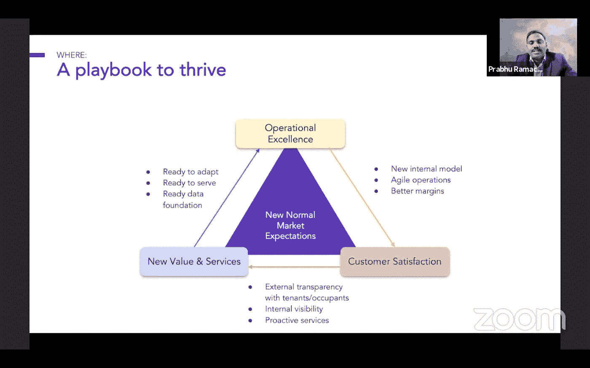
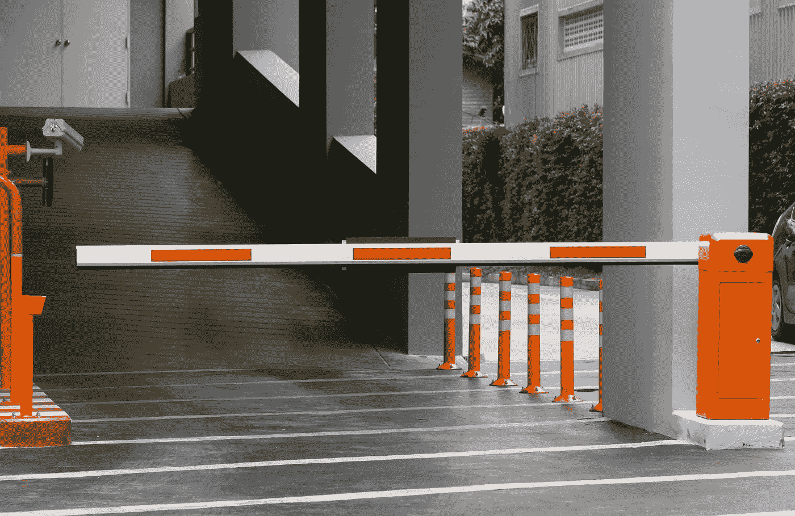
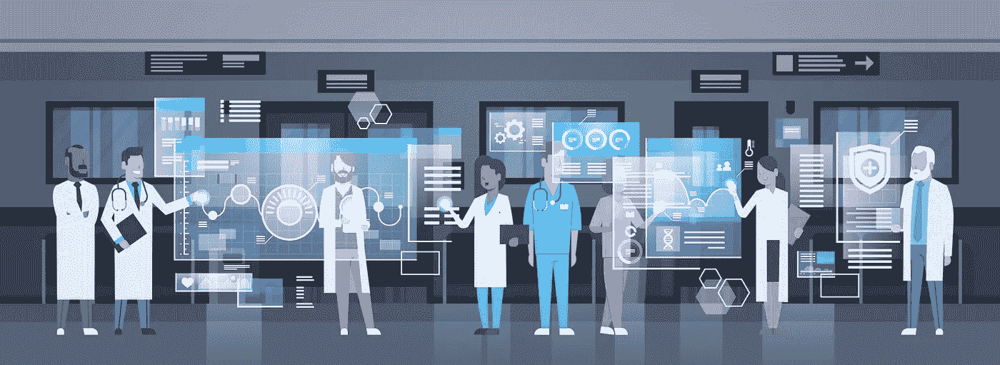
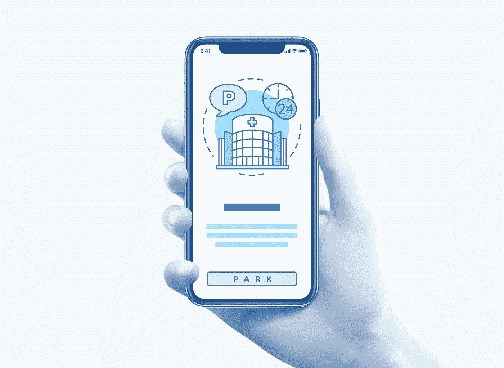
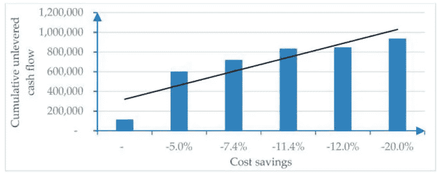
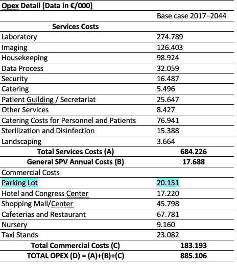

# 为什么智慧医院需要数字化停车？

> 原文：<https://medium.com/geekculture/why-smart-hospitals-need-digital-parking-unlocking-the-potential-of-smart-parking-technologies-to-d63992d332e9?source=collection_archive---------2----------------------->

患者及其家属的整体医院体验有许多组成部分——从医护人员的态度和医疗设备的技术质量到后台元素，如流程效率、沟通以及就诊前后发生的一些看似次要的方面——停车体验。停车设施是一个被忽视的因素，会影响病人和来访者的整体满意度。那么，什么定义了一个现代的、创新的停车设施，对于像混凝土制造的设施这样的结构,“智能”代表什么？为什么以创新为导向的医疗中心也需要在其停车基础设施方面拥抱数字化？

一个停车场的“智能化”程度，可以用它的数字化程度来定义。这涉及到采用基于软件的解决方案，通过减少在停车场转圈的时间和利用空位来提高效率和整体可持续性。

**医院停车场与配备科技设备的医院建筑对齐吗？**

当医院采用软件和基于云的服务时，医疗保健领域的数字投资已经被广泛采用，因为它们有助于提高组织绩效、生产力和增加医疗服务的价值。诊所部署支持工作流管理的系统，例如 EHR(电子健康记录)文档组织。人工智能、自动化和智能技术正广泛应用于预防医学、医学成像(计算机断层扫描)、远程医疗访问等领域，有助于提高治疗和临床决策的准确性。

同时，患者通常通过在线预约等数字平台与医疗机构进行互动。多达 85%的全科医生使用电子邮件与患者沟通，64%的全科医生使用 WhatsApp。11%的患者使用在线预约，7%的患者使用在线支付。41%的公民使用智能手表和其他可穿戴设备等智能设备来监控自己的健康状况[1]。

虽然医疗机构采用数字技术，但如今许多医院停车设施很难与医疗建筑内采用的前沿技术保持一致。新冠肺炎疫情可能会提升医院内部正在发生的数字化转型，以及医院停车设施对数字化解决方案的采用，因此它们不会落后于医院设施内部的技术采用。在冠状病毒危机期间，许多组织将战略转向资源优化。在疫情，拥有强大技术基础设施的建筑比没有技术基础设施的建筑要好得多。这也强调了智能技术在停车资源管理中的作用。

灵活的运营模式能够对不断变化的环境(方案 1)做出快速反应，例如波动的停车需求。我们见证了现在受到疫情影响的设施管理行业如何重新思考以适应这种新常态——在混合类型的工作(部分在家，部分在办公室)方面，改变了流动模式和对卫生措施的期望。所有这些都可以通过涉及停车数字化的解决方案来支持，这意味着通过技术增加停车管理的灵活性和更高的健康安全，并消除现场的人工支持。

方案 1:

Source: [https://facilio.com/blog/for-real-estate-leaders-top-5-takeaways-from-the-smart-built-environment-forum/?utm_source=https://facilio.com/?utm_source=sbef&utm_medium=email&utm_campaign=feb21newsletter](https://facilio.com/blog/for-real-estate-leaders-top-5-takeaways-from-the-smart-built-environment-forum/?utm_source=https://facilio.com/?utm_source=sbef&utm_medium=email&utm_campaign=feb21newsletter)

**自动化程度更高—传输风险更低**

在采取针对 COVID19 的预防措施时，医院至关重要。内部，医疗中心实施特殊程序和高水平的消毒，但在停车场，这个经常是病人与医院第一接触点的地方，仍然被遗忘。按下按钮打印纸质票据或在支付机器上触摸屏幕都有接触病毒的风险。也不方便，费时。这些负担可以通过以下方式消除:

-通过自动车牌识别引入停车时间登记，

-在移动应用程序中创建数字停车票，

-能够通过智能手机支付，

-或者当汽车离开停车场时自动停车付费执行。在这种情况下，ANPR(自动车牌识别)摄像头系统会识别汽车，并自动从智能停车应用程序中与用户账户关联的信用卡中扣除停车费。

ANPR 是一种在车辆接近时读取车辆牌照并与数据库进行核对的技术，访问者的车牌凭证可以不断地添加或删除。

使用现代技术停车提供了便利，但它也使游客避免了接触停车基础设施和表面的潜在风险，这可能使他们暴露于病毒。在 COVID19 期间，提供在线医疗服务的好医生平台上的流量增长了 8 倍多；人们不想去医院。消费者的心态已经改变，因为他们不再觉得有必要去医院看小病。但是如果他们去了，他们想确定健康安全。在这方面，无接触智能停车流程可作为保护医疗保健中心访客的解决方案。

**受停车程序影响的医院体验**

病人及其家属可以在保健中心的评估中预测过时的停车基础设施、停车困难和需要人工干预的流程等缺点。数字解决方案和基于应用程序的停车控制有助于防止错过约会，并降低因停车问题导致的失约率。

当预约医院就诊时，可以通过电子邮件通知客户提供车牌号码，根据该号码可以自动授予进入停车场的权限。提供车牌数据允许自动进入和退出，使过程自由流动和更快。停车自动化简化了许可证验证，支持管理停车位容量和变更费用，并通过减少人为错误来提高安全性和停车执法。

促进更顺畅的到达体验、灵活的支付选项和减少离开时间可以缓解停车方面可能出现的挫折，从而影响医院的整体形象。智能手机上的智能停车应用程序使患者的亲属可以在就诊期间延长停车时间，如果他们的停车票已经预付了特定的时间，就不会匆忙停车。当谈到智能建筑和一般的物业技术时，客户满意度是根据无摩擦服务和响应能力来衡量的[4]。

**反思医院停车**

根据全球公共交通[5]的数据，纸质罚单的数量(在流动性方面)将继续减少，同样的情况也应该发生在用户如此熟悉的停车行业和纸质停车罚单上。由欧盟修订的支付服务指令(PSD2)促进了创新的移动和互联网支付服务，最近允许停车票被视为数字商品，可以在智能手机等智能设备上显示，并通过移动设备进行数字支付。这揭示了基于应用程序的停车支付，并对企业产生了一些重要影响。PSD2 立法意味着设施所有者可以实施停车管理系统，不需要传统的停车(纸质)票自动售货机或取款机。尽管设施所有者采用无票停车后，用户应接受并使用移动电话和智能停车应用程序，以“数字方式”进入、支付和离开停车场。

行为的转变始于思想的转变。虽然疫情期间移动应用的采用增加了 40%，但打破大众的习惯，改变进入停车场时拿纸质罚单的习惯可能需要一段时间。通常，问题不在于将技术交付给项目，而在于客户对新的交互方式的同化(在这种情况下——与停车的交互)。如果代表医院访客的停车预约系统与医生预约相关联，使用该系统的医院工作人员必须对该解决方案感到满意。因此，医生和管理人员必须了解如何使用技术来帮助他们更好地完成工作，同时提高游客满意度。

**(医院)停车的未来是数字化的**

为了实现数字化转型，利益相关方必须改变停车运营的方式——从使用智能停车应用的司机，到部署智能停车解决方案的停车设施所有者，再到利用数字化停车解决方案补充现有城市停车管理和收费流程的市政当局。市政当局和停车场所有者都必须发挥重要的教育作用，向最终用户有效传达智能停车解决方案的重要性和优势。

当前的旧式孤立停车系统的维护成本越来越高。与停车终端和相关设备(如停车票自动售票机(应能防潮防尘)以及纸张本身(必须有涂层)的巨大成本相比，智能停车技术提供了:

-节约成本

-提高运营效率

-优化停车容量利用

-方便最终用户的便捷停车付款

-为停车设施所有者收取更便宜的停车收入(与基于纸质罚单和取款机的流程相比)。

全市智能停车的采用可能取决于市政当局的数字化成熟度，而客户的接受程度部分取决于给定位置的移动电话普及率，并受到智能停车应用等解决方案的存在以及它们如何缓解停车难题的意识的影响。

医院是城市中最大的雇主之一，可以成为城市集成停车管理的一部分(用于路内和路外停车)，从而实现更优化的交通。医院数字停车场可以是一个更大的生态系统的元素之一，该生态系统由迁移到新数字系统的组织组成，从整体上增加了城市移动性的“智能”。如果每个拥有停车基础设施的组织都决定将其数字化，那么这将有助于扩大整个城市停车和移动的数字化转型。

像任何其他停车设施一样，医院停车场也不例外，可以(也应该)数字化——以智能、技术支持的方式为更灵活的空间管理铺平道路。整合来自公共和私人商业实体的关于停车可用性的数据可以构成一个城市停车数据平台，最终用户和停车所有者都可以从使停车更容易获得中受益。

**(停车)共享就是关爱**

数字化医院停车使医院管理者能够更有效地管理停车资源，并对外出售剩余的停车位。这将允许灵活的物业停车操作，并有助于适应流动性和工作模式中断的新现实，从而影响停车需求。

停车资产的虚拟化和通过软件对停车位的管理使得停车设施的商业化使用成为可能，即向利益相关者而非医院访客出售或出租未被占用的停车位。医院停车场的外部客户(和付款人)可能包括:

-司机(非医院员工、承包商、患者或其亲属)路过医院并寻找停车位

-位于附近的其他公司需要为其公司的客户、员工或客人提供停车位。

通过数字停车升级，当所有停车位都收到其“数字双胞胎”并可以在桌面或移动应用程序中看到时，这些停车位可以在市场上出售(即通过应用程序)或分配给相邻的业务合作伙伴。因此，可以消除因停车需求变化而导致的不平衡，例如，一个组织在下午未使用的停车位可以被其他企业或个人使用。停车共享有助于建筑的可持续性和更平衡的城市流动性(固定停车要求和停车位供应过剩经常受到批评，通过技术提高效率——利用现有停车场是这个问题的答案)。

另一种基于适合医院设施的数字停车生态系统的商业模式是订阅。在这种情况下，停车是预付的特定时期，给予订户，个人或企业，使用医院停车位的权利。

总的来说，使用非接触式系统升级停车亭，并将停车转变为一个简单、无接触、无摩擦的过程，游客可以根据车牌号码识别无缝进入，这可以改善停车体验。这不仅适用于诊所，也适用于任何其他计划为客户提供免费或打折停车位并部署智能停车解决方案来简化此类运营的组织。

**停车后的价值**

由于去医院通常是一种充满负面情绪的体验，无缝停车不仅保证了停车、付款和开车的快捷方式，还提供了一种情感价值——内心的平静。前往诊所的人处于一种特定的情绪状态，甚至可能将最小的问题视为压力事件。这就是为什么消除任何可能给患者及其亲属带来不必要压力的痛点(包括停车)对医疗保健提供者来说非常重要。

为了确保医院访客的镇静，访客可以使用应用程序上的预订功能预付停车费，或者由医院管理部门支付停车费。在最后一种情况下，对个人是否有权免费停车的确认以及将他们与预定的约会联系起来可以被数字化地处理。这不仅将改善游客的体验，而且还将提高运营效率，降低成本，并消除停车不当或逾期逗留。无需与现场任何人互动的非接触式停车验证和授权访问也可用于医院员工的无缝停车进出。

**面向未来且经济高效的停车设施**

疫情改变了游戏规则，对公司的运营方式产生了巨大的影响。但它也导致了决定性的转变，在此期间，数字技术被认为是应对不断变化的环境和客户期望的唯一正确方式。COVID19 危机的影响可视为变革的推动力，以及更快采用数字停车解决方案作为优化资源分配和从自有停车基础设施中获利的手段。

基于技术和软件的停车使操作更加灵活，并确保停车管理的弹性。与此同时，停车数字化是未来向完全自主停车运营升级的关键因素——当司机离开停车场时，支付会自动执行，无需人工干预。

替换旧的遗留系统和硬件密集型停车操作增强了最终用户和停车场所有者的能力，帮助他们降低了停车管理的成本。在评估 OPEX 医疗成本(其中一部分是停车场成本)的研究中，基本案例成本与**整合数字服务后的成本的比较显示** **节省了高达 20%[6]。**

方案 2——数字化带来的成本节约

Source: [https://www.ncbi.nlm.nih.gov/core/lw/2.0/html/tileshop_pmc/tileshop_pmc_inline.html?title=Click%20on%20image%20to%20zoom&p=PMC3&id=7177756_ijerph-17-02318-g002.jpg](https://www.ncbi.nlm.nih.gov/core/lw/2.0/html/tileshop_pmc/tileshop_pmc_inline.html?title=Click%20on%20image%20to%20zoom&p=PMC3&id=7177756_ijerph-17-02318-g002.jpg)

表 1 — OPEX 详情

Source: [https://www.ncbi.nlm.nih.gov/pmc/articles/PMC7177756/](https://www.ncbi.nlm.nih.gov/pmc/articles/PMC7177756/)

**总结**

对数字技术的投资是创新和竞争力的驱动力，同时与对物理基础设施或硬件密集型技术的投资相比，回报更短。

在特定的医疗保健领域，数字创新提高了医疗保健的质量，并朝着以患者为中心的战略努力。新冠肺炎疫情推动了智能城市技术的进步和支持移动和非接触式操作的新技术的采用。自动停车出入和无现金停车支付增强了客户的信心，最大限度地降低了病毒传播的风险，从而提升了服务的整体体验。

在一个越来越受技术驱动的世界里，停车的方法应该被重新思考。医疗中心采用各种智能技术、人工智能和机器学习来支持他们的运营。同样，他们的停车设施可以进行数字化升级，使停车更高效、更方便、更可持续、更安全(无病毒)。

智能停车技术带来的新机会改善了当前的流程，使所有利益相关者受益:医院访客(无票、无人驾驶、无现金停车)、医院设施管理者(更高的运营效率、成本削减、通过向非访客出售停车位获得额外收入)、业务合作伙伴(以弹性模式租赁医院的停车位)和城市(改善的停车交通、更平衡的流动性、不浪费公共空间)。

用先进的智能停车技术取代或补充传统的停车技术，如提款机、凭票停车，是停车使用方式的根本转变，也是向医院 360 度数字化转型迈出的一步，因此，这不会将停车设施排除在期待已久的数字化之外。

[1]Osservatorio Innovazione Digitale in sanità，[https://www . osservatori . net/it _ it/osservatori/comunicati-stampa/spesa-sanita-Digitale-Italia](https://www.osservatori.net/it_it/osservatori/comunicati-stampa/spesa-sanita-digitale-italia)。

[2][https://facilio . com/blog/for-real-estate-leaders-top-5-take aways-from-the-smart-build-environment-forum/？UTM _ source = https://facilio . com/？UTM _ source = sbef&UTM _ medium = email&UTM _ campaign = feb 21 news letter](https://facilio.com/blog/for-real-estate-leaders-top-5-takeaways-from-the-smart-built-environment-forum/?utm_source=https://facilio.com/?utm_source=sbef&utm_medium=email&utm_campaign=feb21newsletter)

[3][https://www . McKinsey . com/featured-insights/Asia-Pacific/using-ecologies-to-reach-higher-an-interview-the-co-CEO-of-ping-an-ping](https://www.mckinsey.com/featured-insights/asia-pacific/using-ecosystems-to-reach-higher-an-interview-with-the-co-ceo-of-ping-an)

[4][https://facilio . com/blog/for-real-estate-leaders-top-5-take aways-from-the-smart-build-environment-forum/？UTM _ source = https://facilio . com/？UTM _ source = sbef&UTM _ medium = email&UTM _ campaign = feb 21 news letter](https://facilio.com/blog/for-real-estate-leaders-top-5-takeaways-from-the-smart-built-environment-forum/?utm_source=https://facilio.com/?utm_source=sbef&utm_medium=email&utm_campaign=feb21newsletter)

[5][https://www . global mass transit . net/report-global-transit-ticketing-fare-collection-report 2020 . PHP](https://www.globalmasstransit.net/report-global-transit-ticketing-fare-collection-report2020.php)

[6][https://www . NCBI . NLM . NIH . gov/core/lw/2.0/html/tile shop _ PMC/tile shop _ PMC _ inline . html？title = Click % 20 on % 20 image % 20 to % 20 zoom&p = pm C3&id = 7177756 _ ijer ph-17-02318-g002 . jpg](https://www.ncbi.nlm.nih.gov/core/lw/2.0/html/tileshop_pmc/tileshop_pmc_inline.html?title=Click%20on%20image%20to%20zoom&p=PMC3&id=7177756_ijerph-17-02318-g002.jpg)