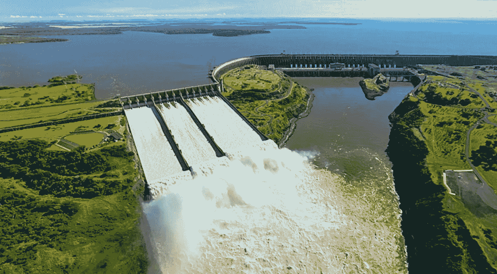

# 为什么要研究大坝？

> 原文：<https://medium.com/geekculture/why-study-big-dams-ad244de40fcc?source=collection_archive---------38----------------------->

*全文由 Atif Ansar、Bent Flyvbjerg、Alexander Budzier 和 Daniel Lunn 合著，点击* [*此处*](https://bit.ly/3igUs3w) *。*

> 大坝是典型的大型工程

我们研究大型水坝，是因为它们是一个特别有用的实证环境，有助于理解投资脆弱性。这是因为以下原因。

首先，大坝是典型的大型项目。水坝是定制的、特定地点的建筑，具有很大的物理比例；需要动员大量的投入(材料、土地、劳动力或物理设备)；需要大量的前期财政支出；产生大量单位输出；需要很长时间来建造；持续很长时间；在空间上是固定的。不仅在组成部分的数量方面，而且在这些部分之间的高度相互依赖方面，都非常复杂。大型水坝在建造、运行和最终拆除过程中，通常也会影响大量人口和环境。

> 一个 90%完工的大坝和一个根本没建的大坝一样没用

第二，大坝是不可分割的离散资产。一个 90%完工的大坝和一个根本没建的大坝一样没用。由于这个原因，与大坝相关的物理范围和成本在方法上有明确的定义，因此特别适用于计划结果和实际结果之间的同类比较。

第三，大坝全寿命成本的主要部分是在施工阶段预先提出的。与火力发电厂不同，水坝在随后的时间里不需要大量的可变成本作为原料。与大坝相关的现金流(或成本和收益流)可能存在一定程度的透明度，这对于其他大型资本投资来说要难得多。

> 直觉表明，总体规划的不确定性在大型水坝中应该比基于提供新服务的革命性新技术的大型资本投资更加有限

最后，大坝的结果可以推广到其他大型项目。大型水坝是一个被广泛研究的工程问题，或者传统理论可能认为是"标准化生产技术"(Sidak 和 Spulber，1997 年)*，产生基本服务，如电力或水，作为具有似乎确定的需求趋势的产出。直觉表明，总体规划的不确定性在大型水坝中应该比基于提供新服务的革命性新技术的大型资本投资更加有限。大坝建设中系统性错误的发现将表明，对于不太规范的资本投资，投资脆弱性问题将更加严重。

*继续阅读关于大坝和投资脆弱性* [*这里*](https://bit.ly/3igUs3w) *。*

____________________________________________

*)在此查看完整的参考文献列表:[https://bit.ly/3igUs3w](https://bit.ly/3igUs3w)