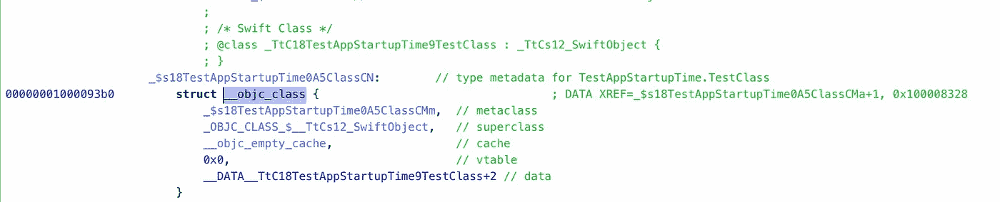
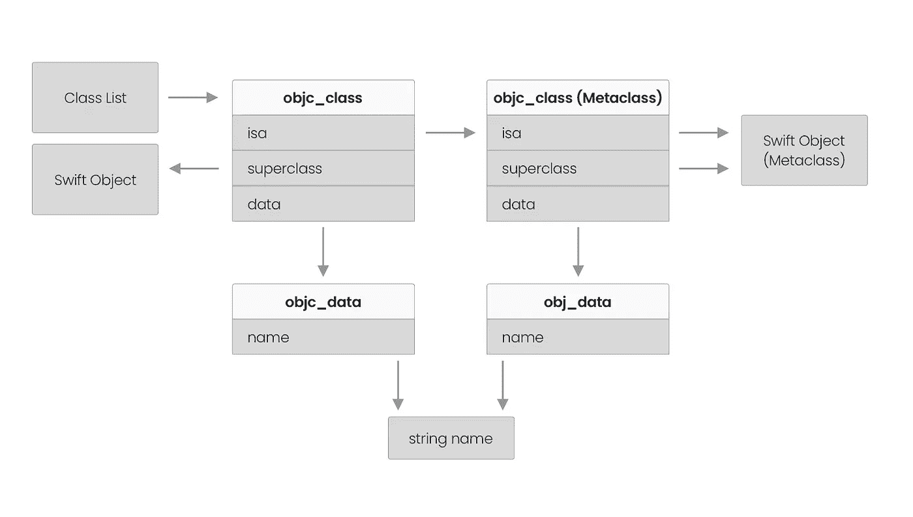

# 为什么 Swift 引用类型对应用启动时间不利

> 原文：<https://medium.com/geekculture/why-swift-reference-types-are-bad-for-app-startup-time-90fbb25237fc?source=collection_archive---------0----------------------->


## 在 [Emerge Tools 博客](https://www.emergetools.com/blog/posts/SwiftReferenceTypes)上阅读这篇文章的完整版本

应用启动体验是你给用户留下的第一印象。他们等待你的应用程序启动的每一毫秒都是他们可以花在其他地方的宝贵时间。如果你的应用有很高的参与度，并且一天被使用多次，那么用户不得不一遍又一遍地等待发布。苹果[推荐](https://developer.apple.com/videos/play/wwdc2019/423/?time=305)第一帧在 400ms 以内画好。这可以确保当跳板的应用程序打开动画结束时，你的应用程序已经准备好可以使用了。

由于只有 400 毫秒的空闲时间，开发人员需要非常小心，不要意外增加应用程序的启动时间。然而，应用启动是一个如此复杂的过程，有如此多的活动部分，很难知道到底是什么促成了它。在开发应用程序大小分析器 [Emerge](https://www.emergetools.com/) 时，我开始深入研究应用程序二进制大小和启动时间之间的关系。在这篇文章中，我将揭开应用程序启动的一个更深奥的方面，并向您展示 Swift 引用类型如何影响二进制大小和更慢的应用程序启动时间。

# Dyld

dyld 加载 Macho-O 可执行文件时，您的应用程序启动。Dyld 是苹果的一个程序，负责让一个应用程序准备就绪。它与您编写的代码在同一个进程中运行，并从加载所有依赖框架开始，包括任何系统框架。

dyld 的部分工作是在描述源代码中类型的二进制元数据中“重定”指针。这种元数据允许动态运行时特性，但可能是二进制文件大小膨胀的常见来源。以下是编译后的应用程序二进制文件中 Obj-C 类的布局:

```
**struct** ObjcClass {
  **let** isa: UInt64
  **let** superclass: UInt64
  **let** cache: UInt64
  **let** mask: UInt32
  **let** occupied: UInt32
  **let** taggedData: UInt64
}
```

每个`UInt64`都是另一个元数据的地址。这是在应用程序二进制中，所以世界上每个人都从应用程序商店下载完全相同的数据。然而，由于地址空间布局随机化( [ASLR](https://en.wikipedia.org/wiki/Address_space_layout_randomization) )，每次启动你的应用时，它都被放置在内存中的不同位置(而不是总是从 0 开始)。这是一种安全特性，旨在使预测特定函数在内存中的位置变得困难。

ASLR 的问题是，硬编码到你的应用程序二进制文件中的地址现在是错误的，它被一个随机的起始位置所偏移。Dyld 负责纠正这种情况，方法是对所有指针进行重新定基，以考虑到唯一的开始位置。对可执行文件中的每个指针和所有依赖框架，包括递归依赖，都要进行这个过程。dyld 完成的其他类型的元数据设置也会影响启动时间，比如“绑定”，但是对于本文，我们将只关注 rebases。

所有这些指针设置都会增加应用程序启动时间，因此**减少它会导致应用程序二进制文件更小，启动时间更快**。让我们看看它是从哪里来的，到底会有什么样的影响。

# Swift 和 Obj-C

我们看到重定基准时间是由您的应用程序中的 Obj-C 元数据引起的，但在 Swift 应用程序中究竟是什么引起了这种元数据呢？Swift 有`@objc`属性使声明在 Objective-C 代码中可见，但是即使您的 Swift 类型对 Obj-C 代码不可见，也会生成元数据。这是因为**在苹果平台**上，所有 Swift 类类型都包含 Objective-C 元数据。让我们通过下面的声明来看看这一点:

```
**final class** TestClass { }
```

这是纯粹的 Swift，它不从`NSObject`继承，也不使用`@objc`，但是，它将在二进制文件中产生一个 Obj-C 类元数据项，并添加 9 个需要重定基础的指针！为了证明这一点，使用类似 Hopper 的工具检查二进制文件，并查看您的“pure Swift”类的 objc_class 条目:



Obj-C metadata in the app binary

您可以通过将`DYLD_PRINT_STATISTICS_DETAILS`环境变量设置为`1`来查看启动应用程序所需的指针重置的确切数量。这将在应用程序启动后向控制台打印重置修复的总数。我们甚至可以精确地标出这 9 个指针的位置。



并非所有 Swift 类型都添加相同数量的 rebases。如果通过从超类重写或者遵循 Obj-C 协议来将方法暴露给 Obj-C，你将会添加更多的 rebases。另外，Swift 类上的每个属性都会在 Objective-C 元数据中生成一个 ivar。

# 测量

重置的实际启动时间影响将根据设备类型和手机上运行的其他内容而有所不同。我是在仍受普遍支持的最古老的设备之一 iPhone 5S 上测量的。

iOS 启动可以大致分为温暖和寒冷。暖是指系统已经启动了应用程序并缓存了一些 dyld 设置信息。因为我测试的第一次发射是冷启动，所以比其他的要慢一些。

在这种情况下，我们看到每 2000 次重定基操作大约增加 1 毫秒。这不会绝对增加启动时间，因为一些操作可以并行进行，但它确实给了我们一个下限，400k rebases 已经是苹果推荐的 400ms 限制的一半。

# 例子

测量一些流行应用程序中的重定基础操作的数量，可以看出这些操作在实践中有多普遍。

```
% xcrun dyldinfo -rebase TikTok.app/TikTok | wc -l
2066598
```

抖音有超过 200 万个 rebases，这导致了整整一秒的启动时间！抖音使用 Objective-C，但我也测试了一些使用整体二进制架构(而不是框架)的最大的 Swift 应用程序，发现 rebases 在 685k 到 180 万之间。

# 能做些什么？

尽管每个类都增加了 rebase 操作，但我并不建议用 struct 替换每个 Swift 类。大型结构也会增加二进制文件的大小，在某些情况下，您只需要引用语义。与任何性能改进一样，您应该避免过早的优化，并从测量开始。 [Emerge](https://www.emergetools.com/) 可以确定你的 app 中有多少 rebases，它们来自哪些模块，那些模块中哪些类型的贡献最大。一旦你衡量了问题，你就可以在你自己的应用中寻找改进的地方。以下是一些常见的情况:

## 在 [Emerge Tools 博客](https://www.emergetools.com/blog/posts/SwiftReferenceTypes)上阅读这篇文章的完整版本